<div align="center">
<br><br>

<h3>Universidad Peruana de Ciencias Aplicadas</h3>

<strong>Facultad de Ingeniería</strong><br>
<strong>Carrera de Ingeniería de Software</strong><br>

<strong>Período 202610 </strong><br>
<strong>1ACC0238</strong><br>
<strong>Aplicaciones para Dispositivos Móviles</strong><br>
<strong>NRC: 3821<br>

<strong>Nombre del profesor: Jorge Luis Mayta Guillermo</strong><br>

<br><strong>_Informe de Trabajo Final_</strong><br><br>

<strong>Nombre del startup: Movildev</strong><br>
<strong>Nombre del producto: SmartStay</strong><br>

### Relación de Integrantes

|   Código   | Apellidos y Nombres               |
| :--------: | :-------------------------------- |
| U202518934 | Herrera Albites, Marcoandres      |
| U20231D343 | Montes Ramos, Henry Jaredt        |
| U20211D760 | Paico, July                       |
| U202210787 | Ramirez Escalante, Carlo Patricio |
| U20221E617 | Verona Flores, Ítalo Sebastián    |

<strong> Abril, 2026</strong><br>

</div>

<div style="page-break-after: always;"></div>

## Registro de Versiones del Informe

El objetivo de esta sección es resumir las modificaciones relevantes que se realizan al informe durante el ciclo de vida del proyecto.  
Esta sección inicia en una página nueva e incluye un cuadro con la siguiente estructura:

| Versión |   Fecha    | Autor                                 | Descripción de los Cambios                                    |
| :-----: | :--------: | :------------------------------------ | :------------------------------------------------------------ |
|   1.0   | 14/04/2026 | Italo Sebastian Verona Flores (Líder) | Estructuración inicial del proyecto y coordinación del equipo |
|   1.1   | 14/04/2026 | Italo Sebastian Verona Flores         | Creación del documento inicial del Informe de Trabajo Final   |

<div style="page-break-after: always;"></div>

## Project Report Collaboration Insights

- **URL del repositorio para el Project Report:** https://github.com/Movil-dev-Aplicaciones-Moviles

El desarrollo del presente informe de trabajo final se realizó de manera colaborativa utilizando las herramientas de control de versiones de GitHub. A continuación se presenta la evidencia de la participación y contribuciones de cada miembro del equipo:

El trabajo en el repositorio del informe demuestra la participación activa de todos los miembros del equipo por cada entrega.

_Primer Avance_

En el Primer Avance el objetivo principal fue la construcción completa del informe base del proyecto. El equipo trabajó en:

- Estructura del documento (portada, índice, organización de capítulos).

- Desarrollo de contenido general y conceptual:

- Contexto del proyecto

- Problemática y objetivos

- Alcance del sistema

- Arquitectura conceptual

- Identificación inicial de usuarios, funcionalidades y módulos

- Definición de lineamientos de estilo y formato del documento.

- Revisión colaborativa del contenido, ajustando redacción, coherencia y estilo.

 aqui van las evidencias de los commits del primer avance

 !aqui van las evidencias de los commits del segundo avance

Los gráficos muestran la distribución del trabajo del equipo durante esta fase, donde todos los miembros aportaron contenido significativo al informe base.

### Metodología de Trabajo Colaborativo

- **Control de versiones:** Uso de Git para el seguimiento de cambios y colaboración
- **Revisiones de contenido:** Implementación de pull requests para la validación del contenido
- **Documentación continua:** Actualización incremental del informe durante todo el ciclo del proyecto
- **Coordinación de equipo:** Reuniones regulares para alinear el progreso y resolver conflictos

<div style="page-break-after: always;"></div>

## Contenido

- [Registro de Versiones del Informe](#registro-de-versiones-del-informe)
- [Project Report Collaboration Insights](#project-report-collaboration-insights)
  - [Metodología de Trabajo Colaborativo](#metodología-de-trabajo-colaborativo)
- [Contenido](#contenido)
- [Student Outcome](#student-outcome)
  - [ABET – EAC - Student Outcome 7](#abet--eac---student-outcome-7)
- [Objetivos SMART](#objetivos-smart)
  - [1. Italo Sebastian Verona Flores](#1-italo-sebastian-verona-flores)
  - [2. Carlo Patricio Ramirez Escalante](#2-carlo-patricio-ramirez-escalante)
  - [3. Henry Jaredt Montes Ramos](#3-henry-jaredt-montes-ramos)
  - [4. Marcoandres Herrera Albites](#4-marcoandres-herrera-albites)
  - [5. July Paico](#5-july-paico)
- [Capítulo I: Presentación](#capítulo-i-presentación)
  - [1.1. Startup Profile](#11-startup-profile)
    - [1.1.1. Descripción de la Startup](#111-descripción-de-la-startup)
    - [1.1.2. Perfiles de integrantes del equipo](#112-perfiles-de-integrantes-del-equipo)
  - [1.2. Solution Profile](#12-solution-profile)
    - [1.2.1. Antecedentes y problemática](#121-antecedentes-y-problemática)
    - [1.2.2. Lean UX Process](#122-lean-ux-process)
      - [1.2.2.1. Lean UX Problem Statements](#1221-lean-ux-problem-statements)
      - [1.2.2.2. Lean UX Assumptions](#1222-lean-ux-assumptions)
      - [1.2.2.3. Lean UX Hypothesis Statements](#1223-lean-ux-hypothesis-statements)
      - [1.2.2.4. Lean UX Canvas](#1224-lean-ux-canvas)
  - [1.3. Segmentos objetivo](#13-segmentos-objetivo)
- [Capítulo II: Requirements Development and Software Solution Design](#capítulo-ii-requirements-development-and-software-solution-design)
  - [2.1. Competidores](#21-competidores)
    - [2.1.1. Análisis competitivo](#211-análisis-competitivo)
    - [2.1.2. Estrategias y tácticas frente a competidores](#212-estrategias-y-tácticas-frente-a-competidores)
  - [2.2. Entrevistas](#22-entrevistas)
    - [2.2.1. Diseño de entrevistas](#221-diseño-de-entrevistas)
    - [2.2.2. Registro de entrevistas](#222-registro-de-entrevistas)
    - [2.2.3. Análisis de entrevistas](#223-análisis-de-entrevistas)
  - [2.3. Needfinding](#23-needfinding)
    - [2.3.1. User Personas](#231-user-personas)
    - [2.3.2. User Task Matrix](#232-user-task-matrix)
    - [2.3.3. User Journey Mapping](#233-user-journey-mapping)
    - [2.3.4. Empathy Mapping](#234-empathy-mapping)
    - [2.3.5. Ubiquitous Language](#235-ubiquitous-language)
  - [2.4. Requirements Specification](#24-requirements-specification)
    - [2.4.1. User Stories](#241-user-stories)
    - [2.4.2. Impact Mapping](#242-impact-mapping)
    - [2.4.3. Product Backlog](#243-product-backlog)
  - [2.5. Strategic-Level Domain-Driven Design](#25-strategic-level-domain-driven-design)
    - [2.5.1. EventStorming](#251-eventstorming)
      - [2.5.1.1. Candidate Context Discovery](#2511-candidate-context-discovery)
      - [2.5.1.2. Domain Message Flows Modeling](#2512-domain-message-flows-modeling)
      - [2.5.1.3. Bounded Context Canvases](#2513-bounded-context-canvases)
    - [2.5.2. Context Mapping](#252-context-mapping)
    - [2.5.3. Software Architecture](#253-software-architecture)
      - [2.5.3.1. Software Architecture Context Level Diagrams](#2531-software-architecture-context-level-diagrams)
      - [2.5.3.2. Software Architecture Container Level Diagrams](#2532-software-architecture-container-level-diagrams)
      - [2.5.3.3. Software Architecture Deployment Diagrams](#2533-software-architecture-deployment-diagrams)
  - [2.6. Tactical-Level Domain-Driven Design](#26-tactical-level-domain-driven-design)
    - [2.6.1. Bounded Context: \[Nombre del Bounded Context\]](#261-bounded-context-nombre-del-bounded-context)
      - [2.6.1.1. Domain Layer](#2611-domain-layer)
      - [2.6.1.2. Interface Layer](#2612-interface-layer)
      - [2.6.1.3. Application Layer](#2613-application-layer)
      - [2.6.1.4. Infrastructure Layer](#2614-infrastructure-layer)
      - [2.6.1.5. Bounded Context Software Architecture Component Level Diagrams](#2615-bounded-context-software-architecture-component-level-diagrams)
      - [2.6.1.6. Bounded Context Software Architecture Code Level Diagrams](#2616-bounded-context-software-architecture-code-level-diagrams)
        - [2.6.1.6.1. Bounded Context Domain Layer Class Diagrams](#26161-bounded-context-domain-layer-class-diagrams)
        - [2.6.1.6.2. Bounded Context Database Design Diagram](#26162-bounded-context-database-design-diagram)
- [Capítulo III: Solution UI/UX Design](#capítulo-iii-solution-uiux-design)
  - [3.1. Product design](#31-product-design)
    - [3.1.1. Style Guidelines](#311-style-guidelines)
      - [3.1.1.1. General Style Guidelines](#3111-general-style-guidelines)
    - [3.1.2. Information Architecture](#312-information-architecture)
      - [3.1.2.1. Organization Systems](#3121-organization-systems)
      - [3.1.2.2. Labelling Systems](#3122-labelling-systems)
      - [3.1.2.3. SEO Tags and Meta Tags](#3123-seo-tags-and-meta-tags)
      - [3.1.2.4. Searching Systems](#3124-searching-systems)
      - [3.1.2.5. Navigation Systems](#3125-navigation-systems)
    - [3.1.3. Landing Page UI Design](#313-landing-page-ui-design)
      - [3.1.3.1. Landing Page Wireframe](#3131-landing-page-wireframe)
      - [3.1.3.2. Landing Page Mock-up](#3132-landing-page-mock-up)
    - [3.1.4. Mobile Applications UX/UI Design](#314-mobile-applications-uxui-design)
      - [3.1.4.1. Mobile Applications Wireframes](#3141-mobile-applications-wireframes)
      - [3.1.4.2. Mobile Applications Wireflow Diagrams](#3142-mobile-applications-wireflow-diagrams)
      - [3.1.4.3. Mobile Applications Mock-ups](#3143-mobile-applications-mock-ups)
      - [3.1.4.4. Mobile Applications User Flow Diagrams](#3144-mobile-applications-user-flow-diagrams)
      - [3.1.4.5. Mobile Applications Prototyping](#3145-mobile-applications-prototyping)
- [Capítulo IV: Product Implementation \& Validation](#capítulo-iv-product-implementation--validation)
  - [4.1. Software Configuration Management](#41-software-configuration-management)
    - [4.1.1. Software Development Environment Configuration](#411-software-development-environment-configuration)
    - [4.1.2. Source Code Management](#412-source-code-management)
    - [4.1.3. Source Code Style Guide \& Conventions](#413-source-code-style-guide--conventions)
    - [4.1.4. Software Deployment Configuration](#414-software-deployment-configuration)
  - [4.2. Landing Page \& Mobile Application Implementation](#42-landing-page--mobile-application-implementation)
    - [4.2.1. Sprint 1](#421-sprint-1)
      - [4.2.1.1. Sprint Planning 1](#4211-sprint-planning-1)
      - [4.2.1.2. Sprint Backlog 1](#4212-sprint-backlog-1)
      - [4.2.1.3. Development Evidence for Sprint Review](#4213-development-evidence-for-sprint-review)
      - [4.2.1.4. Testing Suite Evidence for Sprint Review](#4214-testing-suite-evidence-for-sprint-review)
      - [4.2.1.5. Execution Evidence for Sprint Review](#4215-execution-evidence-for-sprint-review)
      - [4.2.1.6. Services Documentation Evidence for Sprint Review](#4216-services-documentation-evidence-for-sprint-review)
      - [4.2.1.7. Software Deployment Evidence for Sprint Review](#4217-software-deployment-evidence-for-sprint-review)
      - [4.2.1.8. Team Collaboration Insights during Sprint](#4218-team-collaboration-insights-during-sprint)
  - [4.3. Validation Interviews](#43-validation-interviews)
    - [4.3.1. Diseño de Entrevistas](#431-diseño-de-entrevistas)
    - [4.3.2. Registro de Entrevistas](#432-registro-de-entrevistas)
    - [4.3.3. Evaluaciones según heurísticas](#433-evaluaciones-según-heurísticas)
- [Conclusiones y recomendaciones](#conclusiones-y-recomendaciones)
- [Video App Validation](#video-app-validation)
  - [Video About the product](#video-about-the-product)
  - [Video About the team](#video-about-the-team)
- [Glosario](#glosario)
- [Bibliografía](#bibliografía)
- [Anexos](#anexos)

<div style="page-break-after: always;"></div>

<div style="page-break-after: always;"></div>

## Student Outcome

El curso contribuye al cumplimiento del Student Outcome ABET:

### ABET – EAC - Student Outcome 7

**Criterio:** La capacidad de adquirir y aplicar nuevos conocimientos según sea necesario, utilizando estrategias de aprendizaje apropiadas.

En el siguiente cuadro se describe las acciones realizadas y enunciados de conclusiones por parte del grupo, que permiten sustentar el haber alcanzado el logro del ABET – EAC - Student Outcome 7.

| Criterio específico                                                                                                                         | Acciones realizadas                                                                                                                                                                                                                                                                                                                                                                                                                                                                          | Conclusiones                                                                                                                                                                                                                                                                                                                                                                                                                                                                                                               |
| :------------------------------------------------------------------------------------------------------------------------------------------ | :------------------------------------------------------------------------------------------------------------------------------------------------------------------------------------------------------------------------------------------------------------------------------------------------------------------------------------------------------------------------------------------------------------------------------------------------------------------------------------------- | :------------------------------------------------------------------------------------------------------------------------------------------------------------------------------------------------------------------------------------------------------------------------------------------------------------------------------------------------------------------------------------------------------------------------------------------------------------------------------------------------------------------------- |
| **Actualiza conceptos y conocimientos necesarios para su desarrollo profesional y en especial para su proyecto en soluciones de software.** | **Verona Flores, Ítalo Sebastián AV1:** <ul><li>Investigué y apliqué conceptos avanzados de Domain-Driven Design (DDD) tanto estratégico como táctico para la estructuración del proyecto.</li></ul> <br> **Carlo Patricio Ramirez Escalante (U202210787):** <br><br> **Henry Jaredt Montes Ramos (U20231D343):** <br><br> **Marcoandres Herrera Albites (U202518934):** <br><br> **July Paico (U20211D760):**                                                                               | **Grupo AV1:** La adopción de **Domain-Driven Design (DDD)** para una solución móvil permitió al equipo trascender el desarrollo convencional, logrando desacoplar la lógica de negocio de la complejidad técnica de las plataformas nativas y multiplataforma. Esta capacidad de investigación autónoma sobre patrones arquitectónicos avanzados asegura que el producto sea escalable y profesional, sentando una base sólida para la integración de servicios RESTful y el almacenamiento local exigido en el proyecto. |
| **Reconoce la necesidad del aprendizaje permanente para el desempeño profesional y el desarrollo de proyectos en soluciones de software.**  | **Verona Flores, Ítalo Sebastián AV1:** <ul><li>Participé activamente en la búsqueda de soluciones a errores de compatibilidad durante la integración de capas, utilizando documentación técnica oficial y foros especializados como estrategia de aprendizaje continuo.</li></ul> <br> **Carlo Patricio Ramirez Escalante (U202210787):** <br><br> **Henry Jaredt Montes Ramos (U20231D343):** <br><br> **Marcoandres Herrera Albites (U202518934):** <br><br> **July Paico (U20211D760):** | **Grupo AV1:** El proceso de desarrollo evidenció que el ecosistema de aplicaciones móviles demanda una actualización constante debido a la rápida evolución de sus frameworks y herramientas. El equipo concluye que la superación de retos técnicos mediante la consulta de documentación oficial y la investigación autónoma es la única vía para evitar la obsolescencia y garantizar la calidad en el ciclo de vida de una solución de software profesional.                                                          |

<div style="page-break-after: always;"></div>

## Objetivos SMART

En esta sección, cada miembro del equipo formula un plan que incluye al menos dos objetivos SMART centrados en su desarrollo profesional tras finalizar la carrera.

### 1. Italo Sebastian Verona Flores

- **Objetivo 1:** Obtener la certificación **AWS Certified Solutions Architect – Associate** en un plazo de **18 meses** tras la graduación, y escalar hacia la certificación **Professional** en un máximo de **3 años**, con el fin de consolidar mi perfil como **Senior Software Architect**. Esto me permitirá liderar el diseño de infraestructuras escalables para mi propia startup o consultora, asegurando una retribución mensual superior a los **15,000 soles** mediante la validación técnica de mis competencias en el mercado internacional.
- **Objetivo 2:** Fundar y consolidar una Startup tecnológica o establecer una Consultoría de Infraestructura Independiente que sea operativamente remota en un plazo de **5 a 6 años**. El propósito es alcanzar la libertad financiera y técnica necesaria para trasladar mi residencia a un país con altos estándares de seguridad y clima cálido manteniendo un flujo de proyectos que sustente mi desarrollo profesional continuo y mi posicionamiento como referente en arquitectura de software.

### 2. Carlo Patricio Ramirez Escalante

- **Objetivo 1:** [Redactar aquí]
- **Objetivo 2:** [Redactar aquí]

### 3. Henry Jaredt Montes Ramos

**Objetivo a corto plazo (1-2 años):**  
Desarrollarme como profesional en el área de desarrollo Fullstack y fundamentos de ciberseguridad, adquiriendo experiencia práctica en tecnologías como React, Flutter y servicios en la nube con AWS. Mi meta es integrarme a un entorno laboral que me permita fortalecer mis habilidades técnicas, participar en proyectos reales y comprender buenas prácticas de desarrollo seguro, contribuyendo activamente en equipos multidisciplinarios.

**Objetivo a largo plazo (3-5 años):**  
Consolidarme como un profesional Senior especializado en desarrollo Fullstack, Ciberseguridad e Inteligencia Artificial, logrando formar parte de una empresa de alto nivel tecnológico. Busco alcanzar un dominio avanzado en arquitecturas modernas, seguridad de aplicaciones y soluciones inteligentes, generando impacto en productos digitales innovadores. Asimismo, aspiro a obtener una estabilidad económica sólida, con ingresos acordes a mi nivel de experiencia y responsabilidad profesional.

### 4. Marcoandres Herrera Albites

- **Objetivo 1:** [Redactar aquí]
- **Objetivo 2:** [Redactar aquí]

### 5. July Paico

- **Objetivo 1:** [Redactar aquí]
- **Objetivo 2:** [Redactar aquí]

<div style="page-break-after: always;"></div>

## Capítulo I: Presentación

### 1.1. Startup Profile

#### 1.1.1. Descripción de la Startup

La startup Smart Stay surge con el objetivo de transformar la gestión hotelera mediante el uso de tecnologías digitales e Internet of Things (IoT). Nuestra propuesta integra en una sola solución la administración de huéspedes, control de habitaciones y servicios mediante una arquitectura de microservicios y conectividad constante.

A diferencia de soluciones tradicionales, Smart Stay se enfoca en una experiencia móvil robusta, ofreciendo una aplicación nativa en Android (Kotlin) para la gestión operativa del personal y una aplicación multiplataforma en Flutter para el autoservicio y confort del huésped. A través de estas interfaces, el hotel puede optimizar recursos y, al mismo tiempo, ofrecer experiencias personalizadas y automatizadas que elevan el estándar de hospitalidad.

Entre sus principales características destacan:

- Gestión de Acceso Digital: Registro automático y control de acceso a habitaciones desde dispositivos móviles.

- Control de Entorno IoT: Monitoreo y ajuste de temperatura, iluminación y consumo energético de forma remota.

- Servicios Personalizados: Integración de room service y programación de limpieza con notificaciones en tiempo real.

- Optimización Operativa: Tableros de estado para identificación inmediata de habitaciones libres o en mantenimiento.

#### 1.1.2. Perfiles de integrantes del equipo

<table>
  <thead>
    <tr>
      <th>Código</th>
      <th>Integrante</th>
      <th>Carrera</th>
      <th>Perfil Académico y Profesional</th>
      <th>Fotografía</th>
    </tr>
  </thead>
  <tbody>
    <tr>
      <td>U202518934</td>
      <td>Herrera Albites, Marcoandres</td>
      <td>Ing. de Software</td>
      <td>Estudiante enfocado en la innovación tecnológica y la investigación técnica. Posee interés en cómo el Internet de las Cosas (IoT) puede mejorar la experiencia del usuario en el sector hotelero, aportando una visión práctica al desarrollo de soluciones de software eficientes.</td>
      <td>Pendiente</td>
    </tr>
    <tr>
      <td>U20231D343</td>
      <td>Montes Ramos, Henry Jaredt</td>
      <td>Ing. de Software</td>
      <td>Interesado en el desarrollo de la lógica de negocio y la arquitectura de software. Cuenta con conocimientos en programación y gestión de datos, contribuyendo a la estabilidad y escalabilidad del ecosistema de Smart Stay mediante el diseño de servicios robustos.</td>
      <td>Pendiente</td>
    </tr>
    <tr>
      <td>U20211D760</td>
      <td>Paico, July</td>
      <td>Ing. de Software</td>
      <td>Especialista en el diseño de interfaces y experiencia de usuario (UX/UI). Su objetivo es garantizar que tanto la aplicación en Flutter como la de Android nativo sean accesibles, intuitivas y cumplan con los estándares de diseño inclusivo para todos los segmentos de huéspedes.</td>
      <td>Pendiente</td>
    </tr>
    <tr>
      <td>U202210787</td>
      <td>Ramirez Escalante, Carlo Patricio</td>
      <td>Ing. de Software</td>
      <td>Estudiante con orientación al desarrollo móvil y control de calidad. Posee habilidades técnicas en lenguajes de programación modernos y está interesado en la implementación de funcionalidades de alto rendimiento que aseguren la eficiencia operativa del personal del hotel.</td>
      <td>Pendiente</td>
    </tr>
    <tr>
      <td>U20221E617</td>
      <td>Verona Flores, Ítalo Sebastián</td>
      <td>Ing. de Software</td>
      <td>Soy un estudiante con experiencia en programación y diseño de bases de datos. Tengo capacidad para resolver problemas técnicos complejos y  dominio de herramientas de desarrollo que facilitan la integración de servicios RESTful </td>
      <td>Pendiente</td>
    </tr>
  </tbody>
</table>

### 1.2. Solution Profile

#### 1.2.1. Antecedentes y problemática

**Who? (¿Quiénes?)** El problema afecta al Staff Operativo (limpieza, administración, mantenimiento y recepción) y a los huéspedes que buscan autonomía. El Staff Operativo depende de procesos manuales que fragmentan la comunicación interna. Los huéspedes, por su parte, enfrentan una experiencia desconectada que limita su control sobre el entorno de la habitación y la interacción con los servicios del hotel.

**What? (¿Qué?)** El problema central es la nula movilidad y falta de integración digital en la gestión hotelera integral. Esto se traduce en una dependencia de terminales fijas, control ineficiente de habitaciones por falta de datos en tiempo real (IoT), y una experiencia del huésped desconectada de los servicios del hotel.

**Where? (¿Dónde?)** Ocurre en hoteles de tamaño mediano a grande, donde la complejidad operativa y el volumen de huéspedes hacen que los procesos manuales sean ineficientes. La falta de movilidad afecta tanto a las áreas de servicio como a las habitaciones, generando cuellos de botella en la gestión diaria.

**When? (¿Cuándo?)** Ocurre de manera continua las 24 horas. La ineficiencia se agudiza en momentos críticos como los procesos de check-in/check-out, horas pico de solicitudes de servicios, y temporadas de alta ocupación donde la respuesta inmediata es vital para la satisfacción.

**Why? (¿Por qué?)** Se debe a la dependencia de sistemas tradicionales (Legacy Systems) que no permiten la interoperabilidad. Existe una carencia de una arquitectura de software moderna que integre servicios RESTful con tecnología IoT, impidiendo el monitoreo de recursos y la personalización del confort del huésped de forma remota y automatizada.

**How? (¿Cómo?)** La falta de una solución móvil integrada genera ineficiencias operativas, pérdida de productividad y una experiencia del huésped fragmentada. El personal del hotel no puede acceder a información en tiempo real ni gestionar las habitaciones de manera eficiente, mientras que los huéspedes no pueden controlar su entorno ni interactuar con los servicios del hotel desde sus dispositivos móviles.

**How Much? (¿Cuánto?)** La ineficiencia genera una pérdida estimada del 15-20% en la productividad operativa y un aumento innecesario en los costos de suministros y energía por falta de monitoreo. Además, la baja calificación en la experiencia de usuario (User Experience) se traduce en una disminución de la lealtad del cliente y una pérdida de competitividad frente a hoteles tecnológicamente avanzados.

#### 1.2.2. Lean UX Process

##### 1.2.2.1. Lean UX Problem Statements

**Problem Statement: Optimización de la Gestión Operativa y Experiencia del Huésped**

El servicio de Smart Stay busca transformar la gestión hotelera mediante una solución móvil integral que conecte al Staff Operativo con las necesidades en tiempo real de los huéspedes. A través de nuestras aplicaciones móviles, el personal puede administrar de manera eficiente las habitaciones y servicios, mientras que los huéspedes obtienen el control total de su estancia.

Hemos identificado que la dependencia de procesos manuales y sistemas estáticos genera errores críticos en la disponibilidad de habitaciones, tiempos de respuesta lentos en servicios de limpieza y una falta de personalización inmediata. Actualmente, el Staff Operativo carece de una herramienta móvil centralizada que permita la automatización y el monitoreo en tiempo real de los recursos del hotel.

**¿Cómo podríamos digitalizar y automatizar la interacción entre el Staff Operativo y los huéspedes a través de aplicaciones móviles para reducir errores, optimizar la coordinación interna y ofrecer una experiencia personalizada basada en datos en tiempo real?**

**Proposed Solutions (Features)**

Para abordar esta problemática, la solución se centrará en las siguientes funcionalidades integradas en las aplicaciones móviles:

- **Gestión de Inventario de Habitaciones (Staff App):** Visualización centralizada del estado de cada habitación (disponible, ocupada, en mantenimiento) con actualizaciones instantáneas.
- **Check-in y Check-out Digital:** Proceso automatizado para que el huésped registre su entrada y salida desde su dispositivo, sincronizándose con el sistema del hotel.
- **Gestión de Housekeeping (Staff App):** Asignación y seguimiento de tareas de limpieza en tiempo real, con notificaciones al personal cuando una habitación requiere atención.
- **Control de Incidencias de Mantenimiento:** Registro fotográfico y seguimiento de averías reportadas por el personal o el huésped, con flujo de resolución asignado.
- **Dashboard Operativo para el Staff:** Panel de control dentro de la aplicación para que el Staff Operativo gestione recursos, personal y métricas de ocupación diaria.
- **Centro de Servicios al Huésped (Guest App):** Interfaz para solicitar amenities, servicios de habitación o asistencia técnica de manera autónoma.
- **Motor de Notificaciones Inteligentes:** Alertas en tiempo real para el personal sobre nuevas solicitudes y confirmaciones de servicio para los huéspedes.
- **Control de Acceso y Seguridad:** Gestión de llaves digitales y roles de usuario (Staff Operativo vs. Huésped) con permisos diferenciados.

**Business Outcomes**

**Objetivo:** Incrementar la eficiencia operativa y reducir costos por procesos manuales en un periodo de 4 meses.

**Key Results (KR):**

- Reducir en un 20% el tiempo de respuesta del Staff Operativo ante solicitudes de servicios.
- Disminuir en un 10% los errores en el registro de disponibilidad de habitaciones.
- Lograr que el 85% de las tareas de limpieza se reporten y completen a través de la aplicación móvil.

**User Outcomes**

**Objetivo:** Proporcionar una experiencia de usuario fluida y autónoma que maximice la satisfacción del huésped y la productividad del staff.

**Key Results (KR):**

- Lograr que los huéspedes realicen solicitudes de servicios en menos de 45 segundos a través de la aplicación.
- Obtener una calificación promedio de satisfacción de 4.5/5 estrellas en las tiendas de aplicaciones sobre la facilidad de uso.
- Reducir en un 50% la necesidad de que el huésped acuda físicamente a recepción para consultas básicas.

##### 1.2.2.2. Lean UX Assumptions

**Business Assumptions**

1. **Creo que mis clientes necesitan:**
   Una solución integral de gestión hotelera que automatice procesos mediante aplicaciones móviles, optimice el uso de recursos y proporcione una experiencia personalizada a los huéspedes a través de tecnología IoT.

2. **Estas necesidades se pueden resolver con:**
   Un ecosistema de aplicaciones móviles (Android y Flutter) integradas con servicios RESTful y dispositivos IoT que permitan el monitoreo en tiempo real de habitaciones y el control personalizado del ambiente.

3. **Mis clientes iniciales son (o serán):**
   Hoteles boutique y de lujo (3-5 estrellas) con una infraestructura de 50 a 200 habitaciones ubicados en zonas turísticas de Lima Metropolitana.

4. **El valor #1 que un cliente quiere de mi servicio es:**
   Optimización operativa mediante movilidad que reduzca costos y mejore la eficiencia del Staff Operativo, junto con una experiencia tecnológica diferenciada para los huéspedes.

5. **El cliente también puede obtener estos beneficios adicionales:**

- Reducción del 20-30% en costos de energía y servicios públicos mediante monitoreo IoT.
- Visualización de datos operativos en tiempo real desde dispositivos móviles.
- Sincronización inmediata entre las tareas de limpieza y el estado de recepción.
- Reportes automatizados de ocupación y rendimiento de recursos.

6. **Voy a adquirir la mayoría de mis clientes a través de:**
   Marketing directo a gerentes hoteleros, presencia en ferias de hospitalidad (como la Feria Gastronómica y Hotelera de Perú) y alianzas estratégicas con proveedores de hardware IoT.

7. **Haré dinero a través de:**
   Un modelo de suscripción mensual basado en el número de habitaciones gestionadas (SaaS), sumado a una tarifa inicial por implementación de infraestructura IoT y configuración del servicio.

8. **Mi competencia principal en el mercado será:**
   Sistemas de gestión hotelera tradicionales (PMS) que carecen de movilidad nativa, y startups de hotel-tech que no integran el control de la habitación (IoT) en su oferta core.

9. **Los venceremos debido a:**
   Nuestra especialización en movilidad dual (Staff/Huésped), la integración nativa con sensores IoT para personalización del confort y una interfaz diseñada bajo principios de arquitectura de información móvil.

10. **Mi mayor riesgo de producto es:**
    La inestabilidad de la conectividad WiFi en infraestructuras antiguas y la resistencia del Staff Operativo a sustituir métodos manuales por flujos totalmente digitales en dispositivos móviles.

11. **Resolveremos esto a través de:**

- Implementación de un programa piloto con soporte técnico presencial 24/7.
- Capacitación intensiva enfocada en la facilidad de uso de las aplicaciones móviles.
- Modelos de financiamiento para la actualización de la infraestructura de red del hotel.

12. **¿Qué otras suposiciones tenemos que, si se prueba que es falso, causará que nuestro negocio/proyecto no funcione?**

- Los hoteles cuentan con una red estable para soportar el tráfico de datos de sensores IoT.
- El Staff Operativo puede portar dispositivos móviles durante toda su jornada laboral sin inconvenientes.
- Los huéspedes valoran la interacción digital por encima de la interacción humana tradicional en servicios de habitación.

**User Assumptions**

1. **¿Quién es el usuario?**
   Los usuarios son el Staff Operativo (limpieza, mantenimiento y recepción) y los huéspedes. El staff busca agilizar la coordinación de tareas sin depender de bases fijas, mientras que los huéspedes buscan autonomía en el control de su estancia.

2. **¿Dónde encaja nuestro producto en su trabajo o vida?**
   Smart Stay se integra en el flujo diario de trabajo: el Staff Operativo recibe órdenes de servicio y actualiza estados de habitaciones en su aplicación Android mientras se desplaza por el hotel. El huésped usa la aplicación en Flutter para gestionar su confort y servicios desde su llegada hasta el check-out.

3. **¿Qué problemas tiene nuestro producto y cómo se puede resolver?**
   El problema principal es la fragmentación de la información y los tiempos muertos en la comunicación interna. Se resuelve mediante notificaciones automáticas entre aplicaciones y la visualización instantánea del estado de los recursos capturados por IoT.

4. **¿Cuándo y cómo es usado nuestro producto?**
   Es usado continuamente: el Staff Operativo lo utiliza al iniciar turnos de limpieza o al detectar averías; los huéspedes lo activan durante su estancia para ajustar temperatura, iluminación o solicitar servicios de habitación de forma digital.

5. **¿Qué características son importantes?**

- Actualización en tiempo real de disponibilidad de habitaciones (Staff App).
- Gestión de tareas de limpieza y mantenimiento (Staff App).
- Control de dispositivos de habitación mediante IoT (Guest App).
- Solicitud digital de servicios y contacto rápido (Guest App).
- Roles y permisos de seguridad diferenciados.

6. **¿Cómo debe verse nuestro producto y cómo debe comportarse?**
   Debe verse profesional, moderno y ser extremadamente intuitivo (UX móvil). Debe comportarse de forma fluida, con tiempos de respuesta mínimos y ser accesible para usuarios con distintos niveles de alfabetización digital, siguiendo guías de Material Design.

##### 1.2.2.3. Lean UX Hypothesis Statements

**Hypothesis 1: Mobile Check-in/Check-out Autonomy**

**We believe that** implementing an automated digital check-in and check-out system within the Guest App (Flutter) will reduce the average time for these processes by 15%.

**We will know we are successful when we see** that guests complete their registration in less than 3 minutes and 70% of them use the mobile system without needing assistance from the reception staff.

**Hypothesis 2: Staff Operativo Efficiency and Adoption**

**We believe that** providing an intuitive native Android application for the Staff Operativo (housekeeping and maintenance) will achieve at least 80% adoption of the system for their daily coordination tasks.

**We will know this is true when we see** consistent daily use of the Staff App and a 10% reduction in manual operational costs after the first 4 months of implementation.

**Hypothesis 3: Digital Service Satisfaction**

**We believe that** offering a faster and clearer mobile management experience for both guests and the Staff Operativo will significantly improve overall service satisfaction.

**We will know we are successful when we see** a satisfaction score (NPS) of at least 8/10 and that 70% of returning users interact with hotel services via the App without physical intervention.

**Hypothesis 4: IoT-Driven Resource Optimization**

**We believe that** integrating IoT devices for monitoring temperature and energy consumption, accessible via the Staff App, will optimize the hotel's resource usage.

**We will know this is true when we see** a 20% reduction in utility expenses and the generation of detailed consumption reports through the RESTful API services.

**Hypothesis 5: In-Room Experience Personalization**

**We believe that** allowing guests to directly control their room's environment (lighting, temperature) and schedule services through the Guest App will increase the consumption of additional hotel services.

**We will know we are successful when we see** a 25% increase in satisfaction scores regarding room comfort and a 15% increase in digital room service orders.

**Hypothesis 6: Boutique Hotel Market Fit**

**We believe that** offering a scalable subscription model focused on boutique hotels in Lima will generate valid interest for our pilot program.

**We will know this is true when we see** the participation of at least 3 local hotels in our pilot phase with signed collaboration agreements for post-development implementation.

**Hypothesis 7: Mobile-IoT Competitive Advantage**

**We believe that** our complete integration between native mobile applications and IoT technology will provide a superior advantage over legacy hotel management systems.

**We will know we are successful when we see** that pilot hotels report specific operational improvements and express a preference for our mobile solution over traditional manual management.

##### 1.2.2.4. Lean UX Canvas

### 1.3. Segmentos objetivo

Esta sección describe los segmentos asociados al dominio del problema de gestión hotelera manual e ineficiente. Se detallan sus características demográficas e información estadística que sustenta la viabilidad de la solución **Smart Stay** en el mercado de Lima Metropolitana.

---

**Segmento Primario: Staff Operativo de Hoteles Boutique y Pequeños en Lima**

Este segmento comprende al personal encargado de la ejecución y supervisión de las operaciones diarias del hotel, quienes utilizarán la aplicación nativa en **Android** para la gestión de tareas y monitoreo de recursos.

**Perfil Demográfico y Profesional:**

- **Roles Incluidos:** Personal de recepción, supervisores de limpieza (housekeeping), técnicos de mantenimiento y coordinadores de servicios.
- **Edad:** Entre 25 y 45 años.
- **Nivel Educativo:** Técnico o universitario en turismo, hotelería, mantenimiento industrial o administración.
- **Habilidades Tecnológicas:** Usuarios habituales de smartphones con sistema operativo Android; familiarizados con herramientas de mensajería y gestión de tareas básicas.

**Desafíos Operativos:**

- **Dependencia Manual:** Uso de bitácoras físicas o comunicación verbal para reportar estados de habitaciones, lo que genera errores de disponibilidad.
- **Fragmentación de la Información:** Falta de un sistema centralizado para conocer en tiempo real si una habitación requiere mantenimiento o limpieza inmediata.
- **Carga Administrativa:** Tiempo excesivo dedicado a la coordinación entre áreas, reduciendo la eficiencia en la atención directa al huésped.

**Sustento del Segmento:**

- En Lima Metropolitana existen más de 300 hoteles pequeños y boutique (de 20 a 100 habitaciones) que operan con procesos manuales en áreas de servicios y mantenimiento.
- La ineficiencia operativa en este segmento puede representar pérdidas de entre el **15% y 20%** en la productividad del personal debido a fallos en la coordinación interna.

---

**Segmento Secundario: Huéspedes de Hoteles**

Este segmento abarca a los usuarios finales que buscan una estancia moderna y autónoma, interactuando con el hotel mediante la aplicación multiplataforma desarrollada en **Flutter**.

**Perfil Demográfico:**

- **Edad:** Entre 25 y 50 años (predominancia de Millennials y Generación X).
- **Nivel Socioeconómico:** Medio-alto a alto.
- **Procedencia:** Turistas internacionales (40% provenientes de EE.UU., Europa y Latinoamérica) y viajeros nacionales (60% enfocados en viajes de negocios o experiencias urbanas).

**Preferencias y Comportamiento Tecnológico:**

- **Digital-First:** El **68%** de estos huéspedes selecciona hoteles basándose en su reputación digital y facilidades tecnológicas.
- **Demanda de Autonomía:** Alta disposición a utilizar aplicaciones móviles para realizar check-in/check-out sin contacto y gestionar servicios de habitación.
- **Interés en IoT:** Valoran la capacidad de controlar el ambiente de su habitación (iluminación, temperatura) desde su smartphone, asociándolo con una experiencia de lujo y confort.

**Uso de Tecnología durante la Estancia:**

- **Dispositivo Principal:** Smartphone personal como herramienta única para gestionar toda la experiencia de viaje.
- **Expectativas de Conectividad:** Requerimiento de WiFi de alta velocidad e integración con servicios digitales para solicitudes de asistencia inmediata.

---

**Datos de Sustento Estadístico y Oportunidad de Mercado**

- **Potencial de Adopción:** Los ingresos por servicios adicionales y "upgrades" pueden incrementarse hasta en un **20%** en hoteles que implementan soluciones digitales de autoservicio para el huésped.
- **Optimización de Recursos:** La integración con dispositivos **IoT** permite una reducción proyectada del **20-30%** en el consumo energético al monitorear habitaciones desocupadas o ajustar sistemas de climatización automáticamente.
- **Impacto en Satisfacción:** El uso de herramientas digitales para el registro y solicitud de servicios reduce los tiempos de espera en recepción en un **15%**, impactando directamente en la fidelización y reseñas positivas.

Esta segmentación confirma la existencia de una necesidad clara: el **Staff Operativo** requiere movilidad para coordinar el trabajo, mientras que los **Huéspedes** demandan una interfaz moderna para personalizar su estancia, validando el enfoque dual de la solución móvil de **Smart Stay**.

---

## Capítulo II: Requirements Development and Software Solution Design

### 2.1. Competidores

El mercado de soluciones para gestión hotelera presenta diversos actores. Sin embargo, la mayoría se centra en interfaces web, dejando un vacío en la experiencia móvil fluida e integrada con dispositivos físicos (IoT) que Smart Stay busca cubrir.

#### 2.1.1. Análisis competitivo

<table border="1" cellpadding="10" cellspacing="0" style="width: 100%; border-collapse: collapse; font-family: Segoe UI, Arial, sans-serif; font-size: 13px; border: 1px solid #000;">
  <thead>
    <tr style="background-color: #f2f2f2;">
      <th style="text-align: left; width: 15%; border: 1px solid #000;">¿Por qué llevar a cabo este análisis?</th>
      <th colspan="4" style="text-align: left; border: 1px solid #000;">El objetivo es identificar las brechas tecnológicas en la oferta actual de gestión hotelera para diferenciar a Smart Stay mediante una experiencia móvil nativa e integración IoT dirigida a hoteles boutique en LATAM.</th>
    </tr>
    <tr style="background-color: #e6e6e6; text-align: center;">
      <th style="border: 1px solid #000;">Categoría / Aspecto</th>
      <th style="border: 1px solid #000;"><strong>Smart Stay</strong><br></th>
      <th style="border: 1px solid #000;"><strong>Oracle Hospitality</strong><br></th>
      <th style="border: 1px solid #000;"><strong>Room Raccoon</strong><br></th>
      <th style="border: 1px solid #000;"><strong>Sistemas Manuales</strong><br></th>
    </tr>
  </thead>
  <tbody>
    <tr style="background-color: #f9f9f9;">
      <td colspan="5" style="font-weight: bold; border: 1px solid #000; letter-spacing: 1px;">PERFIL</td>
    </tr>
    <tr>
      <td style="border: 1px solid #000;"><strong>Overview</strong></td>
      <td style="border: 1px solid #000;">Plataforma de gestión hotelera con enfoque en hoteles boutique, integrando IoT y una experiencia móvil nativa para el huésped.</td>
      <td style="border: 1px solid #000;">Soluciones globales y robustas (PMS/OPERA) diseñadas para la gestión de grandes cadenas hoteleras internacionales.</td>
      <td style="border: 1px solid #000;">SaaS en la nube todo-en-uno (PMS, Channel Manager) intuitivo, orientado a hoteles pequeños e independientes.</td>
      <td style="border: 1px solid #000;">Sistemas tradicionales basados en herramientas físicas o digitales básicas como Excel y registros en papel.</td>
    </tr>
    <tr>
      <td style="border: 1px solid #000;"><strong>Ventaja competitiva</strong><br><small>¿Qué valor ofrece a los clientes?</small></td>
      <td style="border: 1px solid #000;">Control total del entorno de la habitación y personalización profunda desde una <strong>aplicación móvil nativa</strong>.</td>
      <td style="border: 1px solid #000;">Reconocimiento de marca global, alta confiabilidad y cumplimiento de estándares para operaciones a gran escala.</td>
      <td style="border: 1px solid #000;">Facilidad de implementación, soporte técnico valorado y una interfaz puramente web simplificada.</td>
      <td style="border: 1px solid #000;">Costo de adquisición nulo y flexibilidad operativa total al no depender de infraestructura de software especializada.</td>
    </tr>
    <tr style="background-color: #f9f9f9;">
      <td colspan="5" style="font-weight: bold; border: 1px solid #000; letter-spacing: 1px;">PERFIL DE MARKETING</td>
    </tr>
    <tr>
      <td style="border: 1px solid #000;"><strong>Mercado objetivo</strong></td>
      <td style="border: 1px solid #000;">Hoteles boutique y medianos en crecimiento en Latinoamérica que buscan diferenciación tecnológica.</td>
      <td style="border: 1px solid #000;">Grandes cadenas hoteleras transnacionales y resorts de lujo con procesos operativos complejos.</td>
      <td style="border: 1px solid #000;">Pequeños hoteles, hostales, Bed & Breakfasts y apartamentos turísticos de gestión independiente.</td>
      <td style="border: 1px solid #000;">Micro-hoteles o establecimientos con baja madurez tecnológica que no han iniciado su transformación digital.</td>
    </tr>
    <tr>
      <td style="border: 1px solid #000;"><strong>Estrategias de marketing</strong></td>
      <td style="border: 1px solid #000;">Posicionamiento basado en la modernización, eficiencia operativa móvil y la "Experiencia del Huésped 4.0".</td>
      <td style="border: 1px solid #000;">Ventas corporativas directas (B2B), branding global y presencia en las principales conferencias del sector.</td>
      <td style="border: 1px solid #000;">Marketing digital enfocado en SEO/SEM, resaltando la facilidad de uso y las reseñas positivas de usuarios.</td>
      <td style="border: 1px solid #000;">Inexistente; la adopción se da por costumbre o falta de conocimiento de alternativas digitales.</td>
    </tr>
    <tr style="background-color: #f9f9f9;">
      <td colspan="5" style="font-weight: bold; border: 1px solid #000; letter-spacing: 1px;">PERFIL DE PRODUCTO</td>
    </tr>
    <tr>
      <td style="border: 1px solid #000;"><strong>Productos & Servicios</strong></td>
      <td style="border: 1px solid #000;">PMS, Channel Manager, Motor de Reservas y <strong>aplicaciones móviles</strong> para huéspedes y personal con control IoT.</td>
      <td style="border: 1px solid #000;">Suite OPERA Cloud (PMS, Ventas, POS) con reportes avanzados e integraciones extensas.</td>
      <td style="border: 1px solid #000;">Plataforma unificada que incluye PMS, Channel Manager, sistema de pagos y gestión de limpieza (Housekeeping).</td>
      <td style="border: 1px solid #000;">Plantillas de hojas de cálculo, libros de registro físico y calendarios manuales.</td>
    </tr>
    <tr>
      <td style="border: 1px solid #000;"><strong>Precios & Costos</strong></td>
      <td style="border: 1px solid #000;">Modelo SaaS por suscripción mensual escalable + inversión inicial en hardware para los dispositivos IoT.</td>
      <td style="border: 1px solid #000;">Licenciamiento de nivel empresarial con costos elevados de implementación, soporte y mantenimiento especializado.</td>
      <td style="border: 1px solid #000;">Esquema de suscripción mensual transparente y accesible, basado principalmente en el número de habitaciones.</td>
      <td style="border: 1px solid #000;">Gratuito o limitado al costo de licencias básicas de software de oficina.</td>
    </tr>
    <tr>
      <td style="border: 1px solid #000;"><strong>Canales de distribución</strong><br><small>(Web y/o Móvil)</small></td>
      <td style="border: 1px solid #000;">Plataforma en la nube y <strong>aplicaciones móviles nativas</strong> (Android/iOS) y multiplataforma.</td>
      <td style="border: 1px solid #000;">Aplicación web basada en la nube optimizada para terminales de escritorio en estaciones de trabajo.</td>
      <td style="border: 1px solid #000;">Interfaz web accesible desde navegadores a través de cualquier dispositivo con conexión a internet.</td>
      <td style="border: 1px solid #000;">Offline; requiere presencia física para la manipulación y consulta de registros.</td>
    </tr>
    <tr style="background-color: #f2f2f2; text-align: center;">
      <td colspan="5" style="font-weight: bold; border: 1px solid #000; letter-spacing: 1px;">ANÁLISIS SWOT</td>
    </tr>
    <tr>
      <td style="border: 1px solid #000;"><strong>Fortalezas</strong></td>
      <td style="border: 1px solid #000;">Propuesta de valor única con IoT y enfoque en <strong>desarrollo móvil nativo</strong>.</td>
      <td style="border: 1px solid #000;">Líder indiscutible del mercado con un producto altamente robusto y escalable.</td>
      <td style="border: 1px solid #000;">Proceso de configuración rápido y excelente reputación en el segmento PYME.</td>
      <td style="border: 1px solid #000;">Simplicidad absoluta sin necesidad de capacitación técnica para el personal.</td>
    </tr>
    <tr>
      <td style="border: 1px solid #000;"><strong>Debilidades</strong></td>
      <td style="border: 1px solid #000;">Marca nueva en el mercado; requiere educación del cliente sobre la instalación de hardware físico.</td>
      <td style="border: 1px solid #000;">Interfaz de usuario compleja y costos de entrada prohibitivos para hoteles locales pequeños.</td>
      <td style="border: 1px solid #000;">Funcionalidades limitadas para la gestión de dispositivos físicos y hardware en tiempo real.</td>
      <td style="border: 1px solid #000;">Propenso a errores humanos críticos, nula capacidad de escala y falta de conectividad online.</td>
    </tr>
    <tr>
      <td style="border: 1px solid #000;"><strong>Oportunidades</strong></td>
      <td style="border: 1px solid #000;">Alta demanda de soluciones sin contacto (contactless) y experiencias digitales personalizadas.</td>
      <td style="border: 1px solid #000;">Migración de su extensa base de clientes antiguos hacia infraestructuras modernas en la nube.</td>
      <td style="border: 1px solid #000;">Expansión hacia mercados emergentes mediante la adición de módulos de gestión simplificados.</td>
      <td style="border: 1px solid #000;">La necesidad obligatoria de digitalización representa el punto de partida para adoptar software básico.</td>
    </tr>
    <tr>
      <td style="border: 1px solid #000;"><strong>Amenazas</strong></td>
      <td style="border: 1px solid #000;">Competidores establecidos desarrollando módulos móviles básicos para competir en el mismo nicho.</td>
      <td style="border: 1px solid #000;">Surgimiento de startups ágiles que ofrecen soluciones especializadas a una fracción del costo.</td>
      <td style="border: 1px solid #000;">Saturación del mercado de PMS básicos y guerra de precios entre proveedores SaaS.</td>
      <td style="border: 1px solid #000;">Cualquier solución de software gratuita o de bajo costo representa una amenaza existencial para este método.</td>
    </tr>
  </tbody>
</table>

#### 2.1.2. Estrategias y tácticas frente a competidores

Para posicionarse de forma efectiva frente a la competencia, **Smart Stay** implementará las siguientes estrategias:

#### Estrategias

1. **Diferenciación Tecnológica**: Integrar la gestión hotelera con IoT de manera completa, algo que los competidores actuales aún no ofrecen de forma integral.
2. **Enfoque en nicho**: Dirigirnos específicamente a hoteles boutique y pequeños (20-100 habitaciones), un segmento que los grandes como Oracle o Amadeus suelen dejar de lado.
3. **Modelo de suscripción accesible**: Precios escalables según el número de habitaciones, lo que nos permite competir contra soluciones caras sin sacrificar ninguna funcionalidad.
4. **Soporte local y en español**: Ofrecer un acompañamiento cercano y personalizado que facilita la adopción, marcando una gran diferencia frente a competidores extranjeros.
5. **Valor medible**: Compromiso claro de reducir los costos operativos entre un 10-20%.

#### Tácticas

- **Programa piloto** con hoteles boutique de Lima para generar casos de éxito reales y testimonios auténticos.
- **Alianzas estratégicas** con gremios turísticos (como FEDECATUR) para acelerar la adopción en el sector.
- **Capacitación continua** para el personal hotelero, ayudando a reducir la resistencia al cambio.
- **Marketing digital enfocado en ROI**: Mostrar comparativas claras de costos y beneficios frente a los sistemas tradicionales.
- **Integraciones rápidas** con los PMS existentes para facilitar la migración y minimizar fricciones.
- **Atención postventa 24/7** como una ventaja competitiva clave frente a otras startups con soporte limitado.

### 2.2. Entrevistas

#### 2.2.1. Diseño de entrevistas

#### 2.2.2. Registro de entrevistas

#### 2.2.3. Análisis de entrevistas

### 2.3. Needfinding

#### 2.3.1. User Personas

#### 2.3.2. User Task Matrix

#### 2.3.3. User Journey Mapping

#### 2.3.4. Empathy Mapping

#### 2.3.5. Ubiquitous Language

### 2.4. Requirements Specification

#### 2.4.1. User Stories

#### 2.4.2. Impact Mapping

#### 2.4.3. Product Backlog

### 2.5. Strategic-Level Domain-Driven Design

#### 2.5.1. EventStorming

##### 2.5.1.1. Candidate Context Discovery

##### 2.5.1.2. Domain Message Flows Modeling

##### 2.5.1.3. Bounded Context Canvases

#### 2.5.2. Context Mapping

#### 2.5.3. Software Architecture

##### 2.5.3.1. Software Architecture Context Level Diagrams

##### 2.5.3.2. Software Architecture Container Level Diagrams

##### 2.5.3.3. Software Architecture Deployment Diagrams

### 2.6. Tactical-Level Domain-Driven Design

#### 2.6.1. Bounded Context: [Nombre del Bounded Context]

##### 2.6.1.1. Domain Layer

##### 2.6.1.2. Interface Layer

##### 2.6.1.3. Application Layer

##### 2.6.1.4. Infrastructure Layer

##### 2.6.1.5. Bounded Context Software Architecture Component Level Diagrams

##### 2.6.1.6. Bounded Context Software Architecture Code Level Diagrams

###### 2.6.1.6.1. Bounded Context Domain Layer Class Diagrams

###### 2.6.1.6.2. Bounded Context Database Design Diagram

## Capítulo III: Solution UI/UX Design
### 3.1. Product design
#### 3.1.1. Style Guidelines

La base de esta sección es definir la identidad visual y de diseño de Smart Stay, con el fin de asegurar consistencia, claridad y facilidad de uso en todos los puntos de contacto de la marca, tanto en medios digitales como en la experiencia general del usuario. 

**Objetivo:**
- Alinear la comunicación visual y la propuesta del producto con la misión de la startup.
- Garantizar una experiencia de usuario comprensible, accesible y visualmente atractiva.
- Permitir que el diseño pueda integrarse de manera coherente tanto en la web como en aplicaciones móviles mediante un lenguaje visual unificado.

##### 3.1.1.1. General Style Guidelines

**Branding**

- **Logo Smart Stay:** Corresponde al logotipo principal con el que la startup se presenta frente al público y construye reconocimiento de marca.


- **Logo Modo Oscuro:** Se trata de una variante diseñada para utilizarse sobre fondos oscuros, favoreciendo el contraste visual, el descanso de la vista y, además, el ahorro de batería en ciertos dispositivos.

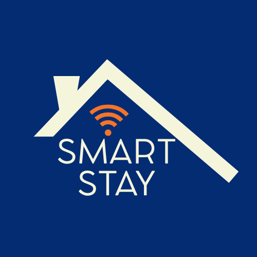

- **Logo Plus:** Es una versión del logotipo con una tonalidad que transmite mayor sofisticación y se utiliza para identificar a los usuarios que optan por la suscripción plus del servicio.

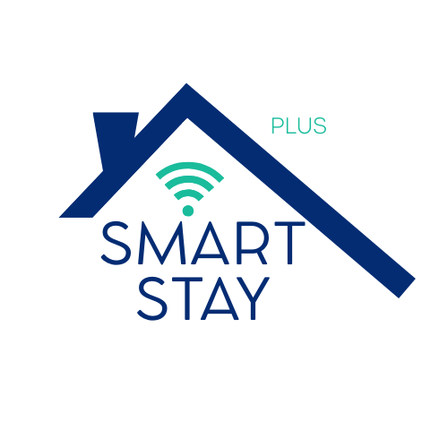

- **Logo Plus Modo Oscuro:** Mantiene la misma finalidad del logo en modo oscuro, pero adaptado específicamente para la versión plus del servicio.

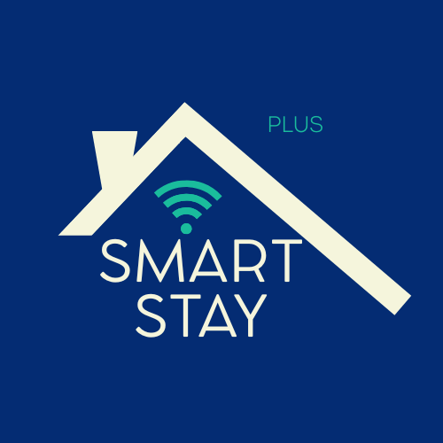

- **Logos Monocromáticos:** Son versiones en blanco y negro pensadas para usos especiales, como impresiones o documentación formal.

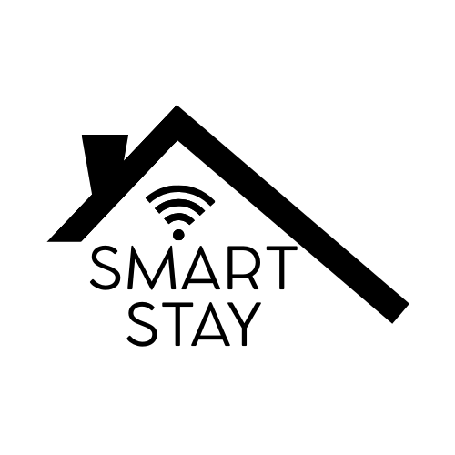
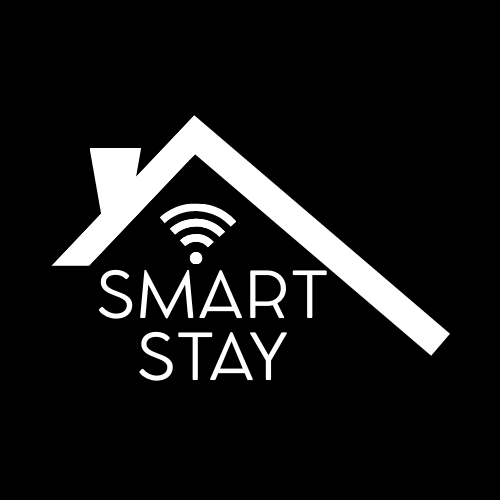

**Tipografía**

- **Fuente principal (Brand & Titles):**  
  **Cocomat Pro**  
  **Uso:** Logo, encabezados y títulos principales dentro de la app o la web.  
  **Razón:** Aporta una apariencia moderna y premium, con una estética limpia que fortalece la identidad visual de la marca.

- **Fuente secundaria (Text & Paragraphs):**  
  **Open Sans o Lato**  
  **Uso:** Textos descriptivos, botones, menús, correos y cualquier bloque de contenido extenso.  
  **Razón:** Son fuentes muy legibles en pantalla, versátiles y complementan la elegancia de Cocomat Pro sin restarle protagonismo.

- **Jerarquía de uso**
1. Títulos (H1, H2): Cocomat Pro Bold.
2. Subtítulos / énfasis: Cocomat Pro Medium.
3. Texto general / párrafos: Open Sans Regular.
4. Botones y menús: Open Sans SemiBold. 

- **Sistema Tipográfico**
  - **H1 (Títulos principales):** Cocomat Pro Bold – 32px  
  - **H2 (Subtítulos / secciones):** Cocomat Pro Medium – 24px  
  - **H3 (Bloques / cards):** Cocomat Pro Medium – 20px  
  - **Texto cuerpo (párrafos):** Open Sans Regular – 16px  
  - **Texto secundario / notas:** Open Sans Regular – 14px  
  - **Botones primarios:** Open Sans SemiBold – 16px (MAYÚSCULAS)

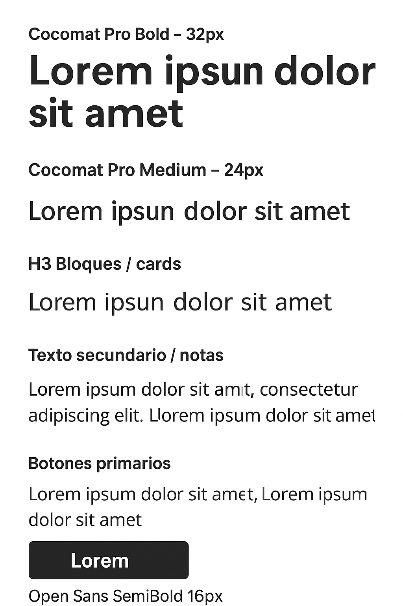

#### 3.1.2. Information Architecture
### UX Heuristics & Principles Evaluation

### Usability – Inclusive Design – Information Architecture

- **CARRERA:** Ingeniería de Software  
- **CURSO:** Aplicaciones para Dispositivos Móviles  
- **SECCIÓN:** 7454  
- **PROFESOR:** Jorge Luis Mayta Guillermo  
- **AUDITOR:** Equipo Smart Stay  
- **CLIENTE(S):** Administradores de Hoteles Boutique y Huéspedes de Hoteles  
- **SITE o APP A EVALUAR:** Smart Stay Mobile Application  

---

### TAREAS A EVALUAR

#### Segmento Objetivo #1: Staff Operativo de Hoteles (Administradores y Personal)

- Gestión de habitaciones: visualización en tiempo real del estado (disponible, ocupado, mantenimiento).
- Coordinación de tareas de limpieza: asignación rápida y seguimiento de housekeeping.
- Notificaciones operativas: alertas sobre incidencias, check-in/check-out y solicitudes de huéspedes.
- Reportes operativos: acceso a métricas de ocupación y estado del hotel.
- Control de incidencias: registro y seguimiento de problemas técnicos en habitaciones.

---

#### Segmento Objetivo #2: Huéspedes de Hoteles

- Check-in / Check-out digital: proceso rápido y sin contacto desde la aplicación.
- Control de habitación: manejo de dispositivos IoT (iluminación, temperatura, Wi-Fi).
- Solicitud de servicios: acceso a room service, limpieza y soporte técnico.
- Personalización de la experiencia: configuración de preferencias durante la estancia.
- Comunicación con el hotel: contacto directo mediante canales digitales.

---

### No incluidas en esta versión de la evaluación:

- Integración con sistemas financieros avanzados (facturación completa).
- Conexión con plataformas externas (marketplaces o agencias de viaje).
- Funcionalidades de marketing interno del hotel.

---

### ESCALA DE SEVERIDAD

| Nivel | Descripción |
|------|------------|
| 1 | Problema leve: no afecta significativamente la experiencia. |
| 2 | Problema moderado: genera fricción ocasional en el uso. |
| 3 | Problema grave: afecta la eficiencia del usuario de forma recurrente. |
| 4 | Problema crítico: impide completar tareas principales dentro de la app. |

---

### TABLA RESUMEN

| # | Problema | Escala de severidad | Heurística/Principio violado |
|--|----------|---------------------|-----------------------------|
| 1 | Dificultad para visualizar el estado de habitaciones en tiempo real | 3 | Visibilidad del estado del sistema |
| 2 | Notificaciones poco configurables para el staff | 2 | Flexibilidad y eficiencia de uso |
| 3 | Navegación poco clara entre módulos principales | 3 | Consistencia y estándares |
| 4 | Exceso de pasos en el proceso de check-in digital | 2 | Minimizar carga cognitiva |
| 5 | Falta de retroalimentación inmediata en acciones del usuario | 3 | Feedback del sistema |
| 6 | Opciones de personalización poco visibles para huéspedes | 2 | Reconocimiento antes que recuerdo |

---

### ANÁLISIS GENERAL

La arquitectura de información de Smart Stay presenta una estructura basada en tareas y roles, lo que facilita la segmentación entre usuarios internos (staff) y externos (huéspedes). Sin embargo, se identifican oportunidades de mejora en la claridad de navegación, visibilidad del estado del sistema y optimización de flujos críticos como el check-in digital.

Se concluye que una correcta reorganización de la jerarquía de información y mejora en la retroalimentación visual permitirá reducir la carga cognitiva del usuario y mejorar la eficiencia operativa del sistema.


##### 3.1.2.1. Organization Systems

En el diseño de interfaces digitales centradas en el usuario, el Sistema de Organización es el componente de la arquitectura de información encargado de definir cómo se agrupan, clasifican y presentan los contenidos dentro de la plataforma. Su objetivo principal es permitir que los usuarios puedan explorar, comprender y acceder a la información de forma rápida e intuitiva, reduciendo la carga cognitiva y mejorando la usabilidad del sistema.

Para la solución Smart Stay, se ha implementado un sistema de organización híbrido que combina estructuras jerárquicas, funcionales y orientadas a tareas. Esta decisión responde a la necesidad de gestionar dos tipos de usuarios principales: el Staff Operativo y los Huéspedes, cada uno con objetivos y flujos de interacción distintos dentro de la aplicación móvil.

En la Landing Page, el contenido se organiza en bloques priorizados que siguen una lógica de captación y conversión. En primer lugar, se destacan las llamadas a la acción principales, como “Probar Demo” o “Explorar Funcionalidades”, seguidas por la propuesta de valor del sistema, donde se explica el uso de tecnologías móviles e IoT para la gestión hotelera. El encabezado (header) y el pie de página (footer) estructuran la navegación mediante accesos directos a secciones clave como beneficios, características, planes y contacto.

Esta organización permite que los usuarios comprendan rápidamente qué ofrece Smart Stay y cómo interactuar con la plataforma, aplicando principios de jerarquía visual, progressive disclosure y adaptabilidad a dispositivos móviles.

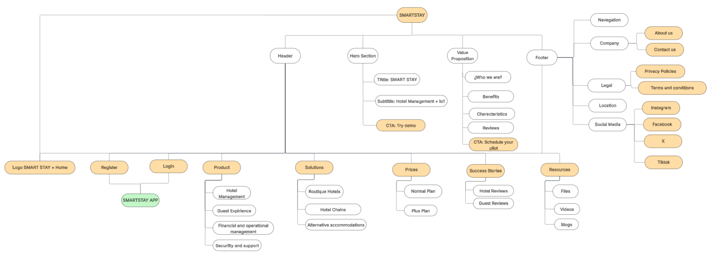

En la Aplicación Móvil, la organización del contenido está orientada a tareas y roles. El acceso inicial se realiza mediante autenticación (login), donde el usuario es redirigido automáticamente según su perfil (Staff o Huésped).

Una vez dentro del sistema, la estructura se organiza en módulos principales accesibles desde la navegación inferior o menú principal:

- Dashboard: vista general del estado del sistema.
- Habitaciones: gestión de disponibilidad y estado.
- Servicios: solicitudes y gestión de requerimientos.
- Perfil: configuración del usuario.

Cada módulo se desglosa en subniveles donde se presentan funcionalidades específicas, manteniendo una estructura jerárquica clara:

- Nivel 1: módulos principales
- Nivel 2: submódulos (ej. tareas de limpieza, incidencias)
- Nivel 3: acciones específicas (ej. marcar habitación como limpia)

Adicionalmente, se aplica una organización contextual, donde la información cambia según la acción del usuario. Por ejemplo:

- Durante el check-in: se priorizan datos del huésped.
- Durante operaciones del staff: se priorizan tareas y estados en tiempo real.
- Durante la estancia: se destacan servicios y control de habitación.

Asimismo, algunos procesos siguen una organización secuencial, como el check-in digital o la solicitud de servicios, guiando al usuario paso a paso para evitar errores.

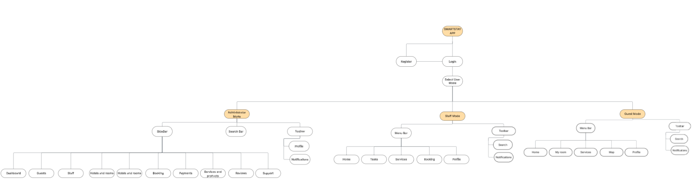

##### 3.1.2.2. Labelling Systems

El sistema de etiquetado define cómo se nombran las secciones, botones y funcionalidades dentro de la aplicación, permitiendo que el usuario comprenda rápidamente el propósito de cada elemento. En Smart Stay, las etiquetas se diseñan bajo principios de claridad, consistencia y orientación al usuario, adaptándose tanto al Staff Operativo como a los Huéspedes.

---

| Etiqueta | Ubicación / Componente | Función |
|----------|------------------------|--------|
| Home | Header / Navegación principal | Redirige a la pantalla principal o dashboard. Permite acceso rápido al inicio. |
| Rooms | Menú principal / App | Acceso a la gestión de habitaciones (estado, disponibilidad, mantenimiento). |
| Services | Menú principal | Muestra los servicios disponibles (limpieza, room service, soporte). |
| Dashboard | Pantalla principal | Vista general del estado del sistema y resumen de operaciones. |
| Bookings | Módulo de reservas | Permite gestionar reservas activas y futuras. |
| Check-in | Flujo principal | Permite registrar la entrada del huésped de forma digital. |
| Check-out | Flujo principal | Permite finalizar la estancia del huésped de forma rápida. |
| Login | Pantalla de acceso | Inicio de sesión del usuario. Término estándar y reconocido. |
| Sign Up | Pantalla de acceso | Registro de nuevos usuarios. Corto, claro y amigable. |
| Try Demo | Landing Page (CTA) | Llamada a la acción principal para probar la aplicación. |
| My Room | App Huésped | Acceso al control de la habitación (IoT, temperatura, iluminación). |
| Requests | App Huésped | Permite solicitar servicios del hotel desde el móvil. |
| Tasks | App Staff | Gestión de tareas operativas (limpieza, mantenimiento). |
| Notifications | Icono / App | Muestra alertas en tiempo real sobre eventos importantes. |
| Profile | Menú usuario | Configuración de cuenta y preferencias del usuario. |
| Settings | Menú secundario | Ajustes generales del sistema. |
| Reports | App Staff | Acceso a métricas y reportes operativos del hotel. |
| Contact | Landing / App | Permite comunicación con el hotel o soporte técnico. |

---

##### 3.1.2.3. SEO Tags and Meta Tags

Los SEO tags y meta tags son elementos fundamentales dentro de la Landing Page de Smart Stay, ya que permiten mejorar la visibilidad del sistema en motores de búsqueda, facilitar su indexación y optimizar la forma en que se presenta tanto en resultados de búsqueda como en redes sociales.

Además, estos elementos son clave para garantizar una correcta visualización en dispositivos móviles, mejorar la experiencia del usuario y aumentar la tasa de interacción (CTR).

La Landing Page de Smart Stay implementa etiquetas esenciales como: charset, viewport, title, description, keywords y favicon, las cuales permiten estructurar correctamente la información del sitio.

---

### Meta charset

```html
<meta charset="UTF-8">
```

- Define la codificación de caracteres de la página.
- Permite que el contenido se muestre correctamente, incluyendo tildes, símbolos y caracteres especiales.
- Es fundamental para evitar errores de visualización en distintos navegadores.

---

### Meta viewport

```html
<meta name="viewport" content="width=device-width, initial-scale=1.0">
```

- Permite que la página sea responsive.
- Ajusta automáticamente el contenido al tamaño de la pantalla del dispositivo.
- Mejora la experiencia de usuario en smartphones y tablets.

---

### Title

```html
<title>Smart Stay</title>
```

- Define el título de la página que aparece en la pestaña del navegador.
- Es uno de los factores más importantes para SEO.
- Se muestra como encabezado principal en los resultados de búsqueda.

---

### 1. Meta Tags principales

- **charset:** Define la codificación del documento. UTF-8 es el estándar actual.
- **viewport:** Permite adaptar la página a diferentes dispositivos y resoluciones.
- **description:** Proporciona un resumen del contenido de la página. Es el texto que aparece debajo del título en los resultados de búsqueda.
- **keywords:** Lista de palabras clave relacionadas con el sistema (ej. hotel management, mobile app, IoT hotel).
- **author:** Identifica al creador del contenido (Smart Stay Team).

---

### 2. Meta Tags para Redes Sociales (Open Graph)

```html
<meta property="og:title" content="Smart Stay">
<meta property="og:description" content="Solución móvil para gestión hotelera con IoT">
<meta property="og:image" content="assets/logo.png">
<meta property="og:url" content="https://smartstay.com">
```

- Permiten controlar cómo se muestra la página al compartirla en redes sociales.
- Mejoran la apariencia visual del enlace (imagen, título y descripción).
- Aumentan la probabilidad de interacción del usuario.

---

### 3. Otros elementos importantes

**Favicon:**

```html
<link rel="icon" href="assets/favicon.png">
```

- Representa el icono del sitio en la pestaña del navegador.
- Refuerza la identidad visual de la marca.

**Canonical URL:**

```html
<link rel="canonical" href="https://smartstay.com">
```

- Evita problemas de contenido duplicado en buscadores.

---

##### 3.1.2.4. Searching Systems

El sistema de búsqueda de Smart Stay permite a los usuarios localizar información, reservas, servicios y funcionalidades de manera rápida y eficiente. En la Landing Page, la búsqueda está orientada a descubrir contenido general sobre la plataforma, utilizando accesos directos, enlaces destacados y navegación guiada hacia secciones clave como “Try Demo” o “Benefits”.

En la aplicación móvil, el sistema de búsqueda es más funcional y está enfocado en la gestión de información específica. Permite a los usuarios filtrar y ordenar datos como habitaciones, reservas, servicios o tareas operativas, utilizando autocompletado, filtros dinámicos y persistencia de resultados. El diseño se basa en principios de usabilidad, consistencia y eficiencia, asegurando que el usuario encuentre lo que necesita sin dificultad.

---

| Search Type | Location / Component | Function |
|-------------|---------------------|----------|
| General Search | Landing Page / Header | Permite buscar información general sobre la plataforma y sus servicios (ej. "servicios", "demo", "beneficios"). Incluye autocompletado básico. |
| Try Demo / Benefits Links | Landing Page / Hero & Value Sections | Funciona como búsqueda indirecta, guiando al usuario hacia contenido relevante sin necesidad de ingresar texto. |
| Rooms Search | Mobile App / Rooms Section | Permite buscar habitaciones por número, estado (disponible, ocupado, mantenimiento) o tipo. |
| Bookings Search | Mobile App / Bookings Section | Filtrado por fechas, estado de reserva (pendiente, confirmada, cancelada) y tipo de cliente. |
| Services Search | Mobile App / Services Section | Permite buscar servicios disponibles (limpieza, room service, soporte técnico) mediante filtros y categorías. |
| Tasks Search | Mobile App / Staff Module | Permite al staff localizar tareas asignadas por prioridad, estado o tipo de actividad. |
| Notifications Search | Mobile App / Notifications Panel | Permite revisar alertas y eventos importantes mediante filtrado por tipo o fecha. |

---

##### 3.1.2.5. Navigation Systems

El sistema de navegación de Smart Stay define cómo los usuarios se desplazan dentro de la plataforma, permitiendo acceder a las distintas secciones de forma clara, rápida e intuitiva. Este sistema está diseñado bajo principios de consistencia, accesibilidad y eficiencia, adaptándose tanto a la Landing Page como a la aplicación móvil.

---

### Landing Page Navigation

| Navigation Item | Location / Component | Function |
|-----------------|----------------------|----------|
| Home | Header | Enlace a la página principal. Permite regresar al inicio desde cualquier sección. |
| Services | Header | Acceso directo a la sección de servicios ofrecidos por la plataforma. |
| Benefits | Header / Value Section | Redirige a la sección donde se explican las ventajas del sistema. |
| Contact | Header | Permite acceder al formulario de contacto o soporte. |
| Sign Up | Header (button) | Registro de nuevos usuarios. Botón destacado visualmente. |
| Login | Header (button) | Acceso a la cuenta del usuario. Fácil de localizar. |
| Try Demo | Hero Section (CTA principal) | Llamada a la acción principal para probar la plataforma. |
| About | Footer / Company | Información institucional de Smart Stay. |
| Privacy Policy | Footer / Legal | Acceso a políticas de privacidad del sistema. |
| Terms & Conditions | Footer / Legal | Información sobre condiciones de uso de la plataforma. |

---

### Mobile Application Navigation

| Navigation Item | Location / Component | Function |
|-----------------|----------------------|----------|
| Dashboard | Bottom Navigation | Vista general del sistema con información resumida. |
| Rooms | Bottom Navigation | Acceso a la gestión y estado de habitaciones. |
| Services | Bottom Navigation | Permite visualizar y solicitar servicios disponibles. |
| Profile | Bottom Navigation | Configuración del usuario y preferencias personales. |
| Notifications | Top Bar / Icon | Acceso a alertas y eventos importantes en tiempo real. |
| Tasks | Staff Module | Permite gestionar tareas operativas asignadas al personal. |
| Bookings | App Module | Acceso a reservas activas, historial y gestión de huéspedes. |
| Back Navigation | App Screens | Permite regresar a la pantalla anterior de forma intuitiva. |

---

#### 3.1.3. Landing Page UI Design

El diseño de la interfaz de la Landing Page de Smart Stay tiene como objetivo principal presentar de manera clara y atractiva la propuesta de valor del sistema, captando la atención del usuario desde el primer contacto. Esta página funciona como el punto de entrada al producto, por lo que su diseño está orientado a la conversión, usabilidad y comprensión inmediata del servicio.

Se aplican principios de diseño centrado en el usuario, jerarquía visual y accesibilidad, permitiendo que tanto potenciales clientes (hoteles) como usuarios finales (huéspedes) comprendan rápidamente los beneficios de la solución.

--- 

##### 3.1.3.1. Landing Page Wireframe

Los wireframes de la Landing Page de Smart Stay definen la estructura base de navegación, asegurando que cada sección tenga un propósito claro dentro de la experiencia del usuario. Cada pantalla está diseñada para guiar al usuario desde el descubrimiento hasta la acción (registro o uso del sistema).

---

### 1. Home

- **Propósito:** Página principal de presentación de Smart Stay.

- **Elementos clave:**
  - Encabezado con menú de navegación.
  - Hero con nombre de la plataforma y botón de llamada a la acción (CTA: Try Demo).
  - Sección “¿Quiénes somos?” con breve descripción.
  - Bloques de beneficios y características principales.
  - Footer con enlaces de contacto, políticas y redes sociales.

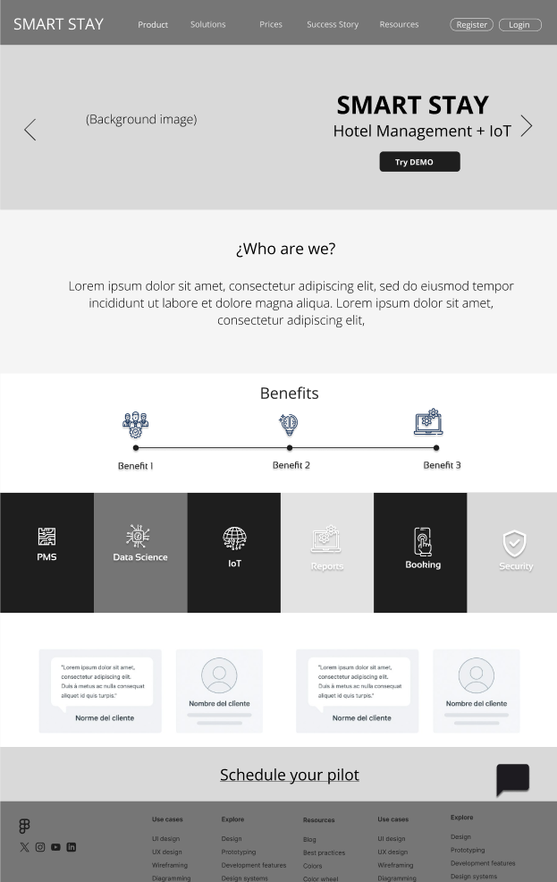

---

### 2. Products

- **Propósito:** Mostrar los productos principales que ofrece Smart Stay.

- **Elementos clave:**
  - Listado de productos o módulos del sistema.
  - Descripción breve de cada funcionalidad.
  - Íconos o ilustraciones representativas.
  - Enlaces para explorar cada producto.

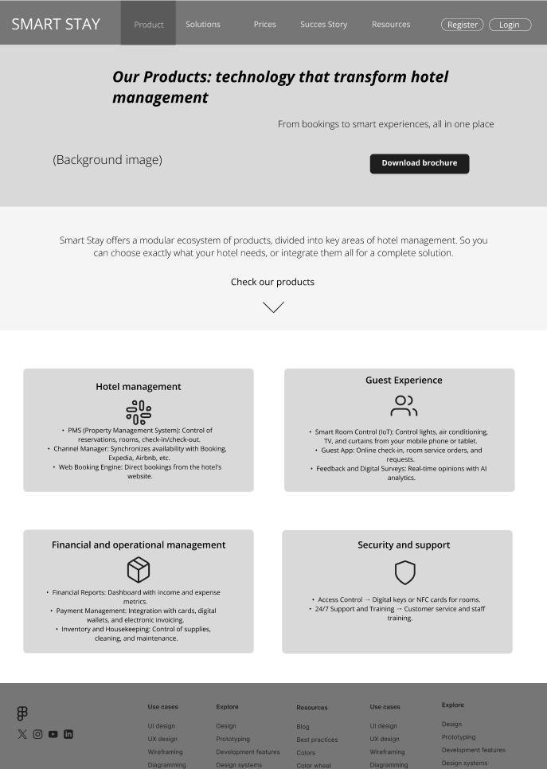

---

### 3. Solutions

- **Propósito:** Explicar cómo la plataforma resuelve problemas específicos del sector hotelero.

- **Elementos clave:**
  - Casos de uso del sistema.
  - Beneficios aplicados a situaciones reales.
  - Explicación de soluciones para gestión, automatización e IoT.

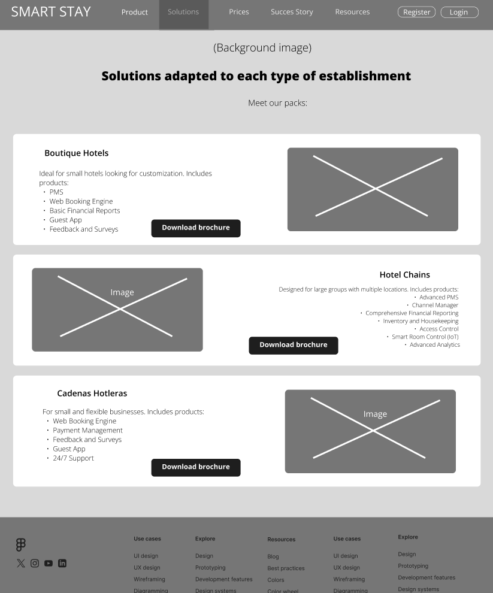

---

### 4. Prices

- **Propósito:** Presentar los planes o modelos de precios del sistema.

- **Elementos clave:**
  - Tabla de precios o planes.
  - Comparación de funcionalidades.
  - Botones de acción para suscripción.

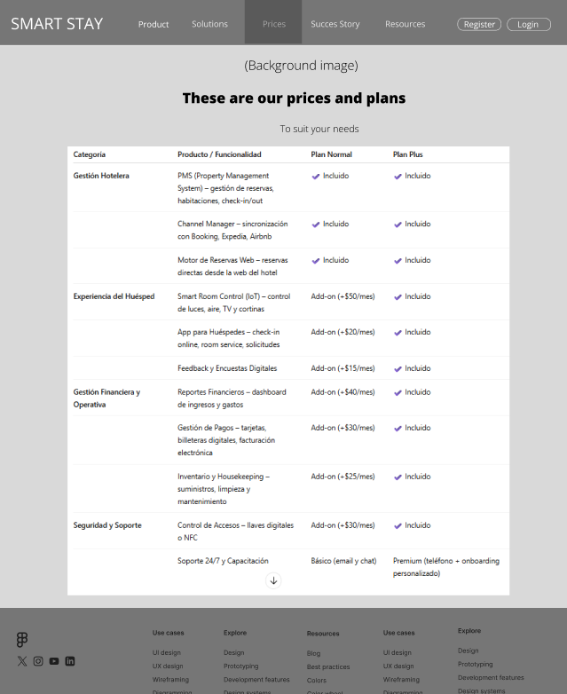
---

### 5. Success Stories

- **Propósito:** Generar confianza mediante casos reales o testimonios.

- **Elementos clave:**
  - Opiniones de clientes.
  - Resultados obtenidos.
  - Fotografías o elementos visuales de respaldo.

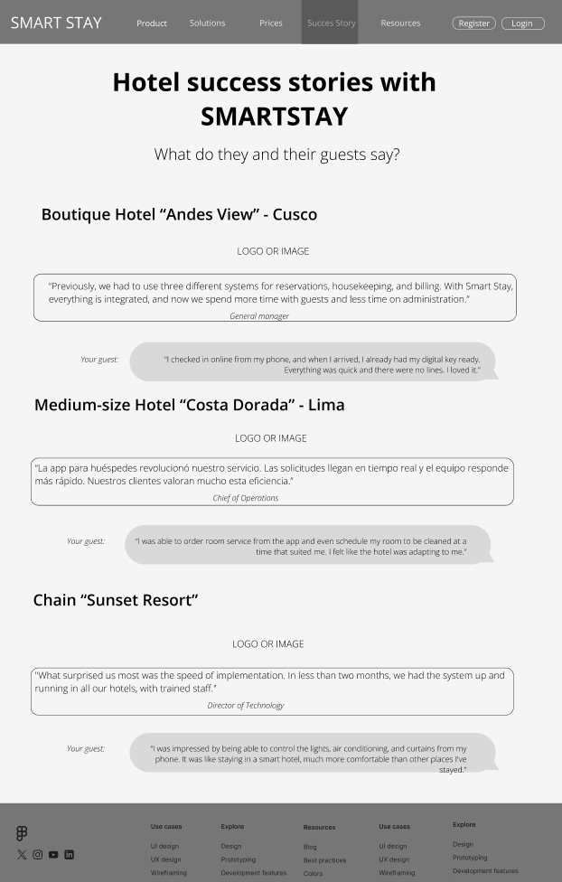

---

### 6. Resources

- **Propósito:** Proporcionar contenido de apoyo para el usuario.

- **Elementos clave:**
  - Guías o documentación.
  - Artículos o blogs.
  - Material informativo sobre el sistema.

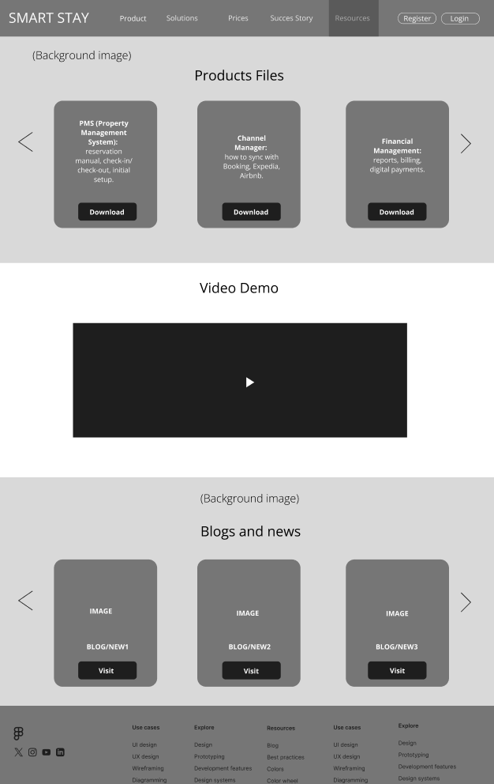

---

### 7. Register

- **Propósito:** Permitir el registro de nuevos usuarios.

- **Elementos clave:**
  - Formulario de registro.
  - Campos básicos (nombre, correo, contraseña).
  - Botón de creación de cuenta.

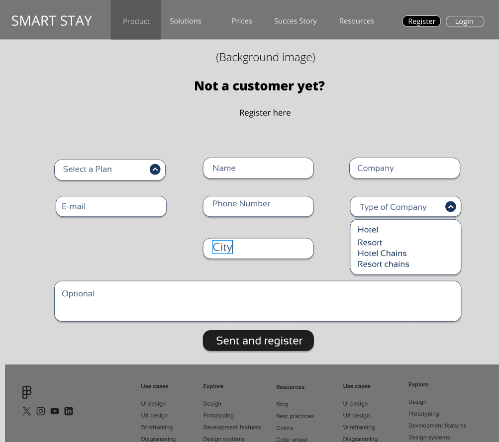

---

### 8. Login

- **Propósito:** Permitir el acceso a usuarios registrados.

- **Elementos clave:**
  - Formulario de inicio de sesión.
  - Campos de usuario y contraseña.
  - Opción de recuperación de contraseña.

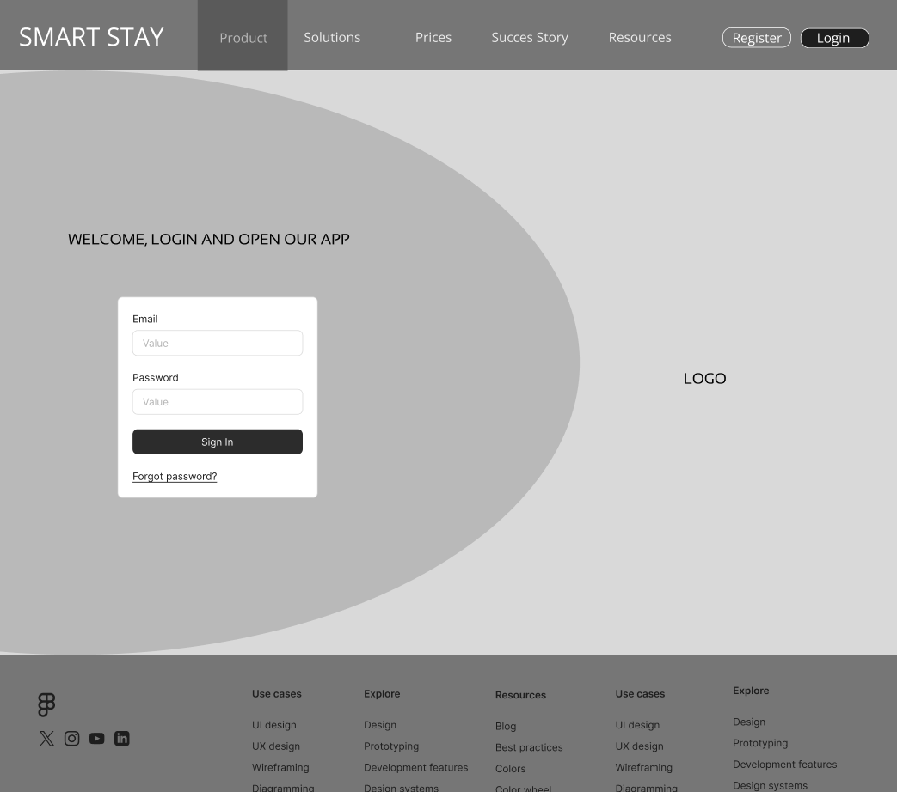

Los wireframes definen la base de navegación de Smart Stay, asegurando que cada sección tenga un propósito claro:

  - Home: captar atención y presentar la plataforma.
  - Productos, Soluciones, Precios: comunicar valor y opciones.
  - Casos de Éxito, Recursos: generar confianza y soporte.
  - Registro y Login: habilitar el acceso a la app.
---

##### 3.1.3.2. Landing Page Mock-up

1. Landing Page

- **Cambios respecto al wireframe:**
  - Se añadió el logotipo de Smart Stay en el header.
  - Paleta de colores aplicada (azul corporativo + tonos complementarios).
  - Imagen de fondo en el Hero con llamada a la acción resaltada (“Try demo”).
  - Iconografía personalizada para los beneficios.

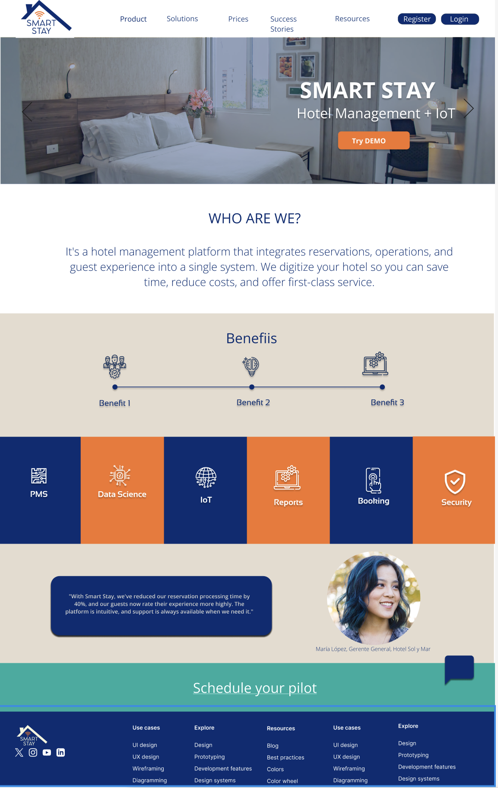

---

2. Product

- **Cambios respecto al wireframe:**
  - Se añadieron tarjetas visuales para cada producto.
  - Uso de iconos representativos para mejorar la comprensión.
  - Aplicación de colores para diferenciar funcionalidades.
  - Mejor organización del contenido en bloques visuales.

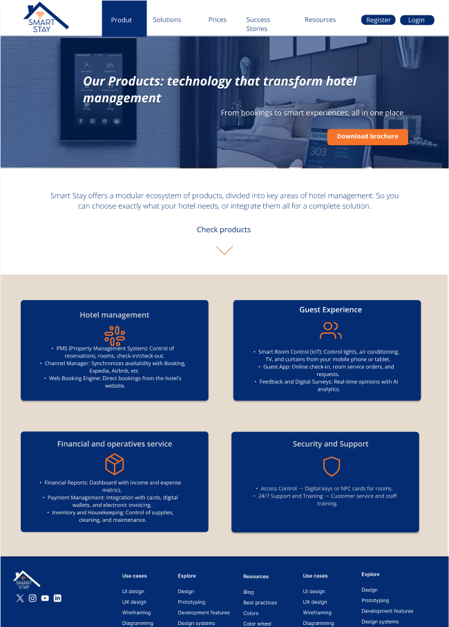

---

3. Solutions

- **Cambios respecto al wireframe:**
  - Se incorporaron secciones visuales para explicar soluciones específicas.
  - Uso de imágenes e iconografía para reforzar el contenido.
  - Reducción de texto y enfoque en contenido visual.
  - Mejora en la jerarquía de información.

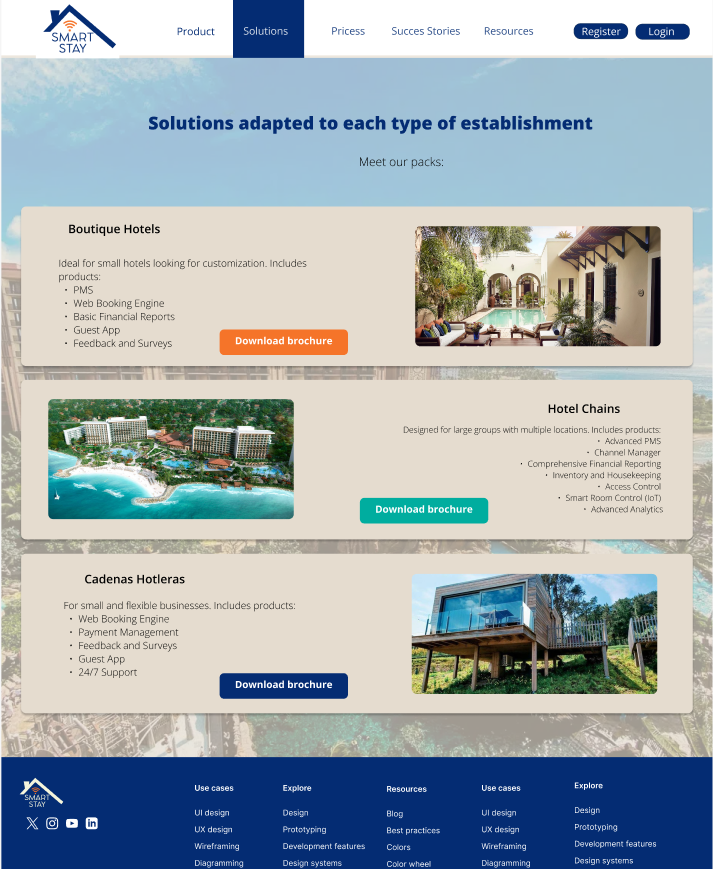

---

4. Prices

- **Cambios respecto al wireframe:**
  - Se implementaron tarjetas de precios con diseño diferenciado.
  - Inclusión de botones de acción para suscripción.
  - Mejora en la comparación entre planes.
  - Uso de colores para destacar el plan principal.

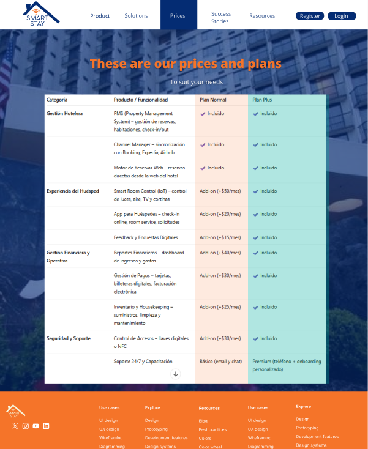

---

5. Success Stories

- **Cambios respecto al wireframe:**
  - Se añadieron testimonios con diseño visual.
  - Inclusión de imágenes o avatares de usuarios.
  - Mejora en la presentación para generar confianza.
  - Organización en bloques claros y legibles.

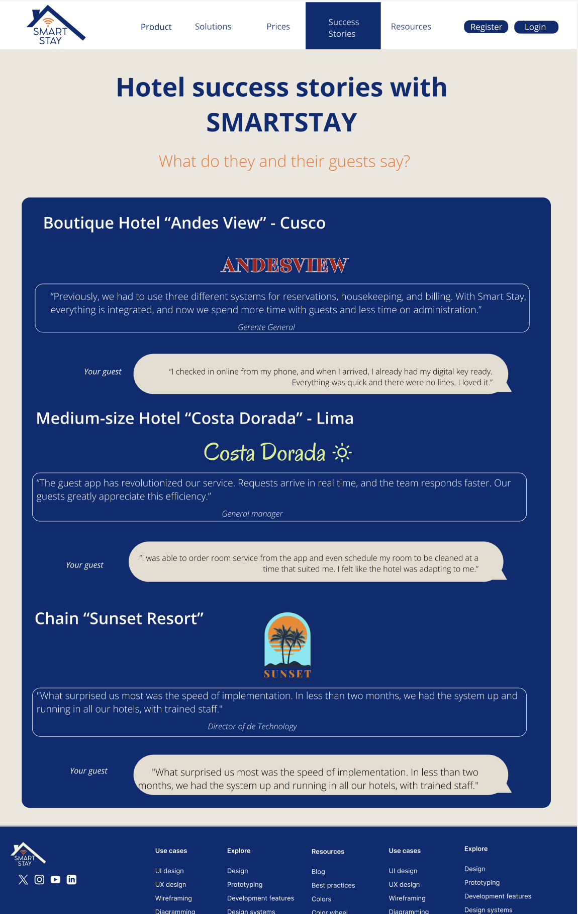

---

6. Resources

- **Cambios respecto al wireframe:**
  - Se estructuraron los recursos en tarjetas visuales.
  - Inclusión de iconos para cada tipo de contenido.
  - Mejora en la accesibilidad a la información.
  - Optimización del diseño para navegación rápida.

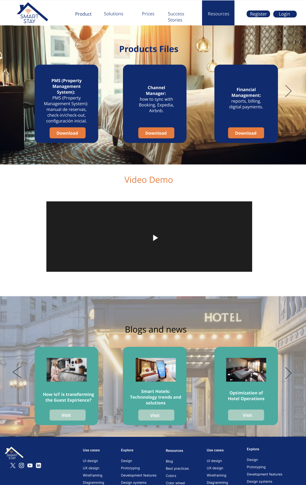

---

7. Register

- **Cambios respecto al wireframe:**
  - Mejora en el diseño del formulario de registro.
  - Aplicación de estilos a los campos de entrada.
  - Botón de registro visualmente destacado.
  - Optimización para dispositivos móviles.

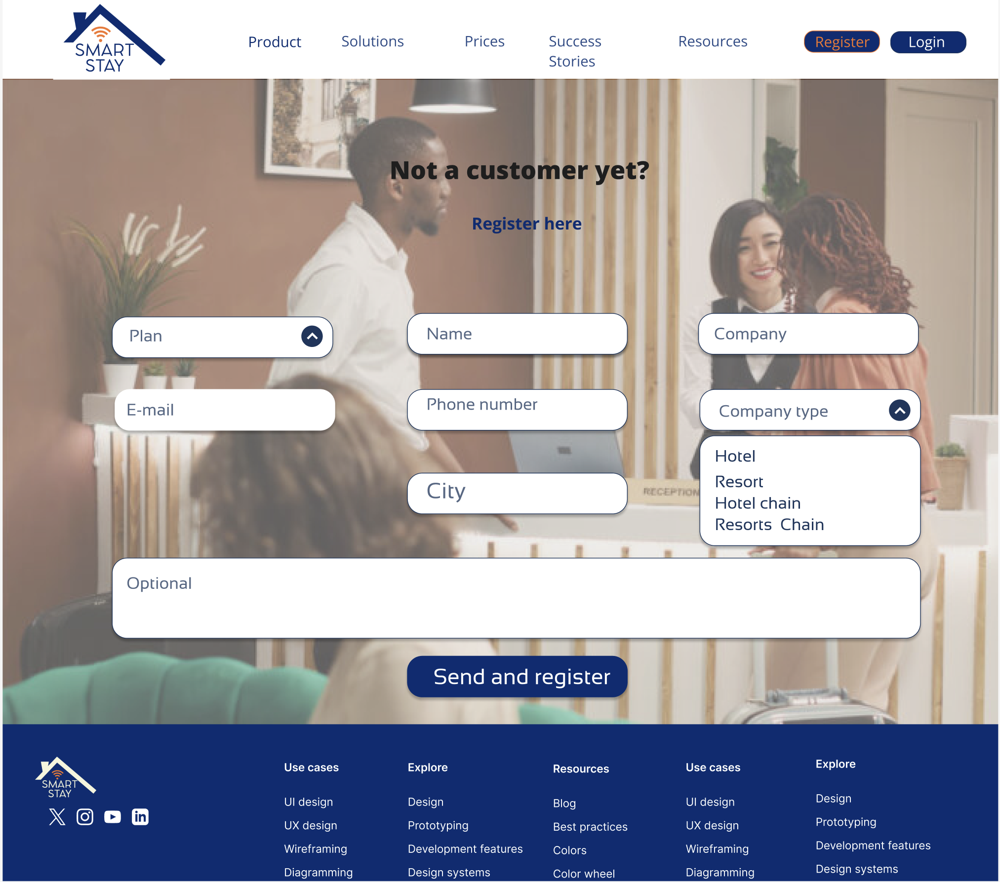

---

8. Login

- **Cambios respecto al wireframe:**
  - Simplificación del formulario de inicio de sesión.
  - Mejora en la visibilidad de los campos.
  - Inclusión de opción de recuperación de contraseña.
  - Diseño optimizado para acceso rápido.

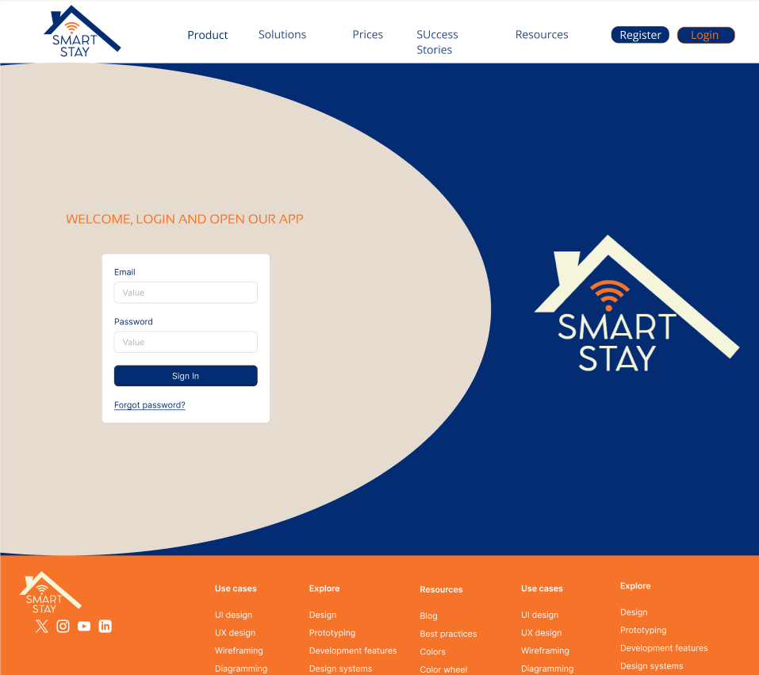

#### 3.1.4. Mobile Applications UX/UI Design

El diseño UX/UI de las aplicaciones móviles de Smart Stay tiene como objetivo principal ofrecer una experiencia intuitiva, eficiente y adaptada a dispositivos móviles, tanto para huéspedes como para el personal del hotel (staff). A diferencia de la Landing Page, estas aplicaciones están orientadas a la interacción constante del usuario, por lo que su diseño prioriza la usabilidad, accesibilidad y rapidez en la ejecución de tareas.


##### 3.1.4.1. Mobile Applications Wireframes

La solución móvil se divide en dos tipos de aplicaciones:

- **Aplicación para Huéspedes:** enfocada en mejorar la experiencia del usuario durante su estadía, permitiendo el control de la habitación, solicitud de servicios y acceso a información relevante.
- **Aplicación para Staff:** orientada a la gestión operativa del hotel, incluyendo tareas, reservas, servicios y control de incidencias.

Ambas aplicaciones comparten principios de diseño consistentes, tales como:

- Uso de navegación inferior (bottom navigation) para acceso rápido a módulos principales.
- Interfaz limpia y minimalista para reducir la carga cognitiva.
- Uso de iconografía clara para facilitar la comprensión.
- Adaptabilidad a diferentes tamaños de pantalla (responsive design).
- Retroalimentación visual mediante notificaciones y estados.


---

### Aplicación Móvil – Huésped

Las pantallas principales de la aplicación para huéspedes incluyen:

- **IntroApp (Bienvenida):**
  - Pantalla inicial que da la bienvenida al usuario.
  - Refuerza la identidad de Smart Stay.

- **Home:**
  - Panel principal con opciones de búsqueda, promociones y acceso rápido a funcionalidades.
  - Incluye acceso a servicios y asistencia.

- **Habitación:**
  - Control de dispositivos IoT (temperatura, luces, cortinas, TV).
  - Información del estado de la habitación.

- **Servicios:**
  - Visualización y solicitud de servicios disponibles (restaurantes, limpieza, amenities).

- **Mapa:**
  - Ubicación de servicios dentro o cerca del hotel.
  - Interfaz de búsqueda y filtros.

- **Perfil:**
  - Información personal del usuario.
  - Gestión de métodos de pago.

- **Notificaciones:**
  - Alertas y mensajes importantes durante la estadía.


---

### Aplicación Móvil – Staff

Las pantallas principales de la aplicación para el personal incluyen:

- **IntroApp Staff:**
  - Pantalla de bienvenida para el personal del hotel.

- **Login:**
  - Acceso seguro mediante credenciales.

- **Home Staff:**
  - Panel con resumen de actividades del día.
  - Acceso a historial y registros.

- **Tareas:**
  - Gestión de tareas asignadas (limpieza, mantenimiento).
  - Visualización de estado de cada actividad.

- **Servicios:**
  - Registro y seguimiento de servicios solicitados por huéspedes.

- **Reservas:**
  - Gestión de check-in y check-out.
  - Visualización de reservas activas.

- **Perfil:**
  - Información del trabajador.
  - Opciones de configuración.

- **Notificaciones:**
  - Alertas sobre cambios, incidencias o nuevas tareas.

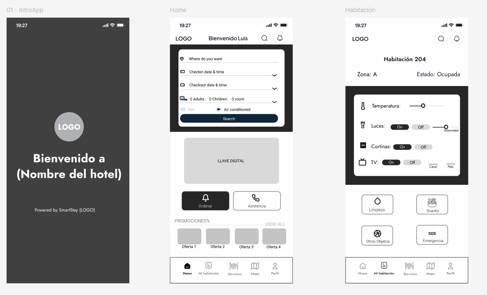
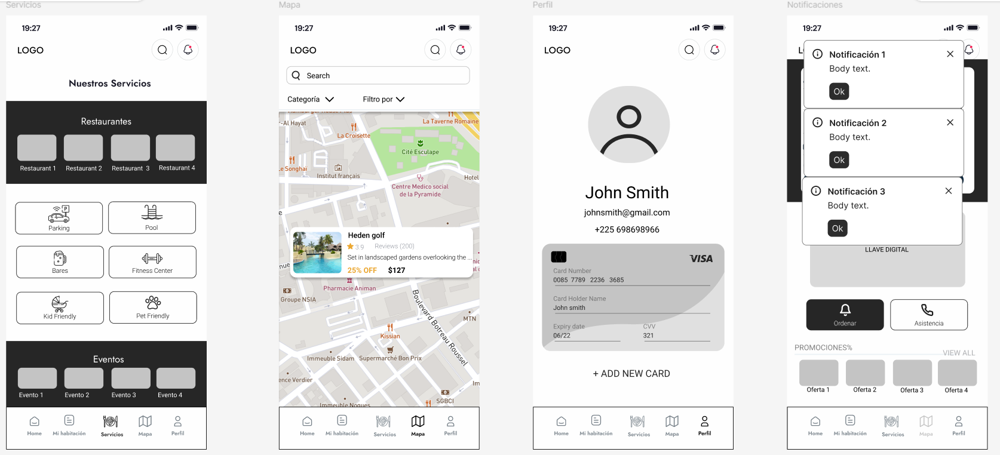

---

### Consideraciones de Diseño UX/UI

El diseño de ambas aplicaciones se basa en los siguientes principios:

- **Usabilidad:** interfaces fáciles de entender y utilizar.
- **Eficiencia:** reducción de pasos para completar tareas.
- **Consistencia:** uso de patrones de diseño similares en ambas apps.
- **Visibilidad del estado:** información clara sobre acciones y resultados.
- **Accesibilidad:** elementos interactivos visibles y fáciles de usar.

---

##### 3.1.4.2. Mobile Applications Wireflow Diagrams

Los wireflow diagrams de las aplicaciones móviles de Smart Stay representan el flujo de navegación entre pantallas, combinando la estructura de los wireframes con las interacciones del usuario dentro del sistema.

Estos diagramas permiten visualizar cómo los usuarios se desplazan entre las distintas funcionalidades de la aplicación, facilitando la comprensión del comportamiento del sistema tanto para huéspedes como para el personal del hotel.

---

### Aplicación Móvil – Huésped

El flujo de navegación para el huésped inicia desde la pantalla de bienvenida (Intro), desde donde el usuario accede al Home, que actúa como punto central de la aplicación.

Desde el Home, el usuario puede navegar hacia:

- **Notificaciones:** para visualizar alertas relacionadas a su estadía.
- **My Room (Habitación):** para controlar dispositivos IoT como luces, temperatura y cortinas.
- **Services:** para explorar y solicitar servicios disponibles.
- **Map:** para ubicar servicios dentro o fuera del hotel.
- **Profile:** para gestionar su información personal y métodos de pago.

Este flujo permite una navegación clara y directa, utilizando una barra de navegación inferior que facilita el acceso rápido a cada módulo.

---

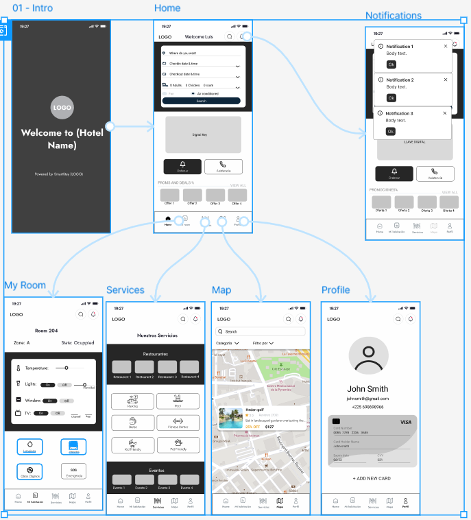

---

### Aplicación Móvil – Staff

El flujo del personal inicia en la pantalla de bienvenida (Intro Staff), seguida del Login, donde el usuario ingresa sus credenciales para acceder al sistema.

Una vez autenticado, el usuario accede al Home Staff, desde donde puede navegar hacia:

- **Notificaciones:** para revisar alertas operativas.
- **Tasks:** para gestionar tareas asignadas (limpieza, mantenimiento, etc.).
- **Services:** para administrar servicios solicitados.
- **Booking (Reservas):** para gestionar check-in y check-out.
- **Profile:** para visualizar y editar su información personal.

Este flujo está diseñado para optimizar la eficiencia operativa del personal, permitiendo acceder rápidamente a las funciones más importantes del sistema.

---

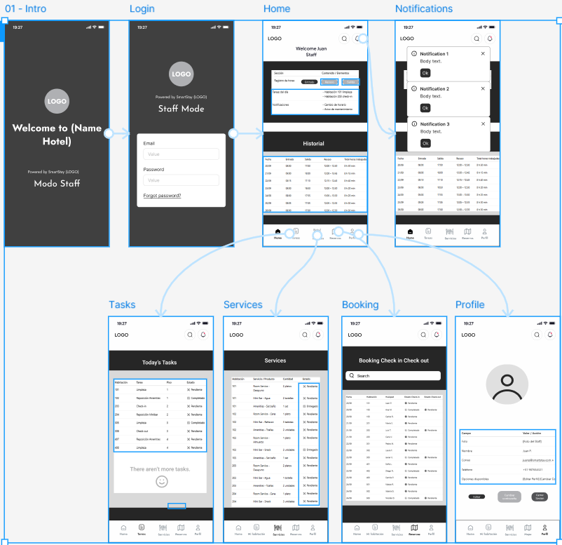

---

##### 3.1.4.3. Mobile Applications Mock-ups

Los mock-ups de las aplicaciones móviles de Smart Stay representan el diseño visual final del sistema, incorporando la identidad gráfica definida, incluyendo colores, tipografía, iconografía e imágenes. A diferencia de los wireframes, estos diseños permiten visualizar cómo interactuará el usuario con una interfaz cercana al producto real.

Se desarrollaron mock-ups para dos tipos de usuarios: huéspedes y personal del hotel (staff), considerando sus necesidades específicas dentro del sistema.

---

### Aplicación Móvil – Huésped

Los mock-ups del módulo de huésped muestran una interfaz moderna, intuitiva y orientada a mejorar la experiencia durante la estadía.

**Pantallas principales:**

- **Intro (Bienvenida):**
  - Pantalla inicial con identidad visual de Smart Stay.
  - Uso de colores corporativos para reforzar branding.

- **Home:**
  - Panel principal con opciones de búsqueda y acceso a funcionalidades.
  - Integración de promociones y accesos rápidos.

- **Habitación:**
  - Interfaz para control de dispositivos IoT (temperatura, luces, cortinas, TV).
  - Diseño centrado en facilidad de uso.

- **Servicios:**
  - Presentación visual de servicios en tarjetas con iconos.
  - Organización clara por categorías.

- **Mapa:**
  - Integración de mapa interactivo.
  - Visualización de ubicaciones con información contextual.

- **Perfil:**
  - Información del usuario con diseño limpio.
  - Gestión de métodos de pago con interfaz visual.

- **Notificaciones:**
  - Alertas visuales organizadas en tarjetas.
  - Fácil lectura e interacción.

---

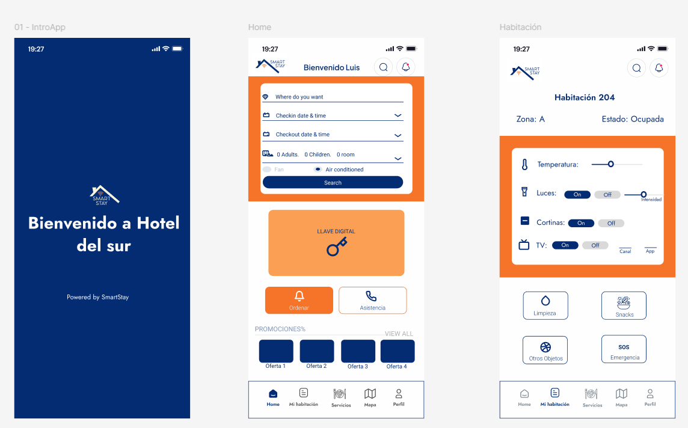

---

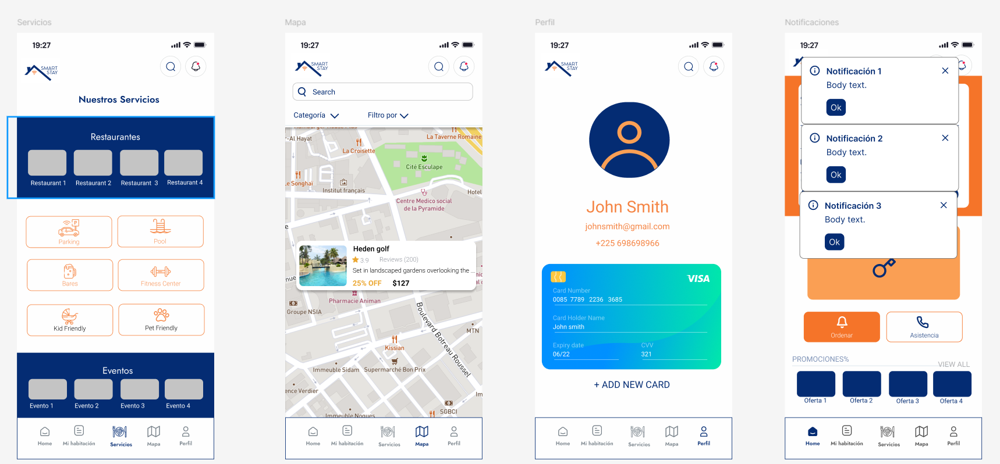

---

### Aplicación Móvil – Staff

Los mock-ups del módulo de staff están diseñados para optimizar la gestión operativa del hotel, priorizando claridad y eficiencia.

**Pantallas principales:**

- **Intro Staff:**
  - Identificación del modo de uso del sistema.
  - Diseño alineado con la identidad visual.

- **Login:**
  - Formulario de acceso claro y sencillo.
  - Campos bien definidos y accesibles.

- **Home Staff:**
  - Panel con resumen de actividades y registros.
  - Acceso a historial y notificaciones.

- **Tareas:**
  - Listado de tareas del día con estado (pendiente, completado).
  - Diseño enfocado en lectura rápida.

- **Servicios:**
  - Registro y seguimiento de servicios.
  - Información organizada en tablas.

- **Reservas:**
  - Gestión de check-in y check-out.
  - Visualización clara de datos.

- **Perfil:**
  - Información del trabajador.
  - Opciones de configuración.

- **Notificaciones:**
  - Alertas visuales para eventos importantes.

---

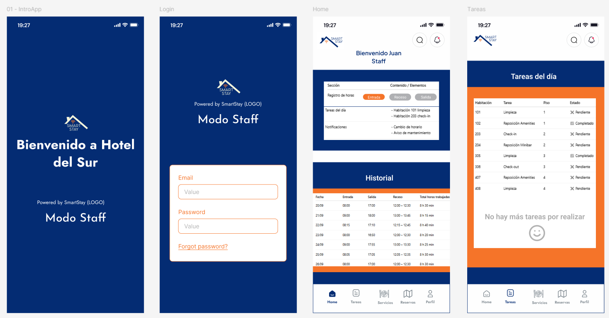

---

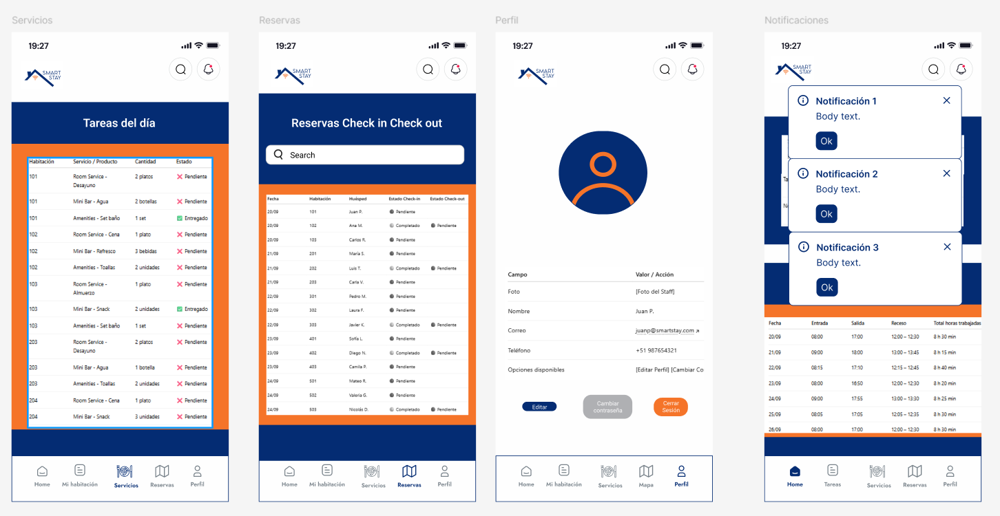

---

##### 3.1.4.4. Mobile Applications User Flow Diagrams

Los User Flow Diagrams de Smart Stay representan de manera detallada el recorrido que realizan los usuarios dentro de la aplicación móvil, desde el ingreso hasta la finalización de sus tareas. Estos diagramas permiten visualizar tanto los flujos ideales (Happy Path) como los escenarios alternativos o de error (Unhappy Path), mejorando el análisis de la experiencia de usuario.

Se desarrollaron flujos para tres tipos de usuarios: huésped, personal (staff) y administrador, considerando sus interacciones específicas con el sistema.

---

### Usuario: Huésped (Guest)

**Happy Path:**
El flujo ideal del huésped inicia al abrir la aplicación, seguido del login o registro. Una vez autenticado, accede al Home, desde donde puede:

- Realizar check-in digital.
- Consultar información de su habitación.
- Solicitar servicios adicionales.
- Visualizar el mapa del hotel.
- Registrar métodos de pago.
- Realizar check-out digital.
- Dejar reseñas de su experiencia.

---

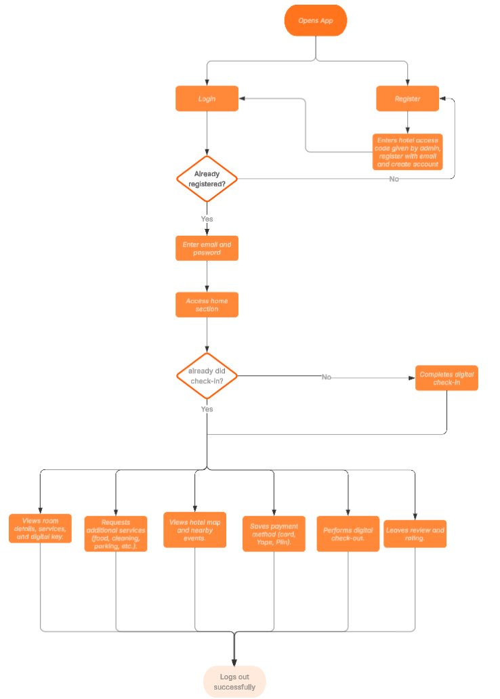

---

**Unhappy Path:**
Incluye escenarios donde:

- El código de acceso es inválido o expirado.
- El check-in aún no está habilitado.
- Un servicio solicitado no está disponible.
- El usuario debe esperar disponibilidad.

---

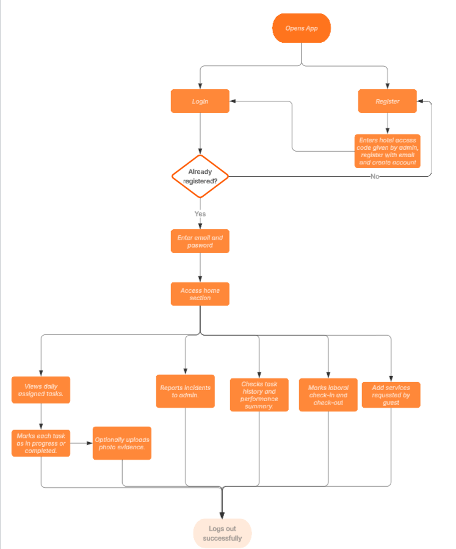

---

### Usuario: Staff

**Happy Path:**
El flujo del personal inicia con login, seguido del acceso al panel principal donde puede:

- Visualizar tareas asignadas.
- Marcar tareas como completadas.
- Gestionar check-in y check-out.
- Consultar historial de actividades.
- Administrar servicios solicitados.

---

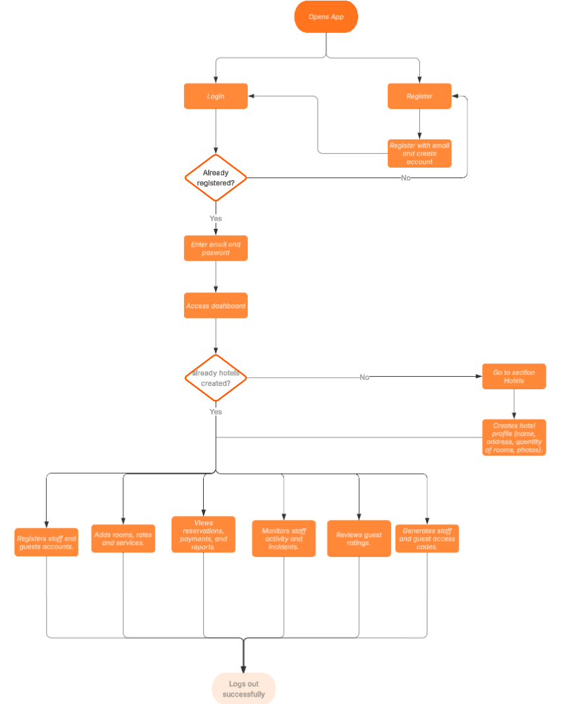

---

**Unhappy Path:**
Se contemplan situaciones como:

- Credenciales incorrectas.
- Falta de conexión a internet.
- Fallo al actualizar estados de tareas.

---

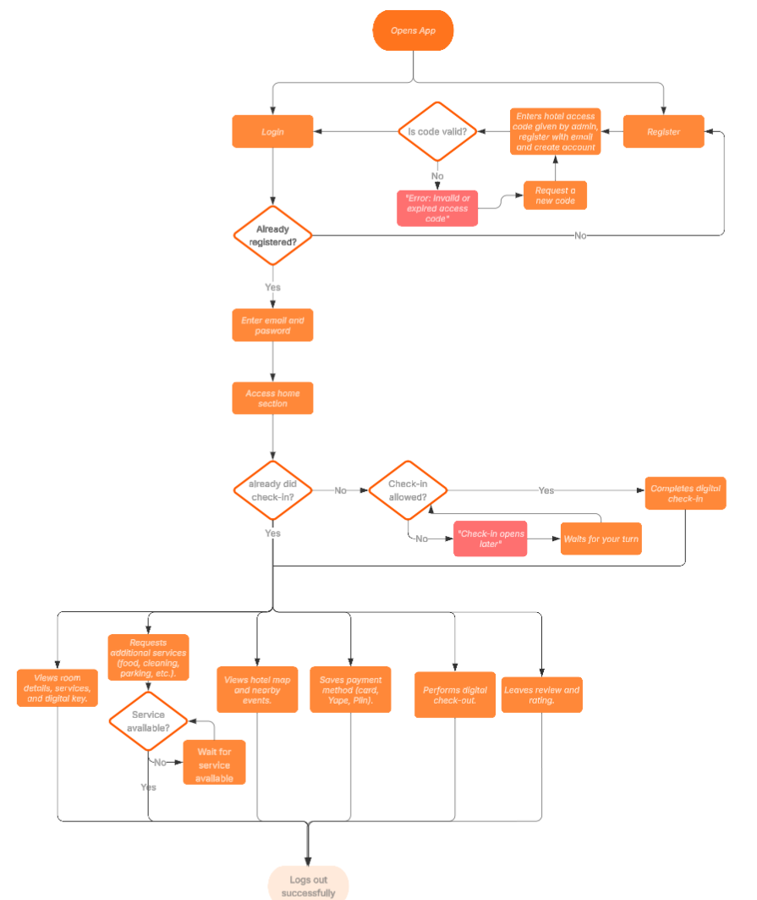

---

### Usuario: Administrador

**Happy Path:**
El flujo del administrador incluye:

- Registro o login.
- Creación de perfil del hotel.
- Gestión de habitaciones, servicios y tarifas.
- Supervisión de reservas, pagos y reportes.
- Monitoreo de actividad y generación de códigos de acceso.

---

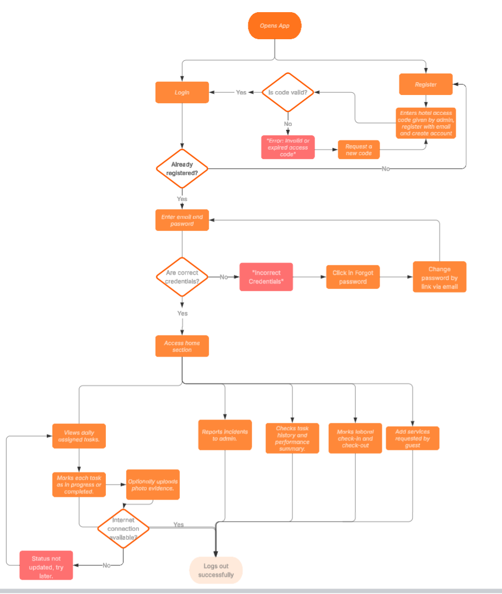

---

**Unhappy Path:**
Incluye casos como:

- Datos incompletos en el registro.
- Duplicación de información.
- Errores en la creación de servicios o habitaciones.

---

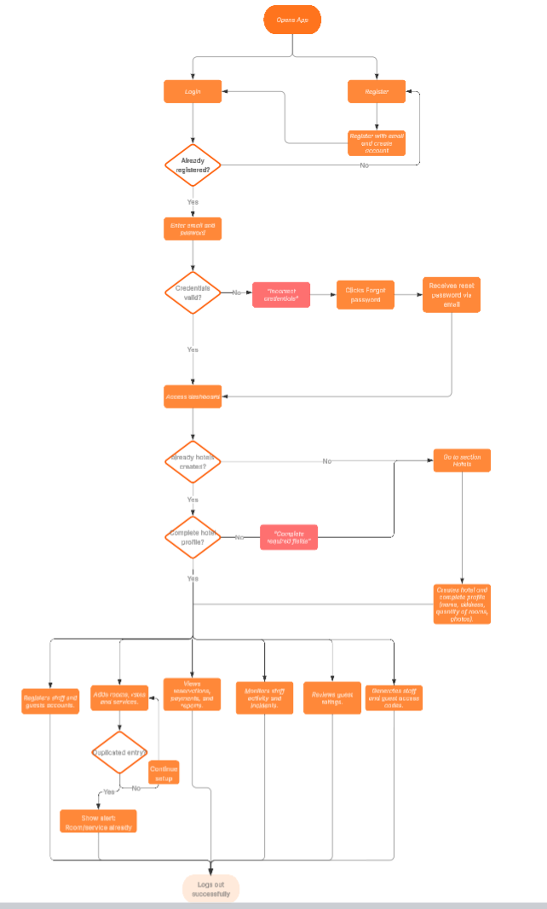

---

##### 3.1.4.5. Mobile Applications Prototyping

El prototipo de la aplicación móvil de Smart Stay fue desarrollado con el objetivo de simular la interacción real del usuario con el sistema, permitiendo validar la navegación, usabilidad y flujo de las funcionalidades principales antes de su implementación.

Para la construcción del prototipo se utilizaron herramientas de diseño como Figma, integrando los mock-ups previamente desarrollados y conectándolos mediante interacciones que representan el comportamiento real de la aplicación.

---

### Características del Prototipo

- Navegación interactiva entre pantallas principales.
- Simulación de acciones del usuario (clicks, transiciones).
- Flujo completo desde el ingreso hasta la finalización de tareas.
- Representación de diferentes tipos de usuario: huésped, staff y administrador.

---

### Flujo del Prototipo

El prototipo incluye los siguientes recorridos principales:

**Huésped:**
- Pantalla de bienvenida (Intro)
- Login / Registro
- Home
- Habitación (control IoT)
- Servicios
- Mapa
- Perfil
- Notificaciones

**Staff:**
- Login
- Home Staff
- Gestión de tareas
- Servicios
- Reservas
- Perfil

**Administrador:**
- Login / Registro
- Panel de administración
- Gestión de habitaciones y servicios
- Supervisión de reservas

---

### Objetivos del Prototipo

- Validar la experiencia de usuario antes del desarrollo.
- Detectar posibles errores en la navegación.
- Evaluar la claridad de las interfaces.
- Mejorar la interacción entre usuario y sistema.

---

### Herramienta Utilizada

El prototipo fue desarrollado en Figma, permitiendo la creación de un entorno interactivo donde se simulan las funcionalidades clave del sistema.

**Prototipo en Figma:**
https://www.figma.com/make/lML4HR5vLsAGMUq3CoqvcS/Minimalist-Photo-Portfolio?t=7b0vXYUcbQwt6eOT-1&preview-route=%2Fguest%2Flogin
---


## Capítulo IV: Product Implementation & Validation

### 4.1. Software Configuration Management

#### 4.1.1. Software Development Environment Configuration

#### 4.1.2. Source Code Management

#### 4.1.3. Source Code Style Guide & Conventions

#### 4.1.4. Software Deployment Configuration

### 4.2. Landing Page & Mobile Application Implementation

#### 4.2.1. Sprint 1

##### 4.2.1.1. Sprint Planning 1

##### 4.2.1.2. Sprint Backlog 1

##### 4.2.1.3. Development Evidence for Sprint Review

##### 4.2.1.4. Testing Suite Evidence for Sprint Review

##### 4.2.1.5. Execution Evidence for Sprint Review

##### 4.2.1.6. Services Documentation Evidence for Sprint Review

##### 4.2.1.7. Software Deployment Evidence for Sprint Review

##### 4.2.1.8. Team Collaboration Insights during Sprint

### 4.3. Validation Interviews

#### 4.3.1. Diseño de Entrevistas

#### 4.3.2. Registro de Entrevistas

#### 4.3.3. Evaluaciones según heurísticas

---

## Conclusiones y recomendaciones

## Video App Validation

### Video About the product

### Video About the team

## Glosario

## Bibliografía

## Anexos
