

  

<h3>Universidad Peruana de Ciencias Aplicadas</h3>

<strong>Facultad de Ingeniería</strong> 
<strong>Carrera de Ingeniería de Software</strong> 

<strong>Período 202610 </strong> 
<strong>1ACC0238</strong> 
<strong>Aplicaciones para Dispositivos Móviles</strong> 
<strong>NRC: 3821</strong> 

<strong>Nombre del profesor: Jorge Luis Mayta Guillermo</strong> 

 <strong>_Informe de Trabajo Final_</strong>  

<strong>Nombre del startup: Movildev</strong> 
<strong>Nombre del producto: SmartStay</strong> 

### Relación de Integrantes

|   Código   | Apellidos y Nombres               |
| :--------: | :-------------------------------- |
| U202518934 | Herrera Albites, Marcoandres      |
| U20231D343 | Montes Ramos, Henry Jaredt        |
| U20211D760 | Paico, July                       |
| U202210787 | Ramirez Escalante, Carlo Patricio |
| U20221E617 | Verona Flores, Ítalo Sebastián    |

<strong> Abril, 2026</strong> 

## Registro de Versiones del Informe

El objetivo de esta sección es resumir las modificaciones relevantes que se realizan al informe durante el ciclo de vida del proyecto.  
Esta sección inicia en una página nueva e incluye un cuadro con la siguiente estructura:

| Versión |   Fecha    | Autor                                 | Descripción de los Cambios                                    |
| :-----: | :--------: | :------------------------------------ | :------------------------------------------------------------ |
|   1.0   | 14/04/2026 | Italo Sebastian Verona Flores (Líder) | Estructuración inicial del proyecto y coordinación del equipo |
|   1.1   | 14/04/2026 | Italo Sebastian Verona Flores         | Creación del documento inicial del Informe de Trabajo Final   |

## Project Report Collaboration Insights

- **URL del repositorio para el Project Report:** https://github.com/Movil-dev-Aplicaciones-Moviles

El desarrollo del presente informe de trabajo final se realizó de manera colaborativa utilizando las herramientas de control de versiones de GitHub. A continuación se presenta la evidencia de la participación y contribuciones de cada miembro del equipo:

El trabajo en el repositorio del informe demuestra la participación activa de todos los miembros del equipo por cada entrega.

_Primer Avance_

En el Primer Avance el objetivo principal fue la construcción completa del informe base del proyecto. El equipo trabajó en:

- Estructura del documento (portada, índice, organización de capítulos).

- Desarrollo de contenido general y conceptual:

- Contexto del proyecto

- Problemática y objetivos

- Alcance del sistema

- Arquitectura conceptual

- Identificación inicial de usuarios, funcionalidades y módulos

- Definición de lineamientos de estilo y formato del documento.

- Revisión colaborativa del contenido, ajustando redacción, coherencia y estilo.

 aqui van las evidencias de los commits del primer avance

 !aqui van las evidencias de los commits del segundo avance

Los gráficos muestran la distribución del trabajo del equipo durante esta fase, donde todos los miembros aportaron contenido significativo al informe base.

### Metodología de Trabajo Colaborativo

- **Control de versiones:** Uso de Git para el seguimiento de cambios y colaboración
- **Revisiones de contenido:** Implementación de pull requests para la validación del contenido
- **Documentación continua:** Actualización incremental del informe durante todo el ciclo del proyecto
- **Coordinación de equipo:** Reuniones regulares para alinear el progreso y resolver conflictos

## Contenido

- [Registro de Versiones del Informe](#registro-de-versiones-del-informe)
- [Project Report Collaboration Insights](#project-report-collaboration-insights)
  - [Metodología de Trabajo Colaborativo](#metodología-de-trabajo-colaborativo)
- [Contenido](#contenido)
- [Student Outcome](#student-outcome)
  - [ABET – EAC - Student Outcome 7](#abet--eac---student-outcome-7)
- [Objetivos SMART](#objetivos-smart)
  - [1. Italo Sebastian Verona Flores](#1-italo-sebastian-verona-flores)
  - [2. Carlo Patricio Ramirez Escalante](#2-carlo-patricio-ramirez-escalante)
  - [3. Henry Jaredt Montes Ramos](#3-henry-jaredt-montes-ramos)
  - [4. Marcoandres Herrera Albites](#4-marcoandres-herrera-albites)
  - [5. July Paico](#5-july-paico)
- [Capítulo I: Presentación](#capítulo-i-presentación)
  - [1.1. Startup Profile](#11-startup-profile)
    - [1.1.1. Descripción de la Startup](#111-descripción-de-la-startup)
    - [1.1.2. Perfiles de integrantes del equipo](#112-perfiles-de-integrantes-del-equipo)
  - [1.2. Solution Profile](#12-solution-profile)
    - [1.2.1. Antecedentes y problemática](#121-antecedentes-y-problemática)
    - [1.2.2. Lean UX Process](#122-lean-ux-process)
      - [1.2.2.1. Lean UX Problem Statements](#1221-lean-ux-problem-statements)
      - [1.2.2.2. Lean UX Assumptions](#1222-lean-ux-assumptions)
      - [1.2.2.3. Lean UX Hypothesis Statements](#1223-lean-ux-hypothesis-statements)
      - [1.2.2.4. Lean UX Canvas](#1224-lean-ux-canvas)
  - [1.3. Segmentos objetivo](#13-segmentos-objetivo)
- [Capítulo II: Requirements Development and Software Solution Design](#capítulo-ii-requirements-development-and-software-solution-design)
  - [2.1. Competidores](#21-competidores)
    - [2.1.1. Análisis competitivo](#211-análisis-competitivo)
    - [2.1.2. Estrategias y tácticas frente a competidores](#212-estrategias-y-tácticas-frente-a-competidores)
    - [Estrategias](#estrategias)
    - [Tácticas](#tácticas)
  - [2.2. Entrevistas](#22-entrevistas)
    - [2.2.1. Diseño de entrevistas](#221-diseño-de-entrevistas)
  - [Entrevista – Segmento 1: Staff Operativo](#entrevista--segmento-1-staff-operativo)
  - [Entrevista – Segmento 2: Huéspedes de Hoteles](#entrevista--segmento-2-huéspedes-de-hoteles)
    - [2.2.2. Registro de entrevistas](#222-registro-de-entrevistas)
  - [Entrevista – Segmento 1: Administradores de Hoteles Boutique y Pequeños](#entrevista--segmento-1-administradores-de-hoteles-boutique-y-pequeños)
    - [Entrevista 1](#entrevista-1)
    - [Entrevista 2](#entrevista-2)
    - [Entrevista 3](#entrevista-3)
  - [Entrevista – Segmento 2: Huéspedes de Hoteles Boutique](#entrevista--segmento-2-huéspedes-de-hoteles-boutique)
    - [Entrevista 1](#entrevista-1-1)
    - [Entrevista 2](#entrevista-2-1)
    - [Entrevista 3](#entrevista-3-1)
    - [2.2.3. Análisis de entrevistas](#223-análisis-de-entrevistas)
  - [2.3. Needfinding](#23-needfinding)
    - [2.3.1. User Personas](#231-user-personas)
  - [2.3.1. User Personas.](#231-user-personas-1)
    - [2.3.2. User Task Matrix](#232-user-task-matrix)
    - [2.3.3. User Journey Mapping](#233-user-journey-mapping)
- [User Journey Mapping](#user-journey-mapping)
    - [2.3.4. Empathy Mapping](#234-empathy-mapping)
      - [1. Segmento Objetivo 1: STAFF OPERATIVO](#1-segmento-objetivo-1-staff-operativo)
      - [2. Segmento Objetivo 2: HUÉSPEDES](#2-segmento-objetivo-2-huéspedes)
    - [1. Segmento Objetivo 1: STAFF OPERATIVO](#1-segmento-objetivo-1-staff-operativo-1)
    - [2. Segmento Objetivo 2: HUÉSPEDES](#2-segmento-objetivo-2-huéspedes-1)
  - [2.3.5. Big Picture EventStorming](#235-big-picture-eventstorming)
    - [2.3.6. Ubiquitous Language](#236-ubiquitous-language)
  - [2.4. Requirements specification](#24-requirements-specification)
    - [2.4.1. User Stories](#241-user-stories)
    - [2.4.2. Impact Mapping](#242-impact-mapping)
    - [Impact Mapping Segmento 1: Hotel Administrador](#impact-mapping-segmento-1-hotel-administrador)
    - [Impact Mapping Segmento 2: Traveler](#impact-mapping-segmento-2-traveler)
  - [2.4.3. Product Backlog](#243-product-backlog)
  - [2.5. Strategic-Level Domain-Driven Design](#25-strategic-level-domain-driven-design)
    - [2.5.1. EventStorming](#251-eventstorming)
      - [2.5.1.1. Candidate Context Discovery](#2511-candidate-context-discovery)
      - [2.5.1.2. Domain Message Flows Modeling](#2512-domain-message-flows-modeling)
      - [2.5.1.3. Bounded Context Canvases](#2513-bounded-context-canvases)
    - [2.5.2. Context Mapping](#252-context-mapping)
    - [2.5.3. Software Architecture](#253-software-architecture)
      - [2.5.3.1. Software Architecture Context Level Diagrams](#2531-software-architecture-context-level-diagrams)
      - [2.5.3.2. Software Architecture Container Level Diagrams](#2532-software-architecture-container-level-diagrams)
      - [2.5.3.3. Software Architecture Deployment Diagrams](#2533-software-architecture-deployment-diagrams)
  - [2.6. Tactical-Level Domain-Driven Design](#26-tactical-level-domain-driven-design)
    - [2.6.1. Bounded Context: \[Nombre del Bounded Context\]](#261-bounded-context-nombre-del-bounded-context)
      - [2.6.1.1. Domain Layer](#2611-domain-layer)
      - [2.6.1.2. Interface Layer](#2612-interface-layer)
      - [2.6.1.3. Application Layer](#2613-application-layer)
      - [2.6.1.4. Infrastructure Layer](#2614-infrastructure-layer)
      - [2.6.1.5. Bounded Context Software Architecture Component Level Diagrams](#2615-bounded-context-software-architecture-component-level-diagrams)
      - [2.6.1.6. Bounded Context Software Architecture Code Level Diagrams](#2616-bounded-context-software-architecture-code-level-diagrams)
        - [2.6.1.6.1. Bounded Context Domain Layer Class Diagrams](#26161-bounded-context-domain-layer-class-diagrams)
        - [2.6.1.6.2. Bounded Context Database Design Diagram](#26162-bounded-context-database-design-diagram)
- [Capítulo III: Solution UI/UX Design](#capítulo-iii-solution-uiux-design)
  - [3.1. Product design](#31-product-design)
    - [3.1.1. Style Guidelines](#311-style-guidelines)
      - [3.1.1.1. General Style Guidelines](#3111-general-style-guidelines)
    - [3.1.2. Information Architecture](#312-information-architecture)
      - [3.1.2.1. Organization Systems](#3121-organization-systems)
      - [3.1.2.2. Labelling Systems](#3122-labelling-systems)
      - [3.1.2.3. SEO Tags and Meta Tags](#3123-seo-tags-and-meta-tags)
      - [3.1.2.4. Searching Systems](#3124-searching-systems)
      - [3.1.2.5. Navigation Systems](#3125-navigation-systems)
    - [3.1.3. Landing Page UI Design](#313-landing-page-ui-design)
      - [3.1.3.1. Landing Page Wireframe](#3131-landing-page-wireframe)
      - [3.1.3.2. Landing Page Mock-up](#3132-landing-page-mock-up)
    - [3.1.4. Mobile Applications UX/UI Design](#314-mobile-applications-uxui-design)
      - [3.1.4.1. Mobile Applications Wireframes](#3141-mobile-applications-wireframes)
      - [3.1.4.2. Mobile Applications Wireflow Diagrams](#3142-mobile-applications-wireflow-diagrams)
      - [3.1.4.3. Mobile Applications Mock-ups](#3143-mobile-applications-mock-ups)
      - [3.1.4.4. Mobile Applications User Flow Diagrams](#3144-mobile-applications-user-flow-diagrams)
      - [3.1.4.5. Mobile Applications Prototyping](#3145-mobile-applications-prototyping)
- [Capítulo IV: Product Implementation \& Validation](#capítulo-iv-product-implementation--validation)
  - [4.1. Software Configuration Management](#41-software-configuration-management)
    - [4.1.1. Software Development Environment Configuration](#411-software-development-environment-configuration)
    - [4.1.2. Source Code Management](#412-source-code-management)
    - [4.1.3. Source Code Style Guide \& Conventions](#413-source-code-style-guide--conventions)
    - [4.1.4. Software Deployment Configuration](#414-software-deployment-configuration)
  - [4.2. Landing Page \& Mobile Application Implementation](#42-landing-page--mobile-application-implementation)
    - [4.2.1. Sprint 1](#421-sprint-1)
      - [4.2.1.1. Sprint Planning 1](#4211-sprint-planning-1)
      - [4.2.1.2. Sprint Backlog 1](#4212-sprint-backlog-1)
      - [4.2.1.3. Development Evidence for Sprint Review](#4213-development-evidence-for-sprint-review)
      - [4.2.1.4. Testing Suite Evidence for Sprint Review](#4214-testing-suite-evidence-for-sprint-review)
      - [4.2.1.5. Execution Evidence for Sprint Review](#4215-execution-evidence-for-sprint-review)
      - [4.2.1.6. Services Documentation Evidence for Sprint Review](#4216-services-documentation-evidence-for-sprint-review)
      - [4.2.1.7. Software Deployment Evidence for Sprint Review](#4217-software-deployment-evidence-for-sprint-review)
      - [4.2.1.8. Team Collaboration Insights during Sprint](#4218-team-collaboration-insights-during-sprint)
  - [4.3. Validation Interviews](#43-validation-interviews)
    - [4.3.1. Diseño de Entrevistas](#431-diseño-de-entrevistas)
    - [4.3.2. Registro de Entrevistas](#432-registro-de-entrevistas)
    - [4.3.3. Evaluaciones según heurísticas](#433-evaluaciones-según-heurísticas)
- [Conclusiones y recomendaciones](#conclusiones-y-recomendaciones)
- [Video App Validation](#video-app-validation)
  - [Video About the product](#video-about-the-product)
  - [Video About the team](#video-about-the-team)
- [Glosario](#glosario)
- [Bibliografía](#bibliografía)
- [Anexos](#anexos)

## Student Outcome

El curso contribuye al cumplimiento del Student Outcome ABET:

### ABET – EAC - Student Outcome 7

**Criterio:** La capacidad de adquirir y aplicar nuevos conocimientos según sea necesario, utilizando estrategias de aprendizaje apropiadas.

En el siguiente cuadro se describe las acciones realizadas y enunciados de conclusiones por parte del grupo, que permiten sustentar el haber alcanzado el logro del ABET – EAC - Student Outcome 7.

| Criterio específico                                                                                                                         | Acciones realizadas                                                                                                                                                                                                                                                                                                                                                                                                                                                                          | Conclusiones                                                                                                                                                                                                                                                                                                                                                                                                                                                                                                               |
| :------------------------------------------------------------------------------------------------------------------------------------------ | :------------------------------------------------------------------------------------------------------------------------------------------------------------------------------------------------------------------------------------------------------------------------------------------------------------------------------------------------------------------------------------------------------------------------------------------------------------------------------------------- | :------------------------------------------------------------------------------------------------------------------------------------------------------------------------------------------------------------------------------------------------------------------------------------------------------------------------------------------------------------------------------------------------------------------------------------------------------------------------------------------------------------------------- |
| **Actualiza conceptos y conocimientos necesarios para su desarrollo profesional y en especial para su proyecto en soluciones de software.** | **Verona Flores, Ítalo Sebastián AV1:** <ul><li>Investigué y apliqué conceptos avanzados de Domain-Driven Design (DDD) tanto estratégico como táctico para la estructuración del proyecto.</li></ul>   **Carlo Patricio Ramirez Escalante (U202210787):**    **Henry Jaredt Montes Ramos (U20231D343):**    **Marcoandres Herrera Albites (U202518934):**    **July Paico (U20211D760):**                                                                               | **Grupo AV1:** La adopción de **Domain-Driven Design (DDD)** para una solución móvil permitió al equipo trascender el desarrollo convencional, logrando desacoplar la lógica de negocio de la complejidad técnica de las plataformas nativas y multiplataforma. Esta capacidad de investigación autónoma sobre patrones arquitectónicos avanzados asegura que el producto sea escalable y profesional, sentando una base sólida para la integración de servicios RESTful y el almacenamiento local exigido en el proyecto. |
| **Reconoce la necesidad del aprendizaje permanente para el desempeño profesional y el desarrollo de proyectos en soluciones de software.**  | **Verona Flores, Ítalo Sebastián AV1:** <ul><li>Participé activamente en la búsqueda de soluciones a errores de compatibilidad durante la integración de capas, utilizando documentación técnica oficial y foros especializados como estrategia de aprendizaje continuo.</li></ul>   **Carlo Patricio Ramirez Escalante (U202210787):**    **Henry Jaredt Montes Ramos (U20231D343):**    **Marcoandres Herrera Albites (U202518934):**    **July Paico (U20211D760):** | **Grupo AV1:** El proceso de desarrollo evidenció que el ecosistema de aplicaciones móviles demanda una actualización constante debido a la rápida evolución de sus frameworks y herramientas. El equipo concluye que la superación de retos técnicos mediante la consulta de documentación oficial y la investigación autónoma es la única vía para evitar la obsolescencia y garantizar la calidad en el ciclo de vida de una solución de software profesional.                                                          |

## Objetivos SMART

En esta sección, cada miembro del equipo formula un plan que incluye al menos dos objetivos SMART centrados en su desarrollo profesional tras finalizar la carrera.

### 1. Italo Sebastian Verona Flores

- **Objetivo 1:** Obtener la certificación **AWS Certified Solutions Architect – Associate** en un plazo de **18 meses** tras la graduación, y escalar hacia la certificación **Professional** en un máximo de **3 años**, con el fin de consolidar mi perfil como **Senior Software Architect**. Esto me permitirá liderar el diseño de infraestructuras escalables para mi propia startup o consultora, asegurando una retribución mensual superior a los **15,000 soles** mediante la validación técnica de mis competencias en el mercado internacional.
- **Objetivo 2:** Fundar y consolidar una Startup tecnológica o establecer una Consultoría de Infraestructura Independiente que sea operativamente remota en un plazo de **5 a 6 años**. El propósito es alcanzar la libertad financiera y técnica necesaria para trasladar mi residencia a un país con altos estándares de seguridad y clima cálido manteniendo un flujo de proyectos que sustente mi desarrollo profesional continuo y mi posicionamiento como referente en arquitectura de software.

### 2. Carlo Patricio Ramirez Escalante

- **Objetivo 1:** [Redactar aquí]
- **Objetivo 2:** [Redactar aquí]

### 3. Henry Jaredt Montes Ramos

- **Objetivo 1:** [Redactar aquí]
- **Objetivo 2:** [Redactar aquí]

### 4. Marcoandres Herrera Albites

- **Objetivo 1:** [Redactar aquí]
- **Objetivo 2:** [Redactar aquí]

### 5. July Paico

- **Objetivo 1:** [Redactar aquí]
- **Objetivo 2:** [Redactar aquí]

## Capítulo I: Presentación

### 1.1. Startup Profile

#### 1.1.1. Descripción de la Startup

La startup Smart Stay surge con el objetivo de transformar la gestión hotelera mediante el uso de tecnologías digitales e Internet of Things (IoT). Nuestra propuesta integra en una sola solución la administración de huéspedes, control de habitaciones y servicios mediante una arquitectura de microservicios y conectividad constante.

A diferencia de soluciones tradicionales, Smart Stay se enfoca en una experiencia móvil robusta, ofreciendo una aplicación nativa en Android (Kotlin) para la gestión operativa del personal y una aplicación multiplataforma en Flutter para el autoservicio y confort del huésped. A través de estas interfaces, el hotel puede optimizar recursos y, al mismo tiempo, ofrecer experiencias personalizadas y automatizadas que elevan el estándar de hospitalidad.

Entre sus principales características destacan:

- Gestión de Acceso Digital: Registro automático y control de acceso a habitaciones desde dispositivos móviles.

- Control de Entorno IoT: Monitoreo y ajuste de temperatura, iluminación y consumo energético de forma remota.

- Servicios Personalizados: Integración de room service y programación de limpieza con notificaciones en tiempo real.

- Optimización Operativa: Tableros de estado para identificación inmediata de habitaciones libres o en mantenimiento.

#### 1.1.2. Perfiles de integrantes del equipo

<table>
  <thead>
    <tr>
      <th>Código</th>
      <th>Integrante</th>
      <th>Carrera</th>
      <th>Perfil Académico y Profesional</th>
      <th>Fotografía</th>
    </tr>
  </thead>
  <tbody>
    <tr>
      <td>U202518934</td>
      <td>Herrera Albites, Marcoandres</td>
      <td>Ing. de Software</td>
      <td>Estudiante enfocado en la innovación tecnológica y la investigación técnica. Posee interés en cómo el Internet de las Cosas (IoT) puede mejorar la experiencia del usuario en el sector hotelero, aportando una visión práctica al desarrollo de soluciones de software eficientes.</td>
      <td>Pendiente</td>
    </tr>
    <tr>
      <td>U20231D343</td>
      <td>Montes Ramos, Henry Jaredt</td>
      <td>Ing. de Software</td>
      <td>Interesado en el desarrollo de la lógica de negocio y la arquitectura de software. Cuenta con conocimientos en programación y gestión de datos, contribuyendo a la estabilidad y escalabilidad del ecosistema de Smart Stay mediante el diseño de servicios robustos.</td>
      <td>Pendiente</td>
    </tr>
    <tr>
      <td>U20211D760</td>
      <td>Paico, July</td>
      <td>Ing. de Software</td>
      <td>Especialista en el diseño de interfaces y experiencia de usuario (UX/UI). Su objetivo es garantizar que tanto la aplicación en Flutter como la de Android nativo sean accesibles, intuitivas y cumplan con los estándares de diseño inclusivo para todos los segmentos de huéspedes.</td>
      <td>Pendiente</td>
    </tr>
    <tr>
      <td>U202210787</td>
      <td>Ramirez Escalante, Carlo Patricio</td>
      <td>Ing. de Software</td>
      <td>Estudiante con orientación al desarrollo móvil y control de calidad. Posee habilidades técnicas en lenguajes de programación modernos y está interesado en la implementación de funcionalidades de alto rendimiento que aseguren la eficiencia operativa del personal del hotel.</td>
      <td>Pendiente</td>
    </tr>
    <tr>
      <td>U20221E617</td>
      <td>Verona Flores, Ítalo Sebastián</td>
      <td>Ing. de Software</td>
      <td>Soy un estudiante con experiencia en programación y diseño de bases de datos. Tengo capacidad para resolver problemas técnicos complejos y  dominio de herramientas de desarrollo que facilitan la integración de servicios RESTful </td>
      <td>Pendiente</td>
    </tr>
  </tbody>
</table>

### 1.2. Solution Profile

#### 1.2.1. Antecedentes y problemática

**Who? (¿Quiénes?)** El problema afecta al Staff Operativo (limpieza, administración, mantenimiento y recepción) y a los huéspedes que buscan autonomía. El Staff Operativo depende de procesos manuales que fragmentan la comunicación interna. Los huéspedes, por su parte, enfrentan una experiencia desconectada que limita su control sobre el entorno de la habitación y la interacción con los servicios del hotel.

**What? (¿Qué?)** El problema central es la nula movilidad y falta de integración digital en la gestión hotelera integral. Esto se traduce en una dependencia de terminales fijas, control ineficiente de habitaciones por falta de datos en tiempo real (IoT), y una experiencia del huésped desconectada de los servicios del hotel.

**Where? (¿Dónde?)** Ocurre en hoteles de tamaño mediano a grande, donde la complejidad operativa y el volumen de huéspedes hacen que los procesos manuales sean ineficientes. La falta de movilidad afecta tanto a las áreas de servicio como a las habitaciones, generando cuellos de botella en la gestión diaria.

**When? (¿Cuándo?)** Ocurre de manera continua las 24 horas. La ineficiencia se agudiza en momentos críticos como los procesos de check-in/check-out, horas pico de solicitudes de servicios, y temporadas de alta ocupación donde la respuesta inmediata es vital para la satisfacción.

**Why? (¿Por qué?)** Se debe a la dependencia de sistemas tradicionales (Legacy Systems) que no permiten la interoperabilidad. Existe una carencia de una arquitectura de software moderna que integre servicios RESTful con tecnología IoT, impidiendo el monitoreo de recursos y la personalización del confort del huésped de forma remota y automatizada.

**How? (¿Cómo?)** La falta de una solución móvil integrada genera ineficiencias operativas, pérdida de productividad y una experiencia del huésped fragmentada. El personal del hotel no puede acceder a información en tiempo real ni gestionar las habitaciones de manera eficiente, mientras que los huéspedes no pueden controlar su entorno ni interactuar con los servicios del hotel desde sus dispositivos móviles.

**How Much? (¿Cuánto?)** La ineficiencia genera una pérdida estimada del 15-20% en la productividad operativa y un aumento innecesario en los costos de suministros y energía por falta de monitoreo. Además, la baja calificación en la experiencia de usuario (User Experience) se traduce en una disminución de la lealtad del cliente y una pérdida de competitividad frente a hoteles tecnológicamente avanzados.

#### 1.2.2. Lean UX Process

##### 1.2.2.1. Lean UX Problem Statements

**Problem Statement: Optimización de la Gestión Operativa y Experiencia del Huésped**

El servicio de Smart Stay busca transformar la gestión hotelera mediante una solución móvil integral que conecte al Staff Operativo con las necesidades en tiempo real de los huéspedes. A través de nuestras aplicaciones móviles, el personal puede administrar de manera eficiente las habitaciones y servicios, mientras que los huéspedes obtienen el control total de su estancia.

Hemos identificado que la dependencia de procesos manuales y sistemas estáticos genera errores críticos en la disponibilidad de habitaciones, tiempos de respuesta lentos en servicios de limpieza y una falta de personalización inmediata. Actualmente, el Staff Operativo carece de una herramienta móvil centralizada que permita la automatización y el monitoreo en tiempo real de los recursos del hotel.

**¿Cómo podríamos digitalizar y automatizar la interacción entre el Staff Operativo y los huéspedes a través de aplicaciones móviles para reducir errores, optimizar la coordinación interna y ofrecer una experiencia personalizada basada en datos en tiempo real?**

**Proposed Solutions (Features)**

Para abordar esta problemática, la solución se centrará en las siguientes funcionalidades integradas en las aplicaciones móviles:

- **Gestión de Inventario de Habitaciones (Staff App):** Visualización centralizada del estado de cada habitación (disponible, ocupada, en mantenimiento) con actualizaciones instantáneas.
- **Check-in y Check-out Digital:** Proceso automatizado para que el huésped registre su entrada y salida desde su dispositivo, sincronizándose con el sistema del hotel.
- **Gestión de Housekeeping (Staff App):** Asignación y seguimiento de tareas de limpieza en tiempo real, con notificaciones al personal cuando una habitación requiere atención.
- **Control de Incidencias de Mantenimiento:** Registro fotográfico y seguimiento de averías reportadas por el personal o el huésped, con flujo de resolución asignado.
- **Dashboard Operativo para el Staff:** Panel de control dentro de la aplicación para que el Staff Operativo gestione recursos, personal y métricas de ocupación diaria.
- **Centro de Servicios al Huésped (Guest App):** Interfaz para solicitar amenities, servicios de habitación o asistencia técnica de manera autónoma.
- **Motor de Notificaciones Inteligentes:** Alertas en tiempo real para el personal sobre nuevas solicitudes y confirmaciones de servicio para los huéspedes.
- **Control de Acceso y Seguridad:** Gestión de llaves digitales y roles de usuario (Staff Operativo vs. Huésped) con permisos diferenciados.

**Business Outcomes**

**Objetivo:** Incrementar la eficiencia operativa y reducir costos por procesos manuales en un periodo de 4 meses.

**Key Results (KR):**

- Reducir en un 20% el tiempo de respuesta del Staff Operativo ante solicitudes de servicios.
- Disminuir en un 10% los errores en el registro de disponibilidad de habitaciones.
- Lograr que el 85% de las tareas de limpieza se reporten y completen a través de la aplicación móvil.

**User Outcomes**

**Objetivo:** Proporcionar una experiencia de usuario fluida y autónoma que maximice la satisfacción del huésped y la productividad del staff.

**Key Results (KR):**

- Lograr que los huéspedes realicen solicitudes de servicios en menos de 45 segundos a través de la aplicación.
- Obtener una calificación promedio de satisfacción de 4.5/5 estrellas en las tiendas de aplicaciones sobre la facilidad de uso.
- Reducir en un 50% la necesidad de que el huésped acuda físicamente a recepción para consultas básicas.

##### 1.2.2.2. Lean UX Assumptions

**Business Assumptions**

1. **Creo que mis clientes necesitan:**
   Una solución integral de gestión hotelera que automatice procesos mediante aplicaciones móviles, optimice el uso de recursos y proporcione una experiencia personalizada a los huéspedes a través de tecnología IoT.

2. **Estas necesidades se pueden resolver con:**
   Un ecosistema de aplicaciones móviles (Android y Flutter) integradas con servicios RESTful y dispositivos IoT que permitan el monitoreo en tiempo real de habitaciones y el control personalizado del ambiente.

3. **Mis clientes iniciales son (o serán):**
   Hoteles boutique y de lujo (3-5 estrellas) con una infraestructura de 50 a 200 habitaciones ubicados en zonas turísticas de Lima Metropolitana.

4. **El valor #1 que un cliente quiere de mi servicio es:**
   Optimización operativa mediante movilidad que reduzca costos y mejore la eficiencia del Staff Operativo, junto con una experiencia tecnológica diferenciada para los huéspedes.

5. **El cliente también puede obtener estos beneficios adicionales:**

- Reducción del 20-30% en costos de energía y servicios públicos mediante monitoreo IoT.
- Visualización de datos operativos en tiempo real desde dispositivos móviles.
- Sincronización inmediata entre las tareas de limpieza y el estado de recepción.
- Reportes automatizados de ocupación y rendimiento de recursos.

6. **Voy a adquirir la mayoría de mis clientes a través de:**
   Marketing directo a gerentes hoteleros, presencia en ferias de hospitalidad (como la Feria Gastronómica y Hotelera de Perú) y alianzas estratégicas con proveedores de hardware IoT.

7. **Haré dinero a través de:**
   Un modelo de suscripción mensual basado en el número de habitaciones gestionadas (SaaS), sumado a una tarifa inicial por implementación de infraestructura IoT y configuración del servicio.

8. **Mi competencia principal en el mercado será:**
   Sistemas de gestión hotelera tradicionales (PMS) que carecen de movilidad nativa, y startups de hotel-tech que no integran el control de la habitación (IoT) en su oferta core.

9. **Los venceremos debido a:**
   Nuestra especialización en movilidad dual (Staff/Huésped), la integración nativa con sensores IoT para personalización del confort y una interfaz diseñada bajo principios de arquitectura de información móvil.

10. **Mi mayor riesgo de producto es:**
    La inestabilidad de la conectividad WiFi en infraestructuras antiguas y la resistencia del Staff Operativo a sustituir métodos manuales por flujos totalmente digitales en dispositivos móviles.

11. **Resolveremos esto a través de:**

- Implementación de un programa piloto con soporte técnico presencial 24/7.
- Capacitación intensiva enfocada en la facilidad de uso de las aplicaciones móviles.
- Modelos de financiamiento para la actualización de la infraestructura de red del hotel.

12. **¿Qué otras suposiciones tenemos que, si se prueba que es falso, causará que nuestro negocio/proyecto no funcione?**

- Los hoteles cuentan con una red estable para soportar el tráfico de datos de sensores IoT.
- El Staff Operativo puede portar dispositivos móviles durante toda su jornada laboral sin inconvenientes.
- Los huéspedes valoran la interacción digital por encima de la interacción humana tradicional en servicios de habitación.

**User Assumptions**

1. **¿Quién es el usuario?**
   Los usuarios son el Staff Operativo (limpieza, mantenimiento y recepción) y los huéspedes. El staff busca agilizar la coordinación de tareas sin depender de bases fijas, mientras que los huéspedes buscan autonomía en el control de su estancia.

2. **¿Dónde encaja nuestro producto en su trabajo o vida?**
   Smart Stay se integra en el flujo diario de trabajo: el Staff Operativo recibe órdenes de servicio y actualiza estados de habitaciones en su aplicación Android mientras se desplaza por el hotel. El huésped usa la aplicación en Flutter para gestionar su confort y servicios desde su llegada hasta el check-out.

3. **¿Qué problemas tiene nuestro producto y cómo se puede resolver?**
   El problema principal es la fragmentación de la información y los tiempos muertos en la comunicación interna. Se resuelve mediante notificaciones automáticas entre aplicaciones y la visualización instantánea del estado de los recursos capturados por IoT.

4. **¿Cuándo y cómo es usado nuestro producto?**
   Es usado continuamente: el Staff Operativo lo utiliza al iniciar turnos de limpieza o al detectar averías; los huéspedes lo activan durante su estancia para ajustar temperatura, iluminación o solicitar servicios de habitación de forma digital.

5. **¿Qué características son importantes?**

- Actualización en tiempo real de disponibilidad de habitaciones (Staff App).
- Gestión de tareas de limpieza y mantenimiento (Staff App).
- Control de dispositivos de habitación mediante IoT (Guest App).
- Solicitud digital de servicios y contacto rápido (Guest App).
- Roles y permisos de seguridad diferenciados.

6. **¿Cómo debe verse nuestro producto y cómo debe comportarse?**
   Debe verse profesional, moderno y ser extremadamente intuitivo (UX móvil). Debe comportarse de forma fluida, con tiempos de respuesta mínimos y ser accesible para usuarios con distintos niveles de alfabetización digital, siguiendo guías de Material Design.

##### 1.2.2.3. Lean UX Hypothesis Statements

**Hypothesis 1: Mobile Check-in/Check-out Autonomy**

**We believe that** implementing an automated digital check-in and check-out system within the Guest App (Flutter) will reduce the average time for these processes by 15%.

**We will know we are successful when we see** that guests complete their registration in less than 3 minutes and 70% of them use the mobile system without needing assistance from the reception staff.

**Hypothesis 2: Staff Operativo Efficiency and Adoption**

**We believe that** providing an intuitive native Android application for the Staff Operativo (housekeeping and maintenance) will achieve at least 80% adoption of the system for their daily coordination tasks.

**We will know this is true when we see** consistent daily use of the Staff App and a 10% reduction in manual operational costs after the first 4 months of implementation.

**Hypothesis 3: Digital Service Satisfaction**

**We believe that** offering a faster and clearer mobile management experience for both guests and the Staff Operativo will significantly improve overall service satisfaction.

**We will know we are successful when we see** a satisfaction score (NPS) of at least 8/10 and that 70% of returning users interact with hotel services via the App without physical intervention.

**Hypothesis 4: IoT-Driven Resource Optimization**

**We believe that** integrating IoT devices for monitoring temperature and energy consumption, accessible via the Staff App, will optimize the hotel's resource usage.

**We will know this is true when we see** a 20% reduction in utility expenses and the generation of detailed consumption reports through the RESTful API services.

**Hypothesis 5: In-Room Experience Personalization**

**We believe that** allowing guests to directly control their room's environment (lighting, temperature) and schedule services through the Guest App will increase the consumption of additional hotel services.

**We will know we are successful when we see** a 25% increase in satisfaction scores regarding room comfort and a 15% increase in digital room service orders.

**Hypothesis 6: Boutique Hotel Market Fit**

**We believe that** offering a scalable subscription model focused on boutique hotels in Lima will generate valid interest for our pilot program.

**We will know this is true when we see** the participation of at least 3 local hotels in our pilot phase with signed collaboration agreements for post-development implementation.

**Hypothesis 7: Mobile-IoT Competitive Advantage**

**We believe that** our complete integration between native mobile applications and IoT technology will provide a superior advantage over legacy hotel management systems.

**We will know we are successful when we see** that pilot hotels report specific operational improvements and express a preference for our mobile solution over traditional manual management.

##### 1.2.2.4. Lean UX Canvas

### 1.3. Segmentos objetivo

Esta sección describe los segmentos asociados al dominio del problema de gestión hotelera manual e ineficiente. Se detallan sus características demográficas e información estadística que sustenta la viabilidad de la solución **Smart Stay** en el mercado de Lima Metropolitana.

---

**Segmento Primario: Staff Operativo de Hoteles Boutique y Pequeños en Lima**

Este segmento comprende al personal encargado de la ejecución y supervisión de las operaciones diarias del hotel, quienes utilizarán la aplicación nativa en **Android** para la gestión de tareas y monitoreo de recursos.

**Perfil Demográfico y Profesional:**

- **Roles Incluidos:** Personal de recepción, supervisores de limpieza (housekeeping), técnicos de mantenimiento y coordinadores de servicios.
- **Edad:** Entre 25 y 45 años.
- **Nivel Educativo:** Técnico o universitario en turismo, hotelería, mantenimiento industrial o administración.
- **Habilidades Tecnológicas:** Usuarios habituales de smartphones con sistema operativo Android; familiarizados con herramientas de mensajería y gestión de tareas básicas.

**Desafíos Operativos:**

- **Dependencia Manual:** Uso de bitácoras físicas o comunicación verbal para reportar estados de habitaciones, lo que genera errores de disponibilidad.
- **Fragmentación de la Información:** Falta de un sistema centralizado para conocer en tiempo real si una habitación requiere mantenimiento o limpieza inmediata.
- **Carga Administrativa:** Tiempo excesivo dedicado a la coordinación entre áreas, reduciendo la eficiencia en la atención directa al huésped.

**Sustento del Segmento:**

- En Lima Metropolitana existen más de 300 hoteles pequeños y boutique (de 20 a 100 habitaciones) que operan con procesos manuales en áreas de servicios y mantenimiento.
- La ineficiencia operativa en este segmento puede representar pérdidas de entre el **15% y 20%** en la productividad del personal debido a fallos en la coordinación interna.

---

**Segmento Secundario: Huéspedes de Hoteles**

Este segmento abarca a los usuarios finales que buscan una estancia moderna y autónoma, interactuando con el hotel mediante la aplicación multiplataforma desarrollada en **Flutter**.

**Perfil Demográfico:**

- **Edad:** Entre 25 y 50 años (predominancia de Millennials y Generación X).
- **Nivel Socioeconómico:** Medio-alto a alto.
- **Procedencia:** Turistas internacionales (40% provenientes de EE.UU., Europa y Latinoamérica) y viajeros nacionales (60% enfocados en viajes de negocios o experiencias urbanas).

**Preferencias y Comportamiento Tecnológico:**

- **Digital-First:** El **68%** de estos huéspedes selecciona hoteles basándose en su reputación digital y facilidades tecnológicas.
- **Demanda de Autonomía:** Alta disposición a utilizar aplicaciones móviles para realizar check-in/check-out sin contacto y gestionar servicios de habitación.
- **Interés en IoT:** Valoran la capacidad de controlar el ambiente de su habitación (iluminación, temperatura) desde su smartphone, asociándolo con una experiencia de lujo y confort.

**Uso de Tecnología durante la Estancia:**

- **Dispositivo Principal:** Smartphone personal como herramienta única para gestionar toda la experiencia de viaje.
- **Expectativas de Conectividad:** Requerimiento de WiFi de alta velocidad e integración con servicios digitales para solicitudes de asistencia inmediata.

---

**Datos de Sustento Estadístico y Oportunidad de Mercado**

- **Potencial de Adopción:** Los ingresos por servicios adicionales y "upgrades" pueden incrementarse hasta en un **20%** en hoteles que implementan soluciones digitales de autoservicio para el huésped.
- **Optimización de Recursos:** La integración con dispositivos **IoT** permite una reducción proyectada del **20-30%** en el consumo energético al monitorear habitaciones desocupadas o ajustar sistemas de climatización automáticamente.
- **Impacto en Satisfacción:** El uso de herramientas digitales para el registro y solicitud de servicios reduce los tiempos de espera en recepción en un **15%**, impactando directamente en la fidelización y reseñas positivas.

Esta segmentación confirma la existencia de una necesidad clara: el **Staff Operativo** requiere movilidad para coordinar el trabajo, mientras que los **Huéspedes** demandan una interfaz moderna para personalizar su estancia, validando el enfoque dual de la solución móvil de **Smart Stay**.

---

## Capítulo II: Requirements Development and Software Solution Design

### 2.1. Competidores

El mercado de soluciones para gestión hotelera presenta diversos actores. Sin embargo, la mayoría se centra en interfaces web, dejando un vacío en la experiencia móvil fluida e integrada con dispositivos físicos (IoT) que Smart Stay busca cubrir.

#### 2.1.1. Análisis competitivo

<table border="1" cellpadding="10" cellspacing="0" style="width: 100%; border-collapse: collapse; font-family: Segoe UI, Arial, sans-serif; font-size: 13px; border: 1px solid #000;">
  <thead>
    <tr style="background-color: #f2f2f2;">
      <th style="text-align: left; width: 15%; border: 1px solid #000;">¿Por qué llevar a cabo este análisis?</th>
      <th colspan="4" style="text-align: left; border: 1px solid #000;">El objetivo es identificar las brechas tecnológicas en la oferta actual de gestión hotelera para diferenciar a Smart Stay mediante una experiencia móvil nativa e integración IoT dirigida a hoteles boutique en LATAM.</th>
    </tr>
    <tr style="background-color: #e6e6e6; text-align: center;">
      <th style="border: 1px solid #000;">Categoría / Aspecto</th>
      <th style="border: 1px solid #000;"><strong>Smart Stay</strong> 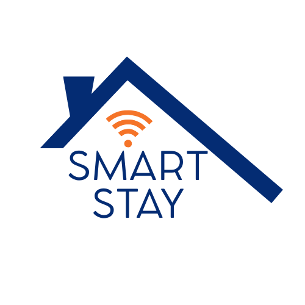</th>
      <th style="border: 1px solid #000;"><strong>Oracle Hospitality</strong> </th>
      <th style="border: 1px solid #000;"><strong>Room Raccoon</strong> 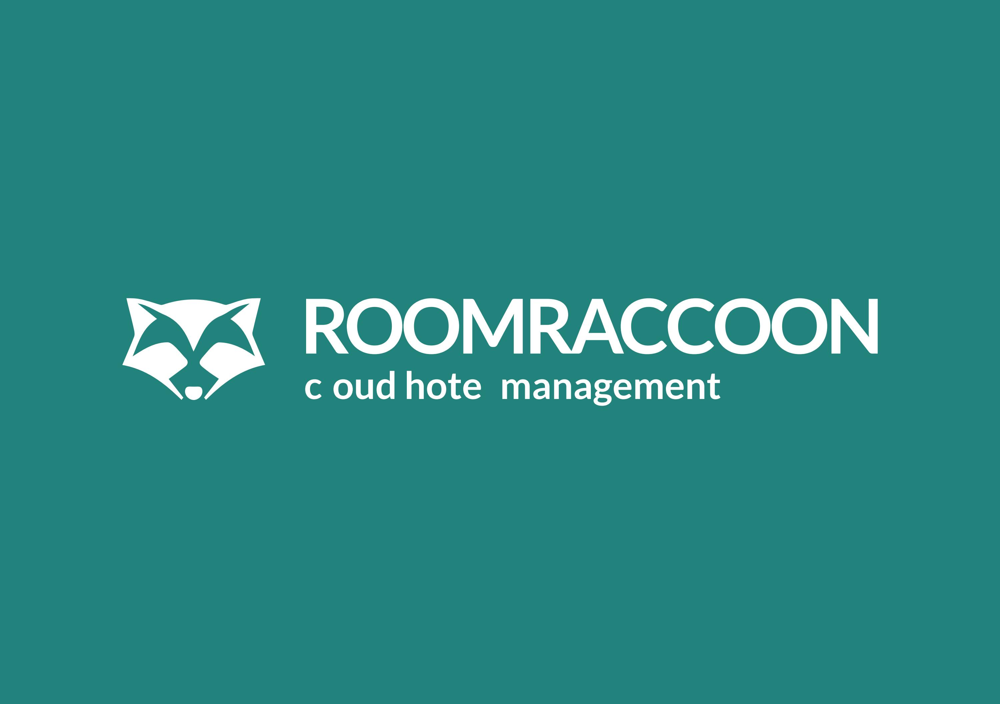</th>
      <th style="border: 1px solid #000;"><strong>Sistemas Manuales</strong> 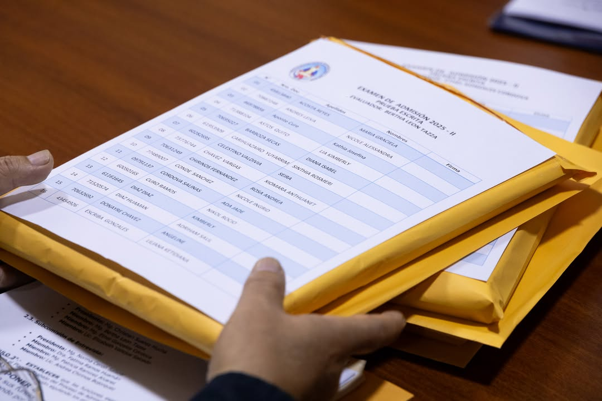</th>
    </tr>
  </thead>
  <tbody>
    <tr style="background-color: #f9f9f9;">
      <td colspan="5" style="font-weight: bold; border: 1px solid #000; letter-spacing: 1px;">PERFIL</td>
    </tr>
    <tr>
      <td style="border: 1px solid #000;"><strong>Overview</strong></td>
      <td style="border: 1px solid #000;">Plataforma de gestión hotelera con enfoque en hoteles boutique, integrando IoT y una experiencia móvil nativa para el huésped.</td>
      <td style="border: 1px solid #000;">Soluciones globales y robustas (PMS/OPERA) diseñadas para la gestión de grandes cadenas hoteleras internacionales.</td>
      <td style="border: 1px solid #000;">SaaS en la nube todo-en-uno (PMS, Channel Manager) intuitivo, orientado a hoteles pequeños e independientes.</td>
      <td style="border: 1px solid #000;">Sistemas tradicionales basados en herramientas físicas o digitales básicas como Excel y registros en papel.</td>
    </tr>
    <tr>
      <td style="border: 1px solid #000;"><strong>Ventaja competitiva</strong> <small>¿Qué valor ofrece a los clientes?</small></td>
      <td style="border: 1px solid #000;">Control total del entorno de la habitación y personalización profunda desde una <strong>aplicación móvil nativa</strong>.</td>
      <td style="border: 1px solid #000;">Reconocimiento de marca global, alta confiabilidad y cumplimiento de estándares para operaciones a gran escala.</td>
      <td style="border: 1px solid #000;">Facilidad de implementación, soporte técnico valorado y una interfaz puramente web simplificada.</td>
      <td style="border: 1px solid #000;">Costo de adquisición nulo y flexibilidad operativa total al no depender de infraestructura de software especializada.</td>
    </tr>
    <tr style="background-color: #f9f9f9;">
      <td colspan="5" style="font-weight: bold; border: 1px solid #000; letter-spacing: 1px;">PERFIL DE MARKETING</td>
    </tr>
    <tr>
      <td style="border: 1px solid #000;"><strong>Mercado objetivo</strong></td>
      <td style="border: 1px solid #000;">Hoteles boutique y medianos en crecimiento en Latinoamérica que buscan diferenciación tecnológica.</td>
      <td style="border: 1px solid #000;">Grandes cadenas hoteleras transnacionales y resorts de lujo con procesos operativos complejos.</td>
      <td style="border: 1px solid #000;">Pequeños hoteles, hostales, Bed & Breakfasts y apartamentos turísticos de gestión independiente.</td>
      <td style="border: 1px solid #000;">Micro-hoteles o establecimientos con baja madurez tecnológica que no han iniciado su transformación digital.</td>
    </tr>
    <tr>
      <td style="border: 1px solid #000;"><strong>Estrategias de marketing</strong></td>
      <td style="border: 1px solid #000;">Posicionamiento basado en la modernización, eficiencia operativa móvil y la "Experiencia del Huésped 4.0".</td>
      <td style="border: 1px solid #000;">Ventas corporativas directas (B2B), branding global y presencia en las principales conferencias del sector.</td>
      <td style="border: 1px solid #000;">Marketing digital enfocado en SEO/SEM, resaltando la facilidad de uso y las reseñas positivas de usuarios.</td>
      <td style="border: 1px solid #000;">Inexistente; la adopción se da por costumbre o falta de conocimiento de alternativas digitales.</td>
    </tr>
    <tr style="background-color: #f9f9f9;">
      <td colspan="5" style="font-weight: bold; border: 1px solid #000; letter-spacing: 1px;">PERFIL DE PRODUCTO</td>
    </tr>
    <tr>
      <td style="border: 1px solid #000;"><strong>Productos & Servicios</strong></td>
      <td style="border: 1px solid #000;">PMS, Channel Manager, Motor de Reservas y <strong>aplicaciones móviles</strong> para huéspedes y personal con control IoT.</td>
      <td style="border: 1px solid #000;">Suite OPERA Cloud (PMS, Ventas, POS) con reportes avanzados e integraciones extensas.</td>
      <td style="border: 1px solid #000;">Plataforma unificada que incluye PMS, Channel Manager, sistema de pagos y gestión de limpieza (Housekeeping).</td>
      <td style="border: 1px solid #000;">Plantillas de hojas de cálculo, libros de registro físico y calendarios manuales.</td>
    </tr>
    <tr>
      <td style="border: 1px solid #000;"><strong>Precios & Costos</strong></td>
      <td style="border: 1px solid #000;">Modelo SaaS por suscripción mensual escalable + inversión inicial en hardware para los dispositivos IoT.</td>
      <td style="border: 1px solid #000;">Licenciamiento de nivel empresarial con costos elevados de implementación, soporte y mantenimiento especializado.</td>
      <td style="border: 1px solid #000;">Esquema de suscripción mensual transparente y accesible, basado principalmente en el número de habitaciones.</td>
      <td style="border: 1px solid #000;">Gratuito o limitado al costo de licencias básicas de software de oficina.</td>
    </tr>
    <tr>
      <td style="border: 1px solid #000;"><strong>Canales de distribución</strong> <small>(Web y/o Móvil)</small></td>
      <td style="border: 1px solid #000;">Plataforma en la nube y <strong>aplicaciones móviles nativas</strong> (Android/iOS) y multiplataforma.</td>
      <td style="border: 1px solid #000;">Aplicación web basada en la nube optimizada para terminales de escritorio en estaciones de trabajo.</td>
      <td style="border: 1px solid #000;">Interfaz web accesible desde navegadores a través de cualquier dispositivo con conexión a internet.</td>
      <td style="border: 1px solid #000;">Offline; requiere presencia física para la manipulación y consulta de registros.</td>
    </tr>
    <tr style="background-color: #f2f2f2; text-align: center;">
      <td colspan="5" style="font-weight: bold; border: 1px solid #000; letter-spacing: 1px;">ANÁLISIS SWOT</td>
    </tr>
    <tr>
      <td style="border: 1px solid #000;"><strong>Fortalezas</strong></td>
      <td style="border: 1px solid #000;">Propuesta de valor única con IoT y enfoque en <strong>desarrollo móvil nativo</strong>.</td>
      <td style="border: 1px solid #000;">Líder indiscutible del mercado con un producto altamente robusto y escalable.</td>
      <td style="border: 1px solid #000;">Proceso de configuración rápido y excelente reputación en el segmento PYME.</td>
      <td style="border: 1px solid #000;">Simplicidad absoluta sin necesidad de capacitación técnica para el personal.</td>
    </tr>
    <tr>
      <td style="border: 1px solid #000;"><strong>Debilidades</strong></td>
      <td style="border: 1px solid #000;">Marca nueva en el mercado; requiere educación del cliente sobre la instalación de hardware físico.</td>
      <td style="border: 1px solid #000;">Interfaz de usuario compleja y costos de entrada prohibitivos para hoteles locales pequeños.</td>
      <td style="border: 1px solid #000;">Funcionalidades limitadas para la gestión de dispositivos físicos y hardware en tiempo real.</td>
      <td style="border: 1px solid #000;">Propenso a errores humanos críticos, nula capacidad de escala y falta de conectividad online.</td>
    </tr>
    <tr>
      <td style="border: 1px solid #000;"><strong>Oportunidades</strong></td>
      <td style="border: 1px solid #000;">Alta demanda de soluciones sin contacto (contactless) y experiencias digitales personalizadas.</td>
      <td style="border: 1px solid #000;">Migración de su extensa base de clientes antiguos hacia infraestructuras modernas en la nube.</td>
      <td style="border: 1px solid #000;">Expansión hacia mercados emergentes mediante la adición de módulos de gestión simplificados.</td>
      <td style="border: 1px solid #000;">La necesidad obligatoria de digitalización representa el punto de partida para adoptar software básico.</td>
    </tr>
    <tr>
      <td style="border: 1px solid #000;"><strong>Amenazas</strong></td>
      <td style="border: 1px solid #000;">Competidores establecidos desarrollando módulos móviles básicos para competir en el mismo nicho.</td>
      <td style="border: 1px solid #000;">Surgimiento de startups ágiles que ofrecen soluciones especializadas a una fracción del costo.</td>
      <td style="border: 1px solid #000;">Saturación del mercado de PMS básicos y guerra de precios entre proveedores SaaS.</td>
      <td style="border: 1px solid #000;">Cualquier solución de software gratuita o de bajo costo representa una amenaza existencial para este método.</td>
    </tr>
  </tbody>
</table>

#### 2.1.2. Estrategias y tácticas frente a competidores

Para posicionarse de forma efectiva frente a la competencia, **Smart Stay** implementará las siguientes estrategias:

#### Estrategias

1. **Diferenciación Tecnológica**: Integrar la gestión hotelera con IoT de manera completa, algo que los competidores actuales aún no ofrecen de forma integral.
2. **Enfoque en nicho**: Dirigirnos específicamente a hoteles boutique y pequeños (20-100 habitaciones), un segmento que los grandes como Oracle o Amadeus suelen dejar de lado.
3. **Modelo de suscripción accesible**: Precios escalables según el número de habitaciones, lo que nos permite competir contra soluciones caras sin sacrificar ninguna funcionalidad.
4. **Soporte local y en español**: Ofrecer un acompañamiento cercano y personalizado que facilita la adopción, marcando una gran diferencia frente a competidores extranjeros.
5. **Valor medible**: Compromiso claro de reducir los costos operativos entre un 10-20%.

#### Tácticas

- **Programa piloto** con hoteles boutique de Lima para generar casos de éxito reales y testimonios auténticos.
- **Alianzas estratégicas** con gremios turísticos (como FEDECATUR) para acelerar la adopción en el sector.
- **Capacitación continua** para el personal hotelero, ayudando a reducir la resistencia al cambio.
- **Marketing digital enfocado en ROI**: Mostrar comparativas claras de costos y beneficios frente a los sistemas tradicionales.
- **Integraciones rápidas** con los PMS existentes para facilitar la migración y minimizar fricciones.
- **Atención postventa 24/7** como una ventaja competitiva clave frente a otras startups con soporte limitado.

### 2.2. Entrevistas

Con el objetivo de profundizar en las necesidades y expectativas de los segmentos objetivos, se realizaron entrevistas semiestructuradas a administradores de hoteles boutique y a huéspedes. Esta información cualitativa sirvió como base para identificar problemáticas actuales y orientar la definición de requisitos del sistema.

#### 2.2.1. Diseño de entrevistas

### Entrevista – Segmento 1: Staff Operativo

1. ¿Cómo te llamas y qué cargo ocupas en el hotel?
2. ¿En qué distrito o ciudad se encuentra el hotel?
3. ¿Cuántas habitaciones y personal gestionan aproximadamente?
4. ¿Podrías contarme cómo es un día típico de trabajo administrando el hotel?
5. ¿Qué tan seguido deben gestionar procesos como reservas, check-in/check-out o facturación?
6. ¿Cómo suelen organizar actualmente la gestión de reservas y pagos?
7. ¿Han tenido dificultades con sobrerreservas, disponibilidad de habitaciones o errores de facturación?
8. ¿Qué dispositivos usas con mayor frecuencia para gestionar el hotel?
9. ¿Qué aplicaciones o sistemas usas actualmente en tu día a día para el manejo del hotel?
10. ¿Has tenido alguna dificultad o experiencia negativa al usarlas?
11. ¿Qué te motivaría a adoptar una nueva herramienta digital para centralizar reservas, pagos y tareas del personal?
12. Si una herramienta digital lograra optimizar tus operaciones y reducir tus costos, ¿cómo valorarías invertir en una suscripción mensual para acceder a ella?
13. ¿Cuáles son tus principales preocupaciones respecto a la gestión del hotel?

### Entrevista – Segmento 2: Huéspedes de Hoteles

1. ¿Cómo te llamas y con qué frecuencia viajas por turismo o trabajo?
2. ¿Qué tipo de hotel sueles elegir (boutique, cadena internacional, Airbnb, etc.) y por qué?
3. ¿Qué valoras más en un hotel: ubicación, precio, comodidad o servicios digitales?
4. ¿Cómo fue tu última experiencia de check-in y check-out? ¿Qué mejorarías?
5. ¿Qué tan importante es para ti poder personalizar tu habitación (temperatura, luz, limpieza, room service) desde tu celular u otro dispositivo tecnológico?
6. ¿Qué servicios digitales utilizas más durante tu estadía en un hotel (WiFi, app del hotel, WhatsApp, smart TV, llaves digitales)?
7. ¿Has tenido experiencias negativas con la gestión del hotel (esperas largas, problemas con el servicio, falta de personalización)?
8. ¿Qué opinas de un sistema que te permita hacer check-in sin pasar por recepción y controlar tu habitación desde una app?
9. ¿Estarías dispuesto a pagar un poco más por un hotel que ofrezca experiencias digitales y personalización avanzada? ¿Cuánto aproximadamente?
10. ¿Qué tanto influyen las reseñas digitales y la reputación online en tu decisión de reservar un hotel?
11. Si un hotel ofreciera un servicio totalmente digitalizado, ¿qué expectativa tendrías respecto al trato humano? ¿Lo consideras un valor agregado o no es necesario?
12. ¿Qué recomendarías para que la experiencia digital en un hotel sea cómoda y no complicada para los huéspedes?

#### 2.2.2. Registro de entrevistas

### Entrevista – Segmento 1: Administradores de Hoteles Boutique y Pequeños

#### Entrevista 1

Datos del entrevistado:

**Nombre completo:** Adrian Saavedra Angulo

**Edad:** 34 años

**Ciudad:** Tarapoto

**Duración:** 8:07 minutos

**Evidencia:** 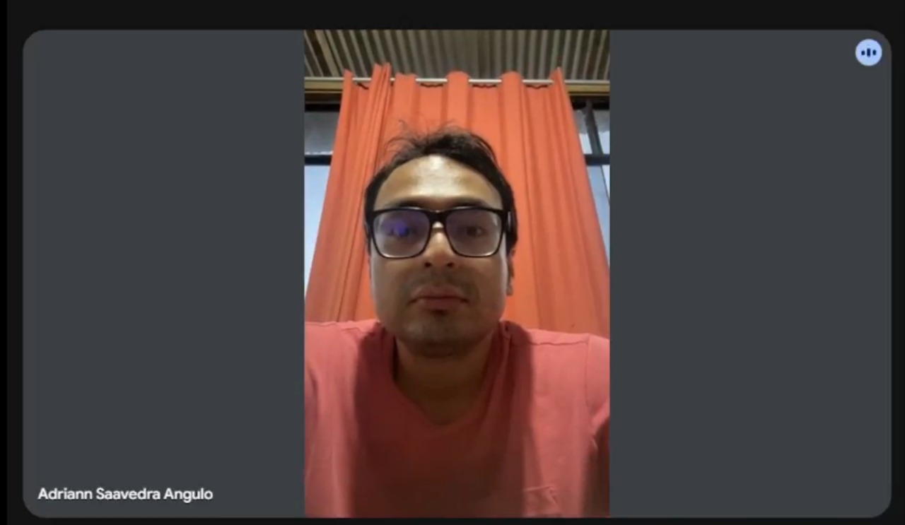

**Resumen de la entrevista**

Adrián administra un hotel de 12 habitaciones en Tarapoto con un equipo de 6 personas. Su rutina diaria incluye revisar reservas, coordinar limpieza, organizar recojos y responder a nuevas solicitudes. Los procesos de reservas y facturación son constantes por el alto movimiento del negocio.
Aunque cuentan con un sistema propio, han tenido problemas de sobreventa porque no se sincroniza con todas las plataformas, lo que obliga a actualizaciones manuales y genera errores. Adrián estaría motivado a usar una herramienta que centralice la gestión y se integre con plataformas externas, siempre que el costo de suscripción sea razonable.

**URL del video:** https://tinyurl.com/ywcf7dpk

---

#### Entrevista 2

Datos del entrevistado:

**Nombre completo:** Monica Hernandez Vela

**Edad:** 33 años

**Ciudad:** Tarapoto

**Duración:** 5:53 minutos

**Evidencia:** 

**URL del video:** https://tinyurl.com/59zmmrjb
**Resumen de la entrevista**

Mónica administra un hotel de 12 habitaciones en Tarapoto con un equipo de 4 personas. Su rutina diaria incluye organizar los desayunos, coordinar la limpieza, asignar habitaciones, atender a los turistas y revisar constantemente las reservas. Utiliza un sistema propio a través de la página web del hotel, gestionado principalmente desde laptops y computadoras, y se comunica con su personal mediante WhatsApp.
Ha tenido dificultades con el uso del sistema actual y señala que le motivaría adoptar una herramienta digital que centralice la gestión de reservas y operaciones, siempre que pueda adaptarse a las características de su hotel. Considera razonable pagar una suscripción mensual si contribuye a mejorar los servicios del establecimiento.

---

#### Entrevista 3

Datos del entrevistado:
**Nombre completo:** Alejandra Beltrán Diaz

**Edad:** 23 años

**Ciudad:** Tarapoto

**Duración:** 4:11 minutos

**Evidencia:** 

**URL del video:** https://tinyurl.com/2p9n2kmb

**Resumen de la entrevista**

Valeria Alejandra administra un hotel de 19 habitaciones junto a un equipo de 5 personas. Su día típico comienza organizando al personal de limpieza, revisando las reservas recibidas por WhatsApp y luego trasladándolas a un archivo Excel para llevar el control. Su principal herramienta es este archivo, aunque reconoce que no siempre guarda correctamente la información, lo que ha ocasionado problemas con reservas perdidas.
También ha tenido experiencias negativas con WhatsApp, ya que a veces resulta difícil ubicar las reservas registradas en la aplicación. Para ella, un sistema ideal de gestión debería incluir notificaciones automáticas que recuerden las reservas del día. Valeria considera que pagar una suscripción mensual sería una buena opción si la herramienta realmente simplifica las labores administrativas del hotel.

---

### Entrevista – Segmento 2: Huéspedes de Hoteles Boutique

#### Entrevista 1

Datos del entrevistado:

**Nombre completo:** Diego Michael Segura Martínez

**Edad:** 25 años

**Distrito:** Santa Anita – Lima Metropolitana

**Duración:** 5:34 minutos

**Evidencia:** 

**URL del video:** https://tinyurl.com/me55rvnx

**Resumen de la entrevista**

Diego suele hospedarse en hoteles cuando viaja, principalmente con su pareja y en menor medida con su familia. Prefiere hoteles cómodos, con privacidad y buena experiencia. Valora la comodidad y los servicios digitales que simplifiquen su estadía.
Su principal frustración son las esperas en recepción y la falta de personalización. Le atrae la idea de un sistema digital que permita check-in/check-out sin filas y control de la habitación desde el celular (luz, temperatura, room service).
Utiliza principalmente WiFi y Smart TV, pero estaría dispuesto a usar una app centralizada. Confía en las reseñas digitales para tomar decisiones y estaría dispuesto a pagar entre 10% y 15% más por un hotel con experiencias digitales avanzadas.
Considera que el trato humano sigue siendo un valor agregado, aunque la digitalización es clave. Recomienda que los sistemas sean fáciles de usar y que cada hotel cuente con una página clara con descripción completa y disponibilidad de habitaciones en tiempo real.

---

#### Entrevista 2

Datos del entrevistado:

**Nombre completo:** Juan Salcedo

**Edad:** 44 años

**Distrito:** San Borja – Lima Metropolitana

**Duración:** 6:11 minutos

**Nombre:** Juan Salcedo  
**Edad:** 44 años  
**Distrito:** San Borja

**Evidencia:** 

**URL del video:** https://tinyurl.com/3mv3ytt5

**Resumen de la entrevista**

Juan viaja por trabajo cada 1-2 meses y prefiere alojamientos cómodos, autónomos y con buena conectividad, optando principalmente por Airbnb y, en menor medida, por hoteles. Valora especialmente la ubicación céntrica, el Wi-Fi de calidad y la facilidad tecnológica. Considera que los horarios estrictos de check-in y check-out son una gran limitación, y aunque nunca ha usado una habitación totalmente “smart”, le interesa la idea, aunque cree que aún no está bien implementada en Perú. No pagaría más por funciones digitales avanzadas, ya que las asocia con un público más joven. Usa Wi-Fi como servicio indispensable, junto con laptop y smartphone, y ha tenido experiencias negativas relacionadas con demoras en la atención y falta de limpieza, además de percibir una falta de personalización en el servicio. Recomienda priorizar la mejora del Wi-Fi (fibra óptica) y mantener una atención eficiente, considerando que la digitalización debe complementar, pero no reemplazar, el buen trato humano.

---

#### Entrevista 3

Datos del entrevistado:

**Nombre completo:** Tadeo Loja Beloglio

**Edad:** 22 años

**Distrito:** Santiago de Surco – Lima Metropolitana

**Duración:** 7:21 minutos

**Evidencia:** 

**URL del video:** https://tinyurl.com/3ztyph92

**Resumen de la entrevista**

Tadeo viaja por turismo una vez al año y suele elegir hoteles de cadenas internacionales porque le ofrecen mayor confianza y calidad de servicio, aunque también considera opciones boutique si el precio es conveniente. Lo que más valora es el precio y la comodidad, seguido de la ubicación. Su última experiencia de check-in fue lenta, mientras que el check-out resultó rápido, por lo que cree que ambos procesos deberían digitalizarse.

No considera esencial la personalización de la habitación, pero sí cómodo poder controlar luz y temperatura desde el celular. Durante sus estadías utiliza principalmente el WiFi y la smart TV, y le gustaría contar con llaves digitales.

Entre los problemas que ha tenido destacan las largas esperas en recepción y la falta de coordinación en la limpieza. Considera muy práctico un sistema de check-in digital y control de la habitación mediante una app, y estaría dispuesto a pagar hasta un 5% más por ello siempre que mejore la experiencia.

Las reseñas digitales influyen en un 70% en su decisión de reserva. Para él, el trato humano sigue siendo un valor agregado incluso en un hotel digitalizado, y recomienda que la experiencia digital se concentre en una app única, sencilla y con asistencia rápida.

#### 2.2.3. Análisis de entrevistas

En esta sección se presenta un análisis detallado por cada segmento objetivo, identificando con sustento estadístico (porcentajes) todas las características objetivas y subjetivas que representan los aspectos más comunes de cada segmento, necesarios para la construcción de los arquetipos. La información se basa en las entrevistas registradas y sus respectivos resúmenes, respaldada por fuentes académicas y de la industria.

**Segmento 1: Administradores de Hoteles Boutique y Pequeños**

**Características Demográficas**

**Perfil de Edad y Ubicación**
Los administradores entrevistados presentan una edad promedio de **30.0 años**, con un rango que va desde los 23 hasta los 34 años.
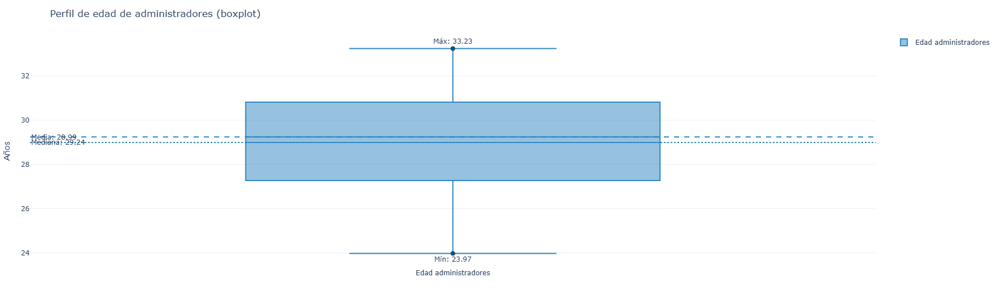
El **100%** de los entrevistados se ubican en Tarapoto, lo que indica una concentración geográfica específica en esta región turística del Perú. Este hallazgo se alinea con las tendencias nacionales, ya que según *Statista Market Forecast (2025)*, Peru ha experimentado un crecimiento significativo en el mercado hotelero, posicionándose como un actor clave en la industria hotelera latinoamericana.
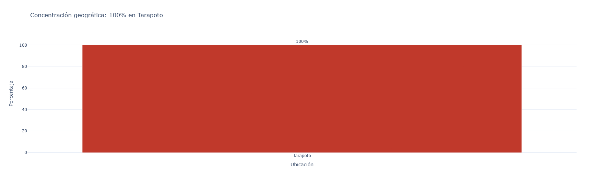

**Características del Negocio**
Los hoteles administrados por este segmento tienen un tamaño promedio de **14.3 habitaciones**, con un rango que va desde 12 hasta 19 habitaciones, confirmando que se trata efectivamente de establecimientos boutique y pequeños. El equipo de trabajo promedio es de **5.0 personas**, variando entre 4 y 6 empleados, lo que refleja operaciones de escala reducida pero con estructura organizacional definida. Estas características coinciden con las tendencias identificadas por *Statista*, donde los viajeros en Perú buscan cada vez más experiencias únicas y auténticas, impulsando la demanda de hoteles boutique.
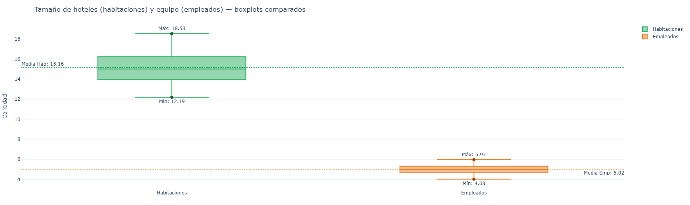

**Herramientas Tecnológicas Actuales**

**Diversidad de Sistemas**
El análisis revela una heterogeneidad en los sistemas utilizados:
- **66.7%** (2 de 3 administradores) utilizan sistemas propios desarrollados para sus hoteles.
- **33.3%** (1 de 3 administradores) depende de herramientas básicas como Excel y WhatsApp.

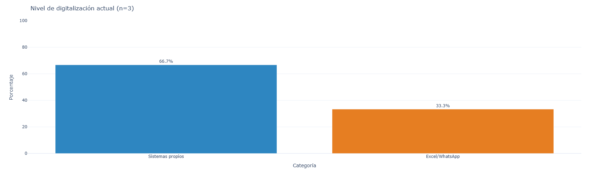

Esta distribución indica que, aunque la mayoría cuenta con algún nivel de digitalización, existe una brecha significativa en la sofisticación de las herramientas empleadas. Este panorama refleja los hallazgos de un estudio académico sobre barreras de adopción tecnológica en hoteles pequeños y medianos, donde se identificó que la falta de recursos financieros, conocimiento de TI y resistencia al cambio son las principales limitaciones.

**Problemas Identificados**

**Distribución Equitativa de Problemas**
Cada administrador enfrenta diferentes tipos de desafíos, con una distribución del **33.3%** para cada categoría:
- **Problemas de sincronización:** Adrián experimenta sobreventa debido a la falta de sincronización entre plataformas.
- **Dificultades operativas:** Mónica tiene complicaciones con el uso de su sistema actual.
- **Pérdida de información:** Alejandra sufre pérdidas de reservas por las limitaciones de sus herramientas básicas.

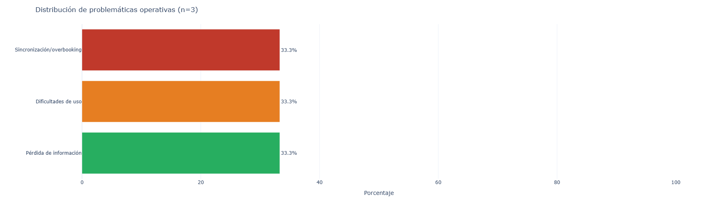

Estas problemáticas están documentadas en la literatura académica, donde se ha identificado que las organizaciones hoteleras pequeñas y medianas son más reluctantes a adoptar nuevas tecnologías de información que las más grandes, debido a la falta de entrenamiento, recursos financieros limitados y percepción de costos elevados.

**Actitud hacia Nueva Tecnología**

**Unanimidad en la Aceptación**
Los resultados muestran una receptividad completa hacia soluciones tecnológicas mejoradas:
- **100%** de los administradores expresan motivación para adoptar una nueva herramienta de gestión.
- **100%** están dispuestos a pagar una suscripción mensual, siempre que el costo sea razonable y justifique la mejora en la eficiencia operativa.

Esta disposición positiva contrasta con estudios previos pero se alinea con las tendencias post-pandemia. Según *Oracle Hospitality & Skift (2022)*, el **89%** de los ejecutivos hoteleros latinoamericanos afirmaron que la pandemia aceleró su adopción de tecnología hotelera, comparado con el 76% globalmente.

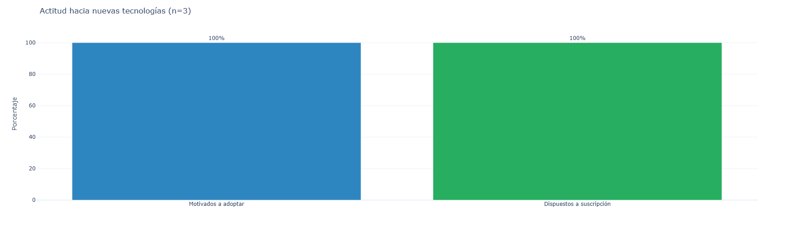

---

**Segmento 2: Huéspedes de Hoteles Boutique**

**Características Demográficas**

**Perfil Generacional**
Los huéspedes entrevistados tienen una edad promedio de **28.0 años**, con un rango de 21 a 44 años. El **75%** pertenece a la generación Millennial/Gen Z (menores de 26 años), lo que sugiere un segmento predominantemente joven y digitalmente nativo. Esta composición demográfica es especialmente relevante, ya que según *Hotel Tech Report (2025)*, los millennials son **57% más propensos** a ser influenciados por la tecnología hotelera.
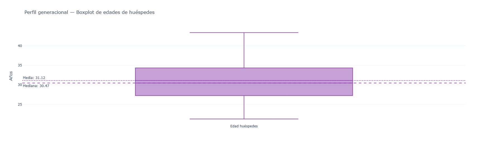

**Patrones de Viaje y Preferencias Tecnológicas**

**Propósito y Frecuencia**
El análisis de los patrones de viaje revela:
- **75%** viaja por turismo (Diego, Tadeo, Joaquín).
- **25%** viaja por trabajo (Juan).
- **100%** mantiene una frecuencia regular de viaje (anual o cada 1-2 meses).

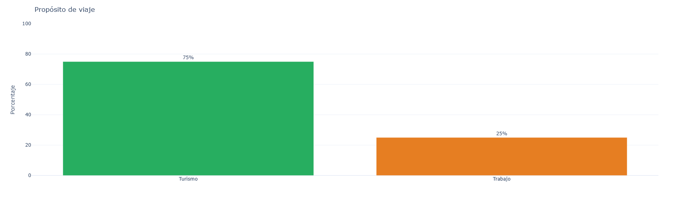

Las preferencias de esta generación están bien documentadas en la investigación de *Mews (2025)*, que indica que las estimaciones sugieren que los millennials representarán el **50%** de los huéspedes hoteleros en los próximos años, convirtiéndolos en críticos para los ingresos y el crecimiento de marca de los hoteles.

**Problemas Más Frecuentes y Expectativas Digitales**

**Consenso en Puntos de Dolor**
Los problemas identificados muestran patrones claros:
- **75%** experimenta esperas prolongadas en recepción como principal frustración.
- **25%** señala problemas con horarios estrictos de check-in/check-out.

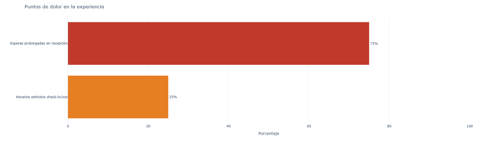

Estos hallazgos se correlacionan directamente con estudios globales de la industria. Según *Oracle Hospitality & Skift (2022)*, el **65%** de los huéspedes desean que los hoteles ofrezcan tecnologías que minimicen el contacto con el personal y otros huéspedes. Además, el **43%** de los huéspedes de lujo esperan no hacer filas, según *Hotel Tech Report (2025)*.

**Actitud hacia la Digitalización**

**Alta Receptividad Tecnológica**
Los resultados demuestran una fuerte inclinación hacia soluciones digitales:
- **75%** muestra alto interés en digitalización de servicios hoteleros.
- **75%** está dispuesto a pagar un sobrecosto por experiencias digitales mejoradas.
- **100%** considera las reseñas digitales como factor influyente en sus decisiones.

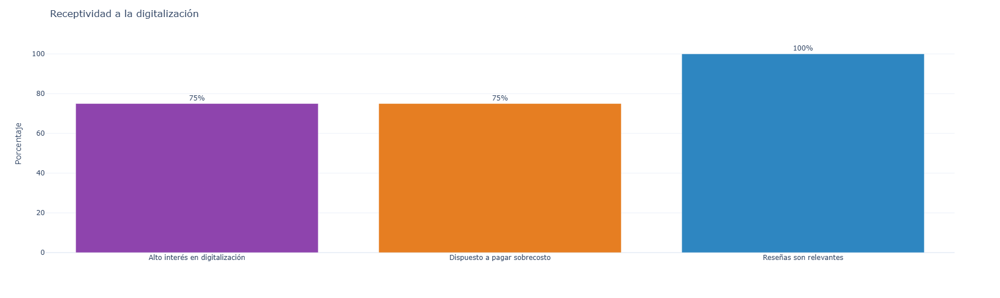

- Estos datos se alinean con investigaciones globales que indican que el **74%** de los huéspedes esperan poder hacer en línea cualquier cosa que ya pueden hacer en persona o por teléfono. Además, el **48%** de los huéspedes considera las reseñas en línea como el factor principal para elegir un hotel.

**Disposición de Pago por Digitalización**
- **25%** pagaría entre 10-15% adicional.
- **50%** pagaría entre 5-10% adicional.
- **25%** no pagaría sobrecosto adicional.

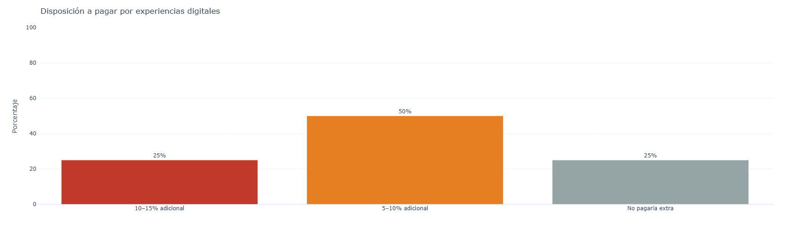

La disposición a pagar por tecnología varía según la generación. Mientras que el **35%** de la Gen Z considera que la velocidad del Wi-Fi es más importante que la comodidad de la cama, los usuarios de mayor edad muestran menos disposición a pagar extra por funciones digitales avanzadas.

**Influencia de Reseñas Digitales**
- **50%** reporta alta influencia de reseñas (70% o más en su decisión).
- **100%** considera las reseñas como factor relevante en su proceso de selección.

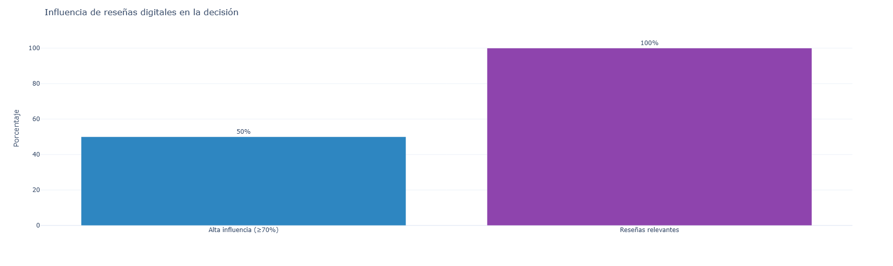

Esta tendencia refleja datos globales donde las reseñas en línea han reemplazado el boca a boca tradicional, con los millennials consultando plataformas como TripAdvisor, Google y redes sociales antes de reservar.

### 2.3. Needfinding

#### 2.3.1. User Personas

### 2.3.1. User Personas.

#### 2.3.2. User Task Matrix

#### 2.3.3. User Journey Mapping

## User Journey Mapping

El **User Journey Mapping** permite visualizar las etapas que recorren los usuarios desde el descubrimiento de la solución hasta la evaluación final de su experiencia. A través de este recurso se identifican los objetivos de los usuarios, los puntos de contacto con el servicio, sus pensamientos, percepciones y oportunidades de mejora en cada fase del proceso.

En el caso de **Smart Stay**, se elaboraron dos mapas diferenciados según los segmentos objetivos:

- **Segmento 1:** enfocado en la gestión operativa y la centralización de reservas.
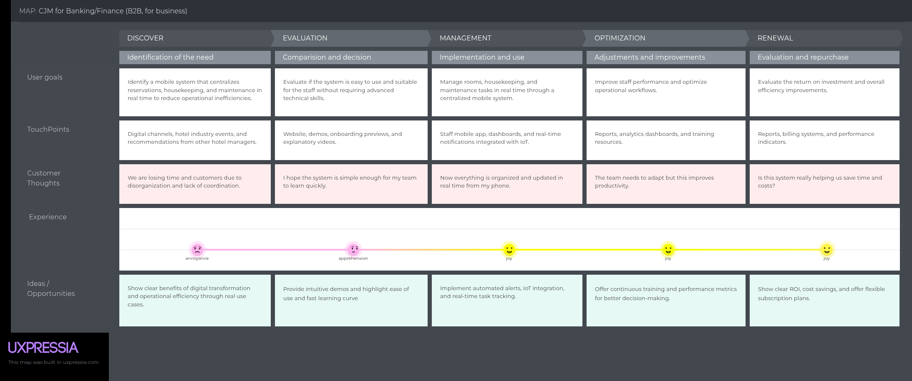

- **Segmento 2:** centrado en la experiencia de estadía y la digitalización de servicios.
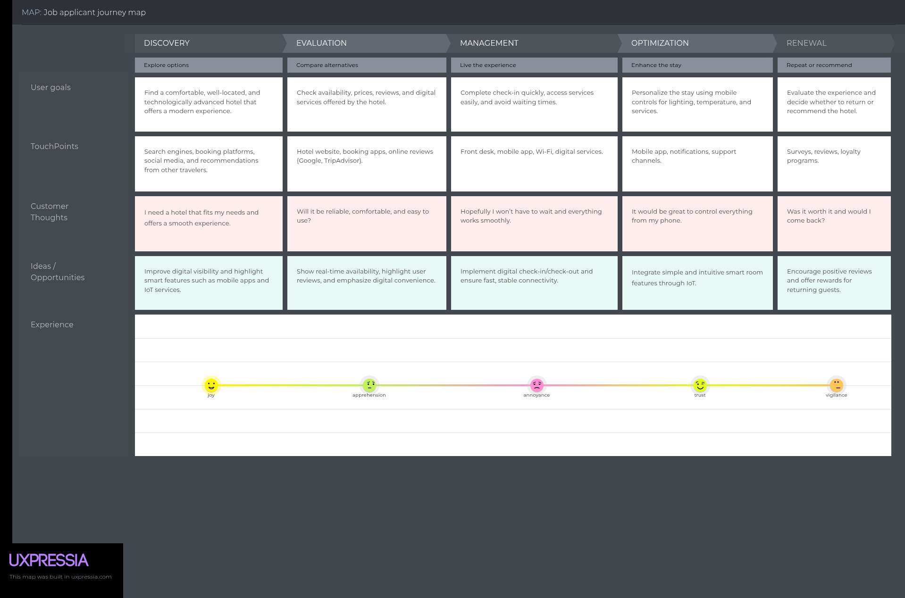

Estos recorridos permiten detectar fricciones, validar expectativas y proponer mejoras orientadas a optimizar tanto la gestión hotelera como la satisfacción de los huéspedes.

#### 2.3.4. Empathy Mapping
El Empathy Mapping permite comprender en profundidad las emociones, pensamientos y comportamientos de los usuarios, facilitando una conexión más humana con sus necesidades reales. A través de esta herramienta, se identifican los dolores, motivaciones y expectativas de los distintos perfiles, lo que contribuye al diseño de soluciones más relevantes y personalizadas.

En el caso de Smart Stay, se elaboraron dos mapas de empatía diferenciados según los segmentos objetivos:
##### 1. Segmento Objetivo 1: STAFF OPERATIVO
##### 2. Segmento Objetivo 2: HUÉSPEDES 

Estos mapas permiten visualizar cómo cada tipo de usuario piensa, siente y actúa frente al servicio, además de reconocer los puntos de dolor (pains) y las ganancias esperadas (gains). El análisis conjunto de ambos segmentos brinda una visión integral para mejorar la eficiencia operativa del hotel y elevar la satisfacción del huésped, alineando tecnología y experiencia humana.
#### 1. Segmento Objetivo 1: STAFF OPERATIVO
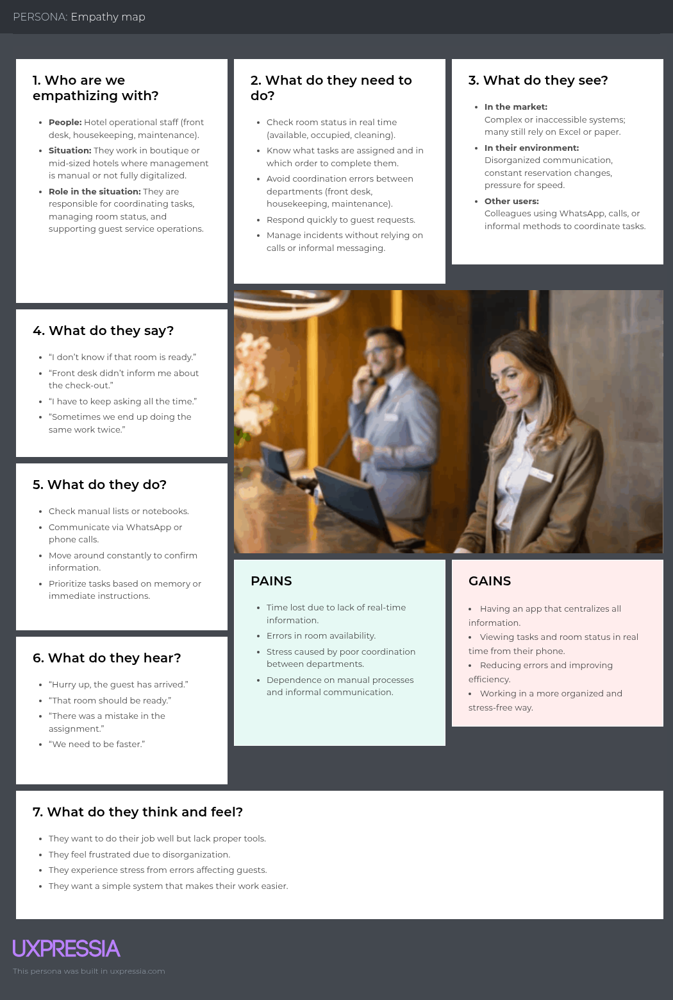

---

#### 2. Segmento Objetivo 2: HUÉSPEDES 
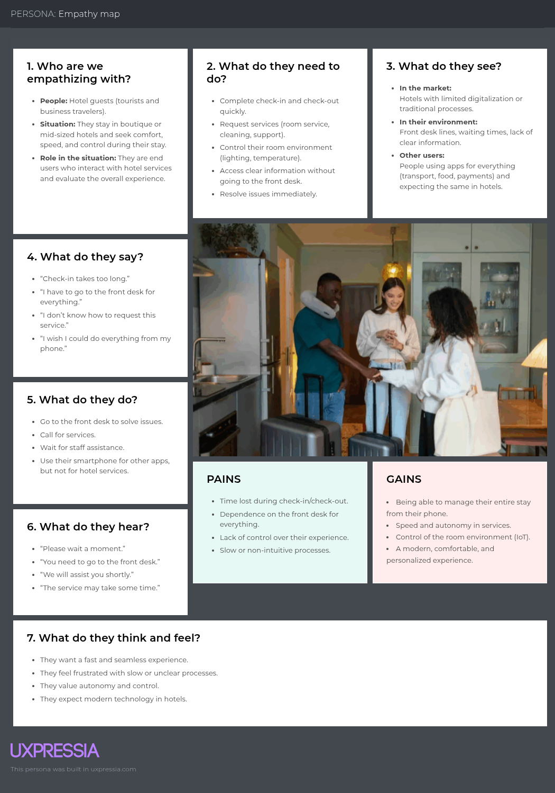

### 2.3.5. Big Picture EventStorming

**Chaotic Exploration:**

En la primera etapa del Big Picture Event Storming hicimos una Exploración Caótica (Chaotic Exploration), donde se identificaron libremente todos los eventos de dominio relevantes del sistema hotelero sin imponer un orden previo.
Los eventos capturados cubren el ciclo completo de la experiencia de un huésped: desde la reserva realizada por app/web y su confirmación con pago, pasando por la publicación en plataformas externas (Booking/Google), la llegada del huésped, el check-in (tanto presencial como digital), la asignación de habitación, la provisión de servicios adicionales como Wi-Fi, hasta la generación automática de facturas y el check-out digital. También se identificaron eventos de gestión interna, como la corrección de reservas duplicadas y la generación de reportes de ocupación por parte del manager.

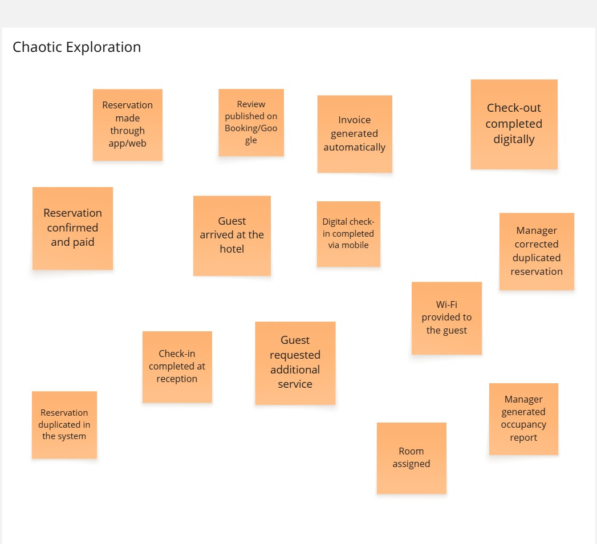

**Timeline:**

En la etapa de Timeline, los eventos de la exploración caótica fueron organizados cronológicamente siguiendo el flujo real del negocio hotelero. Se identificó un punto de dolor en el largo tiempo de espera durante el check-in presencial (rosado), y como solución se propone el check-in digital vía móvil (verde). El flujo concluye con el check-out digital, la facturación automática y la publicación de reseñas en plataformas externas.

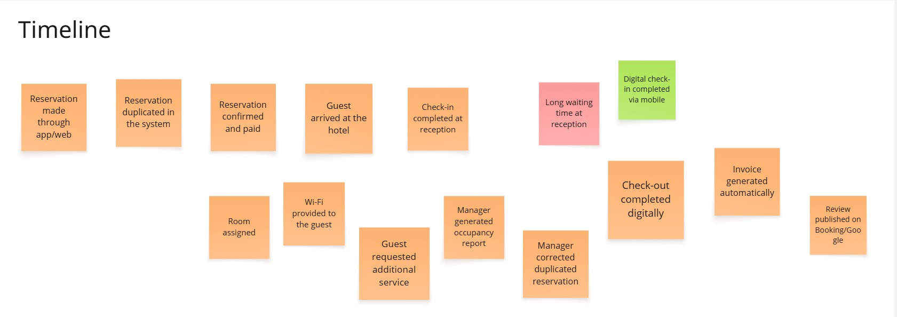

**People & Systems:**

En la etapa de People & Systems, se asoció cada evento con los actores y sistemas involucrados. Los actores principales son Valeria (Guest) y Adrián (Manager), acompañados por el Reception Staff y Cleaning Staff. Como sistemas externos (rosado) se identificaron las plataformas OTA (Booking, Expedia, WhatsApp), el Payment Gateway, y SUNAT/Accounting System para la facturación electrónica.

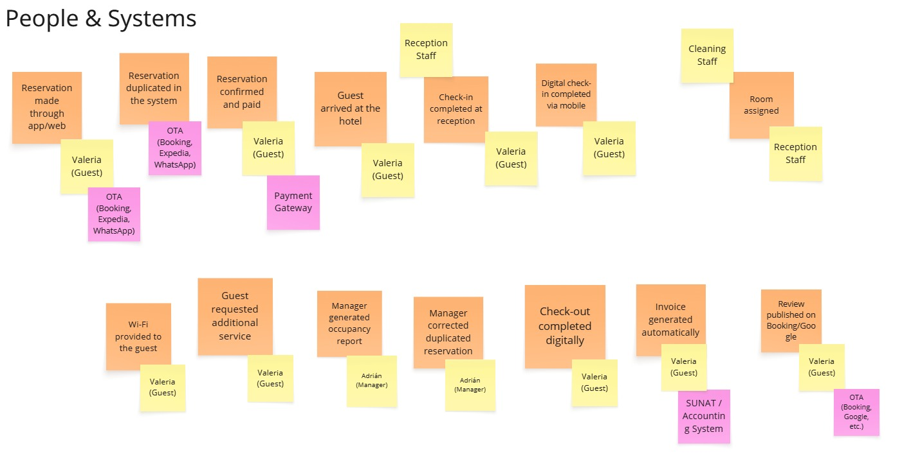

**Problems & Opportunities:**

En la etapa de Problems & Opportunities, se analizaron los eventos para identificar problemas y oportunidades de mejora. Se detectó que el check-in presencial genera largas filas y tiempos de espera, sumado a ello reservas duplicadas, ingreso manual de datos y errores en facturación, lo que afecta la satisfacción del huésped. La oportunidad identificada es implementar un check-in digital a través de una aplicación móvil, permitiendo a los huéspedes registrarse de forma autónoma y rápida, mejorando la experiencia general y reduciendo la carga operativa del personal de recepción.

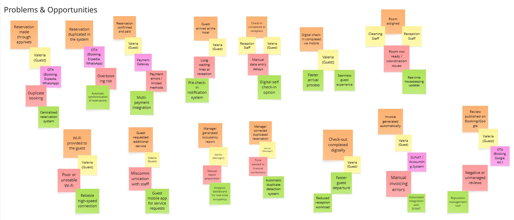 

**Prioritization:**

En la etapa de Prioritization, se priorizaron los problemas más críticos del flujo hotelero usando una escala de estrellas. El riesgo de overbooking resultó el de mayor prioridad, con sincronización automática de reservas como solución; seguido de los retrasos por ingreso manual en el check-in, resueltos con check-in digital; y finalmente el Wi-Fi inestable, con menor prioridad relativa.

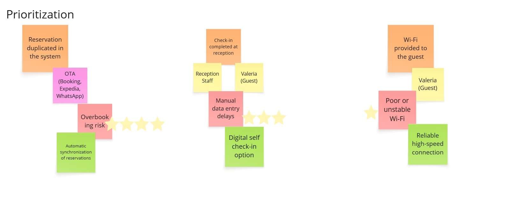

#### 2.3.6. Ubiquitous Language

| **Término en Inglés**        | **Término en Español**             | **Definición**                                                                                                                                      |
|------------------------------|------------------------------------|-----------------------------------------------------------------------------------------------------------------------------------------------------|
| Hotel Administrator          | Administrador del hotel            | Usuario encargado de la gestión operativa del hotel. Supervisa reservas, limpieza, facturación y coordinación con el personal.                      |
| Reservation Management       | Gestión de reservas                | Proceso centralizado de registro, confirmación, modificación y cancelación de reservas en tiempo real.                                              |
| Overbooking                  | Sobreventa                         | Situación en la que el hotel vende más habitaciones de las disponibles debido a la falta de sincronización en los sistemas de reserva.              |
| Housekeeping Schedule        | Programación de limpieza           | Organización de tareas de limpieza y mantenimiento de habitaciones, coordinadas desde el sistema de gestión.                                        |
| Digital Check-In / Check-Out | Registro digital de entrada/salida | Funcionalidad que permite al huésped ingresar o salir del hotel sin necesidad de hacer filas en recepción, a través de una aplicación o portal web. |
| Guest Profile                | Perfil del huésped                 | Información digital del cliente que incluye preferencias, historial de estadías y solicitudes especiales.                                           |
| Smart Room Control           | Control inteligente de habitación  | Función que permite al huésped manejar servicios como iluminación, temperatura o room service desde su dispositivo móvil.                           |
| Real-Time Notification       | Notificación en tiempo real        | Alerta automática que informa sobre nuevas reservas, cambios en disponibilidad o solicitudes de huéspedes.                                          |
| Financial Report             | Reporte financiero                 | Documento digital generado por el sistema que resume ingresos, gastos y métricas clave para evaluar la rentabilidad del hotel.                      |
| Guest Feedback               | Retroalimentación del huésped      | Opiniones y calificaciones que los huéspedes comparten sobre su estadía, utilizadas para mejorar los servicios.                                     |

### 2.4. Requirements specification

#### 2.4.1. User Stories
<table>
  <tr>
    <th>Epic / Story ID</th>
    <th>Title</th>
    <th>Description</th>
    <th>Acceptance Criteria</th>
    <th>Related to (Epic ID)</th>
  </tr>

  <!-- EPICS -->
  <tr class="epic-row">
    <td><strong>EP-01</strong></td>
    <td><strong>Authentication and User Management</strong></td>
    <td>Epic that groups functionalities for registration, login, profile management, and role-based access control for all user types (administrators, staff, and guests).</td>
    <td></td>
    <td>-</td>
  </tr>
  <tr class="epic-row">
    <td><strong>EP-02</strong></td>
    <td><strong>Central Hotel Management</strong></td>
    <td>Epic that includes reservation management, room management, digital check-in/check-out, daily operations, and internal service coordination.</td>
    <td></td>
    <td>-</td>
  </tr>
  <tr class="epic-row">
    <td><strong>EP-03</strong></td>
    <td><strong>Digital Guest Experience</strong></td>
    <td>Epic focused on the guest experience: IoT environmental control, personalized services, digital communication, and post-stay evaluation.</td>
    <td></td>
    <td>-</td>
  </tr>
  <tr class="epic-row">
    <td><strong>EP-04</strong></td>
    <td><strong>Analytics and Reporting</strong></td>
    <td>Epic that covers management dashboards, occupancy reports, operational KPIs, satisfaction analysis, and financial metrics.</td>
    <td></td>
    <td>-</td>
  </tr>
  <tr class="epic-row">
    <td><strong>EP-05</strong></td>
    <td><strong>Integrations and External Channels</strong></td>
    <td>Epic for connections with OTAs, WhatsApp, payment systems, digital reputation platforms, and third-party webhooks.</td>
    <td></td>
    <td>-</td>
  </tr>
  <tr class="epic-row">
    <td><strong>EP-06</strong></td>
    <td><strong>Landing Page and Digital Marketing</strong></td>
    <td>Epic for the informational website with segmented content, success stories, simulators, and business contact channels.</td>
    <td></td>
    <td>-</td>
  </tr>
  <tr class="epic-row">
    <td><strong>EP-07</strong></td>
    <td><strong>RESTful API and Technical Services</strong></td>
    <td>Epic that includes endpoints, API authentication, technical documentation, monitoring, and integration with external systems.</td>
    <td></td>
    <td>-</td>
  </tr>
  <tr class="epic-row">
    <td><strong>EP-08</strong></td>
    <td><strong>Notifications and Communication</strong></td>
    <td>Epic for the push notification system, email, SMS, automated alerts, and communication between staff and guests.</td>
    <td></td>
    <td>-</td>
  </tr>

  <!-- USER STORIES -->
  <tr>
    <td>US-01</td>
    <td>User registration with validation</td>
    <td class="user-story-desc"><strong>As a</strong> new user, <strong>I want</strong> to register in Smart Stay by validating my email from the mobile application <strong>so that</strong> I can access features according to my role.</td>
    <td class="acceptance-criteria">
      <strong>Scenario 1: Successful registration</strong> 
      <strong>Given that</strong> I am a new user with valid data, <strong>when</strong> I complete the registration form from the app, <strong>then</strong> my account is successfully created and I receive a confirmation email. 
      <strong>Scenario 2: Email already registered</strong> 
      <strong>Given that</strong> I try to register with an existing email, <strong>when</strong> I submit the form, <strong>then</strong> the system displays the message “Email already registered” and suggests recovering my password. 
      <strong>Scenario 3: Incomplete data</strong> 
      <strong>Given that</strong> I leave required fields empty, <strong>when</strong> I try to continue, <strong>then</strong> the application highlights the missing fields and does not allow me to complete the registration. 
      <strong>Scenario 4: Email format validation</strong> 
      <strong>Given that</strong> I enter an email with an invalid format, <strong>when</strong> I submit the form, <strong>then</strong> the app displays a format error.
    </td>
    <td>EP-01</td>
  </tr>

  <tr>
    <td>US-02</td>
    <td>Secure login</td>
    <td class="user-story-desc"><strong>As a</strong> registered user, <strong>I want</strong> to log in securely from the mobile application <strong>so that</strong> I can access my personalized dashboard according to my role.</td>
    <td class="acceptance-criteria">
      <strong>Scenario 1: Successful login</strong> 
      <strong>Given that</strong> I have valid credentials, <strong>when</strong> I log in from the app, <strong>then</strong> I access the corresponding dashboard according to my role. 
      <strong>Scenario 2: Incorrect credentials</strong> 
      <strong>Given that</strong> I enter incorrect data, <strong>when</strong> I try to access, <strong>then</strong> I receive an error message without revealing whether the email or password was incorrect. 
      <strong>Scenario 3: Account locked</strong> 
      <strong>Given that</strong> I fail to log in 5 consecutive times, <strong>when</strong> I try again, <strong>then</strong> the account is temporarily locked and I receive a notification. 
      <strong>Scenario 4: Persistent session</strong> 
      <strong>Given that</strong> I activate the “remember me” option, <strong>when</strong> I close and reopen the application, <strong>then</strong> I remain logged in until I log out manually.
    </td>
    <td>EP-01</td>
  </tr>

  <tr>
    <td>US-03</td>
    <td>Profile and role management</td>
    <td class="user-story-desc"><strong>As an</strong> administrator, <strong>I want</strong> to manage users and assign roles and permissions from the mobile application <strong>so that</strong> I can control access to the system’s different functionalities.</td>
    <td class="acceptance-criteria">
      <strong>Scenario 1: Create staff user</strong> 
      <strong>Given that</strong> I am an administrator, <strong>when</strong> I create a user from the mobile app, <strong>then</strong> I can assign specific permissions such as housekeeping, reception, or maintenance. 
      <strong>Scenario 2: Modify permissions</strong> 
      <strong>Given that</strong> there is a registered user, <strong>when</strong> I update their permissions from my mobile device, <strong>then</strong> their access rights are modified immediately. 
      <strong>Scenario 3: Deactivate user</strong> 
      <strong>Given that</strong> I need to deactivate a user, <strong>when</strong> I perform the action from the app, <strong>then</strong> the user loses access but their history is preserved. 
      <strong>Scenario 4: Access audit</strong> 
      <strong>Given that</strong> I want to review activity, <strong>when</strong> I access the history from the app, <strong>then</strong> I can view the date, time, user, and action performed.
    </td>
    <td>EP-01</td>
  </tr>

  <tr>
    <td>US-04</td>
    <td>Password recovery</td>
    <td class="user-story-desc"><strong>As a</strong> user, <strong>I want</strong> to recover my password from the mobile application through my email <strong>so that</strong> I can regain access to my account.</td>
    <td class="acceptance-criteria">
      <strong>Scenario 1: Valid request</strong> 
      <strong>Given that</strong> I request password recovery with a registered email, <strong>when</strong> I send the request, <strong>then</strong> I receive a reset link by email. 
      <strong>Scenario 2: Unregistered email</strong> 
      <strong>Given that</strong> I request recovery with an unregistered email, <strong>when</strong> I send the request, <strong>then</strong> I receive a generic message without revealing whether the email exists or not. 
      <strong>Scenario 3: Expired link</strong> 
      <strong>Given that</strong> the recovery link is older than 30 minutes, <strong>when</strong> I try to use it, <strong>then</strong> the system indicates that it has expired and I must request a new one. 
      <strong>Scenario 4: Successful change</strong> 
      <strong>Given that</strong> I have a valid link, <strong>when</strong> I set a new password, <strong>then</strong> it is successfully updated and I receive confirmation.
    </td>
    <td>EP-01</td>
  </tr>

  <tr>
    <td>US-05</td>
    <td>Mobile administrative dashboard</td>
    <td class="user-story-desc"><strong>As an</strong> administrator, <strong>I want</strong> to access a centralized dashboard from my smartphone <strong>so that</strong> I can view key hotel information and make quick decisions.</td>
    <td class="acceptance-criteria">
      <strong>Scenario 1: Overview</strong> 
      <strong>Given that</strong> I access the dashboard from the mobile app, <strong>when</strong> the main screen loads, <strong>then</strong> I see current occupancy, today’s check-ins/check-outs, pending tasks, and important alerts. 
      <strong>Scenario 2: Date filters</strong> 
      <strong>Given that</strong> I want to review a specific period, <strong>when</strong> I select a date range from the app, <strong>then</strong> the indicators are updated correctly. 
      <strong>Scenario 3: Quick access</strong> 
      <strong>Given that</strong> I am on the mobile dashboard, <strong>when</strong> I tap a metric, <strong>then</strong> I am redirected to the corresponding detailed section. 
      <strong>Scenario 4: Real-time updates</strong> 
      <strong>Given that</strong> operational changes occur, <strong>when</strong> they are recorded, <strong>then</strong> the mobile dashboard updates without needing a manual refresh.
    </td>
    <td>EP-02</td>
  </tr>

  <tr>
    <td>US-06</td>
    <td>Room and status management</td>
    <td class="user-story-desc"><strong>As an</strong> administrator, <strong>I want</strong> to manage room statuses from the mobile application <strong>so that</strong> I can optimize the hotel’s daily operations in real time.</td>
    <td class="acceptance-criteria">
      <strong>Scenario 1: Change room status</strong> 
      <strong>Given that</strong> I select a room from the app, <strong>when</strong> I change its status to available, occupied, cleaning, or maintenance, <strong>then</strong> the system updates it immediately and notifies the corresponding staff. 
      <strong>Scenario 2: Mobile room map view</strong> 
      <strong>Given that</strong> I access the room map from my phone, <strong>when</strong> the view loads, <strong>then</strong> I can see all statuses with color codes and make quick changes. 
      <strong>Scenario 3: Change history</strong> 
      <strong>Given that</strong> I need to review modifications, <strong>when</strong> I check the history from the app, <strong>then</strong> I see the date, time, and user responsible for each change. 
      <strong>Scenario 4: Automatic alerts</strong> 
      <strong>Given that</strong> a room remains in maintenance for more than 24 hours, <strong>when</strong> that time is reached, <strong>then</strong> I receive an automatic alert on my mobile device.
    </td>
    <td>EP-02</td>
  </tr>

  <tr>
    <td>US-07</td>
    <td>Centralized reservation management</td>
    <td class="user-story-desc"><strong>As an</strong> administrator, <strong>I want</strong> to manage all reservations from the mobile application <strong>so that</strong> I can avoid overbooking and optimize hotel occupancy.</td>
    <td class="acceptance-criteria">
      <strong>Scenario 1: Mobile calendar view</strong> 
      <strong>Given that</strong> I enter the reservations section from the app, <strong>when</strong> I select the calendar view, <strong>then</strong> I can see all reservations organized by date with key information. 
      <strong>Scenario 2: Create manual reservation</strong> 
      <strong>Given that</strong> I receive a reservation by phone, <strong>when</strong> I enter it from the mobile app, <strong>then</strong> the system validates availability and confirms it. 
      <strong>Scenario 3: Modify existing reservation</strong> 
      <strong>Given that</strong> I need to edit a reservation, <strong>when</strong> I make changes from my phone, <strong>then</strong> the system validates availability and notifies the guest. 
      <strong>Scenario 4: Cancellation with policies</strong> 
      <strong>Given that</strong> a reservation is canceled, <strong>when</strong> I process the cancellation from the app, <strong>then</strong> the corresponding policies are applied and the room is released.
    </td>
    <td>EP-02</td>
  </tr>

  <tr>
    <td>US-08</td>
    <td>Automated digital check-in</td>
    <td class="user-story-desc"><strong>As an</strong> administrator and guest, <strong>I want</strong> check-in to be completed digitally from the mobile application in less than 3 minutes <strong>so that</strong> the arrival experience is improved.</td>
    <td class="acceptance-criteria">
      <strong>Scenario 1: Successful guest check-in</strong> 
      <strong>Given that</strong> the guest starts check-in from the app, <strong>when</strong> they complete their data and confirm, <strong>then</strong> they receive digital access to their room and the corresponding code. 
      <strong>Scenario 2: Document validation</strong> 
      <strong>Given that</strong> the guest uploads their documents from their phone, <strong>when</strong> the system processes them, <strong>then</strong> it automatically validates them and approves the check-in. 
      <strong>Scenario 3: Assisted check-in</strong> 
      <strong>Given that</strong> the guest has difficulties, <strong>when</strong> they request help from the application, <strong>then</strong> staff receive a notification to assist them. 
      <strong>Scenario 4: Automatic notification</strong> 
      <strong>Given that</strong> check-in is completed, <strong>when</strong> it is confirmed, <strong>then</strong> housekeeping receives the notification and the administrator sees the updated status.
    </td>
    <td>EP-02</td>
  </tr>

  <tr>
    <td>US-09</td>
    <td>Digital check-out and billing</td>
    <td class="user-story-desc"><strong>As a</strong> guest, <strong>I want</strong> to check out from the mobile application and automatically receive my invoice <strong>so that</strong> I can speed up my departure.</td>
    <td class="acceptance-criteria">
      <strong>Scenario 1: Successful check-out</strong> 
      <strong>Given that</strong> I start check-out from the app, <strong>when</strong> I confirm my departure and review the charges, <strong>then</strong> the room is released and I receive the invoice by email. 
      <strong>Scenario 2: Additional charges</strong> 
      <strong>Given that</strong> I have pending consumption charges, <strong>when</strong> I complete check-out, <strong>then</strong> I see the charge details and can approve the payment. 
      <strong>Scenario 3: Late check-out</strong> 
      <strong>Given that</strong> I leave after the established time, <strong>when</strong> I process check-out, <strong>then</strong> the corresponding charge is applied and I am notified. 
      <strong>Scenario 4: Notification to housekeeping</strong> 
      <strong>Given that</strong> I complete check-out, <strong>when</strong> it is confirmed, <strong>then</strong> housekeeping automatically receives the task to prepare the room.
    </td>
    <td>EP-02</td>
  </tr>

  <tr>
    <td>US-10</td>
    <td>Staff task assignment and tracking</td>
    <td class="user-story-desc"><strong>As an</strong> administrator, <strong>I want</strong> to assign tasks and monitor their progress from the mobile application <strong>so that</strong> I can improve operational coordination.</td>
    <td class="acceptance-criteria">
      <strong>Scenario 1: Assign housekeeping task</strong> 
      <strong>Given that</strong> a room needs cleaning, <strong>when</strong> I assign the task from the app, <strong>then</strong> staff receive a notification with details and priority. 
      <strong>Scenario 2: Update progress</strong> 
      <strong>Given that</strong> staff start a task, <strong>when</strong> they mark it as “in progress” from their mobile device, <strong>then</strong> I can see the update in real time. 
      <strong>Scenario 3: Complete task</strong> 
      <strong>Given that</strong> a task has been finished, <strong>when</strong> the worker marks it as completed in the app, <strong>then</strong> I receive a notification to validate the work. 
      <strong>Scenario 4: Overdue tasks</strong> 
      <strong>Given that</strong> a task is not completed on time, <strong>when</strong> the deadline passes, <strong>then</strong> the app generates an automatic alert.
    </td>
    <td>EP-02</td>
  </tr>

  <tr>
    <td>US-11</td>
    <td>IoT environmental control from the mobile app</td>
    <td class="user-story-desc"><strong>As a</strong> guest, <strong>I want</strong> to control temperature, lighting, and other room environment aspects from my smartphone <strong>so that</strong> I can personalize my room experience.</td>
    <td class="acceptance-criteria">
      <strong>Scenario 1: Temperature adjustment</strong> 
      <strong>Given that</strong> I am in my room, <strong>when</strong> I change the temperature from the app, <strong>then</strong> the IoT system adjusts the climate in less than 30 seconds. 
      <strong>Scenario 2: Lighting control</strong> 
      <strong>Given that</strong> I want to modify the lights, <strong>when</strong> I use the app controls, <strong>then</strong> I can change brightness, color, and turn specific lights on or off. 
      <strong>Scenario 3: Blind settings</strong> 
      <strong>Given that</strong> I want to control natural light entry, <strong>when</strong> I adjust the blinds from the application, <strong>then</strong> they open or close according to the selected percentage. 
      <strong>Scenario 4: Personalized settings</strong> 
      <strong>Given that</strong> I want quick adjustments, <strong>when</strong> I save a setting such as “rest” or “work,” <strong>then</strong> I can activate multiple preferences with a single tap.
    </td>
    <td>EP-03</td>
  </tr>

  <tr>
    <td>US-12</td>
    <td>Service requests from the app</td>
    <td class="user-story-desc"><strong>As a</strong> guest, <strong>I want</strong> to request room service, additional cleaning, and other services from the mobile application <strong>so that</strong> I can access them conveniently and quickly.</td>
    <td class="acceptance-criteria">
      <strong>Scenario 1: Request room service</strong> 
      <strong>Given that</strong> I want to order food, <strong>when</strong> I access the menu from the app, <strong>then</strong> I can select products, customize them, and confirm the order with an estimated time. 
      <strong>Scenario 2: Request additional cleaning</strong> 
      <strong>Given that</strong> I need extra cleaning, <strong>when</strong> I make the request from the app, <strong>then</strong> I can choose the preferred time and staff receive the request immediately. 
      <strong>Scenario 3: Track request</strong> 
      <strong>Given that</strong> I already placed an order, <strong>when</strong> I check its status in the app, <strong>then</strong> I see the progress in real time. 
      <strong>Scenario 4: Special services</strong> 
      <strong>Given that</strong> I need services such as transportation, tours, or reservations, <strong>when</strong> I request them from the app, <strong>then</strong> staff receive a notification to coordinate the service.
    </td>
    <td>EP-03</td>
  </tr>

  <tr>
    <td>US-13</td>
    <td>Digital communication between guest and staff</td>
    <td class="user-story-desc"><strong>As a</strong> guest, <strong>I want</strong> to communicate digitally with hotel staff from the mobile application <strong>so that</strong> I can resolve questions and requests quickly.</td>
    <td class="acceptance-criteria">
      <strong>Scenario 1: Real-time chat</strong> 
      <strong>Given that</strong> I have a question, <strong>when</strong> I start a chat from the app, <strong>then</strong> I connect with available staff and receive a response in less than 5 minutes. 
      <strong>Scenario 2: Specific requests</strong> 
      <strong>Given that</strong> I need something specific, <strong>when</strong> I send a detailed message, <strong>then</strong> the corresponding department receives the request. 
      <strong>Scenario 3: Conversation history</strong> 
      <strong>Given that</strong> I had several interactions, <strong>when</strong> I enter the history from the app, <strong>then</strong> I can review all conversations from my stay. 
      <strong>Scenario 4: Automatic escalation</strong> 
      <strong>Given that</strong> my request is not resolved within the expected time, <strong>when</strong> that limit is exceeded, <strong>then</strong> the system automatically escalates it to a supervisor.
    </td>
    <td>EP-03</td>
  </tr>

  <tr>
    <td>US-14</td>
    <td>Experience personalization based on preferences</td>
    <td class="user-story-desc"><strong>As a</strong> guest, <strong>I want</strong> the system to learn my preferences <strong>so that</strong> it can offer me personalized experiences and services from the mobile application.</td>
    <td class="acceptance-criteria">
      <strong>Scenario 1: Initial preference setup</strong> 
      <strong>Given that</strong> it is my first stay, <strong>when</strong> I complete my preference profile in the app, <strong>then</strong> the system configures the room according to my preferences before my arrival. 
      <strong>Scenario 2: Automatic learning</strong> 
      <strong>Given that</strong> I have already used the system several times, <strong>when</strong> I return, <strong>then</strong> the application suggests settings and services based on my history. 
      <strong>Scenario 3: Personalized recommendations</strong> 
      <strong>Given that</strong> there is a profile with my preferences, <strong>when</strong> I am at the hotel, <strong>then</strong> I receive recommendations for restaurants, activities, and services aligned with my interests. 
      <strong>Scenario 4: Exclusive offers</strong> 
      <strong>Given that</strong> I am a recurring guest, <strong>when</strong> I enter the app, <strong>then</strong> I see personalized offers and upgrades based on my history.
    </td>
    <td>EP-03</td>
  </tr>

  <tr>
    <td>US-15</td>
    <td>Post-stay evaluation and feedback</td>
    <td class="user-story-desc"><strong>As a</strong> guest, <strong>I want</strong> to evaluate my experience from the mobile application after my stay <strong>so that</strong> I can help the hotel improve its services.</td>
    <td class="acceptance-criteria">
      <strong>Scenario 1: Automatic evaluation</strong> 
      <strong>Given that</strong> I completed my check-out, <strong>when</strong> 2 hours pass, <strong>then</strong> I receive an automatic invitation to evaluate my experience through a simple form. 
      <strong>Scenario 2: Detailed feedback</strong> 
      <strong>Given that</strong> I want to provide more complete feedback, <strong>when</strong> I access the extended form, <strong>then</strong> I can rate specific aspects and leave comments. 
      <strong>Scenario 3: Negative feedback follow-up</strong> 
      <strong>Given that</strong> I leave a low rating, <strong>when</strong> I submit the evaluation, <strong>then</strong> the hotel receives an immediate alert to take action. 
      <strong>Scenario 4: Feedback incentives</strong> 
      <strong>Given that</strong> I complete the evaluation, <strong>when</strong> I submit it, <strong>then</strong> I receive a benefit for my next stay.
    </td>
    <td>EP-03</td>
  </tr>

  <tr>
    <td>US-16</td>
    <td>Analytics dashboard and operational KPIs</td>
    <td class="user-story-desc"><strong>As an</strong> administrator, <strong>I want</strong> to view key metrics and KPIs from the mobile application <strong>so that</strong> I can make informed decisions about hotel operations.</td>
    <td class="acceptance-criteria">
      <strong>Scenario 1: Real-time metrics</strong> 
      <strong>Given that</strong> I enter the analytics dashboard from the app, <strong>when</strong> the view loads, <strong>then</strong> I see current occupancy, daily revenue, completed tasks, and average satisfaction. 
      <strong>Scenario 2: Historical comparisons</strong> 
      <strong>Given that</strong> I want to analyze trends, <strong>when</strong> I select comparison periods from my phone, <strong>then</strong> I see comparative charts of occupancy, revenue, and operations. 
      <strong>Scenario 3: Metric drill-down</strong> 
      <strong>Given that</strong> I identify an important metric, <strong>when</strong> I select it from the app, <strong>then</strong> I access its details with filters by date, room, or service. 
      <strong>Scenario 4: Smart alerts</strong> 
      <strong>Given that</strong> the system detects negative trends, <strong>when</strong> they occur, <strong>then</strong> I receive automatic alerts with action suggestions.
    </td>
    <td>EP-04</td>
  </tr>

  <tr>
    <td>US-17</td>
    <td>Financial and occupancy reports</td>
    <td class="user-story-desc"><strong>As an</strong> administrator, <strong>I want</strong> to generate and consult financial and occupancy reports from the mobile application <strong>so that</strong> I can support management analysis and decision-making.</td>
    <td class="acceptance-criteria">
      <strong>Scenario 1: Automatic daily report</strong> 
      <strong>Given that</strong> the operational day ends, <strong>when</strong> midnight arrives, <strong>then</strong> the app displays the daily report with revenue, occupancy, and incidents. 
      <strong>Scenario 2: Custom report</strong> 
      <strong>Given that</strong> I need a specific analysis, <strong>when</strong> I configure dates, metrics, and filters from the app, <strong>then</strong> I generate a custom report in PDF or Excel. 
      <strong>Scenario 3: Forecasts</strong> 
      <strong>Given that</strong> historical data exists, <strong>when</strong> I enter the forecasting section from the app, <strong>then</strong> I see estimated occupancy and revenue. 
      <strong>Scenario 4: Benchmarking</strong> 
      <strong>Given that</strong> I have market data, <strong>when</strong> I generate a comparative report, <strong>then</strong> I see the hotel’s performance against local competitors.
    </td>
    <td>EP-04</td>
  </tr>

  <tr>
    <td>US-18</td>
    <td>Guest satisfaction analysis</td>
    <td class="user-story-desc"><strong>As an</strong> administrator, <strong>I want</strong> to analyze guest satisfaction from the mobile application <strong>so that</strong> I can identify service improvement opportunities.</td>
    <td class="acceptance-criteria">
      <strong>Scenario 1: Satisfaction dashboard</strong> 
      <strong>Given that</strong> I enter the satisfaction section in the app, <strong>when</strong> the dashboard loads, <strong>then</strong> I see average NPS, rating distribution, and recent comments. 
      <strong>Scenario 2: Analysis by category</strong> 
      <strong>Given that</strong> I want to understand specific issues, <strong>when</strong> I filter by cleanliness, service, or comfort, <strong>then</strong> I see detailed ratings by area. 
      <strong>Scenario 3: Time trends</strong> 
      <strong>Given that</strong> I want to observe evolution, <strong>when</strong> I select a time-based view from the app, <strong>then</strong> I visualize changes in satisfaction over time. 
      <strong>Scenario 4: Corrective actions</strong> 
      <strong>Given that</strong> I identify a recurring problem, <strong>when</strong> I mark it from the app, <strong>then</strong> an automatic task is created for the responsible department.
    </td>
    <td>EP-04</td>
  </tr>

  <tr>
    <td>US-19</td>
    <td>IoT energy consumption monitoring</td>
    <td class="user-story-desc"><strong>As an</strong> administrator, <strong>I want</strong> to monitor energy consumption from the mobile application <strong>so that</strong> I can optimize operating costs and improve hotel efficiency.</td>
    <td class="acceptance-criteria">
      <strong>Scenario 1: Real-time consumption dashboard</strong> 
      <strong>Given that</strong> I access the monitoring from the app, <strong>when</strong> the view loads, <strong>then</strong> I observe current consumption by room, common area, and main equipment. 
      <strong>Scenario 2: Alerts for excessive consumption</strong> 
      <strong>Given that</strong> a room exceeds normal consumption, <strong>when</strong> the threshold is surpassed, <strong>then</strong> I receive an immediate alert on my phone. 
      <strong>Scenario 3: Automatic optimization</strong> 
      <strong>Given that</strong> a room is unoccupied, <strong>when</strong> 30 minutes pass without activity, <strong>then</strong> the system automatically adjusts lights and temperature to energy-saving mode. 
      <strong>Scenario 4: Savings report</strong> 
      <strong>Given that</strong> optimizations were implemented, <strong>when</strong> I generate the monthly report from the app, <strong>then</strong> I see a comparison of consumption and achieved savings.
    </td>
    <td>EP-04</td>
  </tr>

  <tr>
    <td>US-20</td>
    <td>Integration with OTAs and booking channels</td>
    <td class="user-story-desc"><strong>As an</strong> administrator, <strong>I want</strong> to integrate the hotel inventory with Booking.com, Expedia, and other OTAs <strong>so that</strong> I can maximize occupancy and avoid overbooking, while supervising everything from a mobile interface.</td>
    <td class="acceptance-criteria">
      <strong>Scenario 1: Automatic availability synchronization</strong> 
      <strong>Given that</strong> I change availability in Smart Stay, <strong>when</strong> it is updated, <strong>then</strong> all connected channels are synchronized in less than 5 minutes. 
      <strong>Scenario 2: Automatic reservation import</strong> 
      <strong>Given that</strong> I receive a reservation from an OTA, <strong>when</strong> it is confirmed, <strong>then</strong> it is automatically imported into Smart Stay with all guest information. 
      <strong>Scenario 3: Centralized rate management</strong> 
      <strong>Given that</strong> I want to change prices, <strong>when</strong> I update them in Smart Stay, <strong>then</strong> they are automatically propagated to all configured channels. 
      <strong>Scenario 4: Conflict resolution</strong> 
      <strong>Given that</strong> there is a discrepancy between channels, <strong>when</strong> the system detects it, <strong>then</strong> it immediately notifies me and suggests corrective actions.
    </td>
    <td>EP-05</td>
  </tr>

  <tr>
    <td>US-21</td>
    <td>WhatsApp Business integration</td>
    <td class="user-story-desc"><strong>As an</strong> administrator, <strong>I want</strong> to use WhatsApp Business integrated with the application <strong>so that</strong> I can communicate directly with guests and manage inquiries before and after their stay.</td>
    <td class="acceptance-criteria">
      <strong>Scenario 1: Automatic welcome messages</strong> 
      <strong>Given that</strong> a guest confirms their reservation, <strong>when</strong> it is recorded, <strong>then</strong> they receive an automatic WhatsApp message with arrival and contact information. 
      <strong>Scenario 2: Pre-arrival inquiries</strong> 
      <strong>Given that</strong> a guest sends an inquiry through WhatsApp, <strong>when</strong> the message arrives, <strong>then</strong> staff receive a notification in Smart Stay and can respond from the platform. 
      <strong>Scenario 3: Service confirmation</strong> 
      <strong>Given that</strong> the guest requests a service via WhatsApp, <strong>when</strong> it is processed, <strong>then</strong> they receive an automatic confirmation with details and estimated time. 
      <strong>Scenario 4: Post-stay follow-up</strong> 
      <strong>Given that</strong> the guest has already checked out, <strong>when</strong> 1 day passes, <strong>then</strong> they receive a thank-you message and an invitation to evaluate their experience.
    </td>
    <td>EP-05</td>
  </tr>

  <tr>
    <td>US-22</td>
    <td>Digital reputation management</td>
    <td class="user-story-desc"><strong>As an</strong> administrator, <strong>I want</strong> to manage reviews and digital reputation from the mobile application <strong>so that</strong> I can respond quickly and maintain a good hotel image.</td>
    <td class="acceptance-criteria">
      <strong>Scenario 1: Review consolidation</strong> 
      <strong>Given that</strong> I enter the reputation section from the app, <strong>when</strong> it loads, <strong>then</strong> I see reviews from Google, TripAdvisor, and OTAs in one place. 
      <strong>Scenario 2: Centralized response</strong> 
      <strong>Given that</strong> I want to reply to a review, <strong>when</strong> I write the response from the app, <strong>then</strong> it is published on the corresponding platform. 
      <strong>Scenario 3: Alerts for negative reviews</strong> 
      <strong>Given that</strong> a review of 3 stars or less is published, <strong>when</strong> the system detects it, <strong>then</strong> I receive an immediate notification. 
      <strong>Scenario 4: Sentiment analysis</strong> 
      <strong>Given that</strong> several reviews are registered, <strong>when</strong> I access the analysis from the app, <strong>then</strong> I can visualize trends, frequent words, and areas for improvement.
    </td>
    <td>EP-05</td>
  </tr>

  <tr>
    <td>US-23</td>
    <td>Digital payment processing</td>
    <td class="user-story-desc"><strong>As an</strong> administrator and guest, <strong>I want</strong> to process digital payments securely from the mobile application using different payment methods <strong>so that</strong> transactions are easier.</td>
    <td class="acceptance-criteria">
      <strong>Scenario 1: Card payment during check-in</strong> 
      <strong>Given that</strong> the guest performs digital check-in, <strong>when</strong> they enter their card information, <strong>then</strong> a secure pre-authorization is processed and the check-in is confirmed. 
      <strong>Scenario 2: Payment for additional services</strong> 
      <strong>Given that</strong> the guest requests a service, <strong>when</strong> they confirm the order, <strong>then</strong> they can pay immediately from the app using a saved method. 
      <strong>Scenario 3: Automatic charge at check-out</strong> 
      <strong>Given that</strong> the guest performs check-out, <strong>when</strong> they confirm the final charges, <strong>then</strong> the payment is processed and they receive their digital invoice. 
      <strong>Scenario 4: Failed payment handling</strong> 
      <strong>Given that</strong> a payment fails, <strong>when</strong> the error occurs, <strong>then</strong> the guest receives an immediate notification with payment alternatives.
    </td>
    <td>EP-05</td>
  </tr>

  <tr>
    <td>US-24</td>
    <td>Segmented landing page</td>
    <td class="user-story-desc"><strong>As a</strong> visitor, <strong>I want</strong> to access a landing page segmented according to my profile from my mobile device <strong>so that</strong> I can quickly understand Smart Stay’s value.</td>
    <td class="acceptance-criteria">
      <strong>Scenario 1: Information for administrators</strong> 
      <strong>Given that</strong> I am a hotel administrator, <strong>when</strong> I enter from my smartphone, <strong>then</strong> I see operational benefits, ROI, success stories, and access to a demo. 
      <strong>Scenario 2: Information for guests</strong> 
      <strong>Given that</strong> I am a traveler, <strong>when</strong> I browse from my phone, <strong>then</strong> I see benefits related to comfort, experience, and technology. 
      <strong>Scenario 3: Intuitive mobile navigation</strong> 
      <strong>Given that</strong> I access the landing page, <strong>when</strong> it loads on my phone, <strong>then</strong> I identify my profile and reach relevant information in less than 3 clicks. 
      <strong>Scenario 4: Clear calls to action</strong> 
      <strong>Given that</strong> I am interested in continuing, <strong>when</strong> I review the page from mobile, <strong>then</strong> I find clear buttons to request a demo, contact sales, or download the app.
    </td>
    <td>EP-06</td>
  </tr>

  <tr>
    <td>US-25</td>
    <td>ROI simulator for hotels</td>
    <td class="user-story-desc"><strong>As an</strong> interested hotel administrator, <strong>I want</strong> to use an ROI simulator from my mobile device <strong>so that</strong> I can estimate the return on investment I would obtain with Smart Stay.</td>
    <td class="acceptance-criteria">
      <strong>Scenario 1: Basic ROI calculation</strong> 
      <strong>Given that</strong> I enter basic data such as number of rooms and average occupancy, <strong>when</strong> I run the simulation from my phone, <strong>then</strong> I obtain estimated annual savings and payback time. 
      <strong>Scenario 2: Customization by hotel type</strong> 
      <strong>Given that</strong> I select the hotel type, <strong>when</strong> I use the mobile simulator, <strong>then</strong> the calculations are adjusted to my segment. 
      <strong>Scenario 3: Comparison with current situation</strong> 
      <strong>Given that</strong> I enter current operating costs, <strong>when</strong> I generate the result, <strong>then</strong> I see a clear comparison between current and projected operation. 
      <strong>Scenario 4: Export results</strong> 
      <strong>Given that</strong> I finish the simulation, <strong>when</strong> I want to save the results, <strong>then</strong> I can export them as a PDF from the mobile device.
    </td>
    <td>EP-06</td>
  </tr>

  <tr>
    <td>US-26</td>
    <td>Success stories and testimonials</td>
    <td class="user-story-desc"><strong>As an</strong> interested visitor, <strong>I want</strong> to see success stories and testimonials from the mobile application or mobile site <strong>so that</strong> I can validate the effectiveness of the solution.</td>
    <td class="acceptance-criteria">
      <strong>Scenario 1: Video testimonials</strong> 
      <strong>Given that</strong> I access the section from my phone, <strong>when</strong> I browse it, <strong>then</strong> I can watch videos of real administrators sharing their experience. 
      <strong>Scenario 2: Improvement metrics</strong> 
      <strong>Given that</strong> I review a success story, <strong>when</strong> I open its details, <strong>then</strong> I see concrete data on cost reduction, satisfaction improvement, and time savings. 
      <strong>Scenario 3: Filter by hotel type</strong> 
      <strong>Given that</strong> I want references similar to my business, <strong>when</strong> I filter the cases from mobile, <strong>then</strong> I see the most relevant ones for my profile. 
      <strong>Scenario 4: Request more information</strong> 
      <strong>Given that</strong> I am interested in a specific case, <strong>when</strong> I press the contact option, <strong>then</strong> I can request additional information directly from my phone.
    </td>
    <td>EP-06</td>
  </tr>

  <tr>
    <td>US-27</td>
    <td>Demo request and commercial contact</td>
    <td class="user-story-desc"><strong>As an</strong> interested visitor, <strong>I want</strong> to request a demo and contact the sales team from my mobile device in a simple and fast way <strong>so that</strong> I can explore Smart Stay.</td>
    <td class="acceptance-criteria">
      <strong>Scenario 1: Demo form</strong> 
      <strong>Given that</strong> I want to see a demonstration, <strong>when</strong> I complete the form from mobile, <strong>then</strong> I receive immediate confirmation. 
      <strong>Scenario 2: Automatic scheduling</strong> 
      <strong>Given that</strong> I submit the request, <strong>when</strong> the registration is completed, <strong>then</strong> I can schedule an appointment in the available calendar. 
      <strong>Scenario 3: Accessible contact information</strong> 
      <strong>Given that</strong> I prefer direct contact, <strong>when</strong> I review the commercial section from mobile, <strong>then</strong> I find the team’s phone number, email, and WhatsApp. 
      <strong>Scenario 4: Automatic follow-up</strong> 
      <strong>Given that</strong> I requested information, <strong>when</strong> some time passes without a response, <strong>then</strong> I receive a reminder or automatic follow-up.
    </td>
    <td>EP-06</td>
  </tr>

  <tr>
    <td>US-28</td>
    <td>Corporate information and values</td>
    <td class="user-story-desc"><strong>As a</strong> visitor, <strong>I want</strong> to know Smart Stay’s mission, vision, and values from a mobile interface <strong>so that</strong> I can understand the company’s philosophy.</td>
    <td class="acceptance-criteria">
      <strong>Scenario 1: Complete “About Us” section</strong> 
      <strong>Given that</strong> I am looking for institutional information, <strong>when</strong> I enter the section from my smartphone, <strong>then</strong> I find the company’s mission, vision, values, and history. 
      <strong>Scenario 2: Team and leadership</strong> 
      <strong>Given that</strong> I want to know the team, <strong>when</strong> I browse the app or mobile site, <strong>then</strong> I see information about founders and key leaders. 
      <strong>Scenario 3: Commitment to sustainability</strong> 
      <strong>Given that</strong> environmental impact matters to me, <strong>when</strong> I review the information, <strong>then</strong> I find the company’s commitment to sustainability and energy efficiency. 
      <strong>Scenario 4: Certifications and recognitions</strong> 
      <strong>Given that</strong> I want to validate the company’s quality, <strong>when</strong> I review its credentials, <strong>then</strong> I find certifications and recognitions visible from mobile.
    </td>
    <td>EP-06</td>
  </tr>

  <tr>
    <td>US-29</td>
    <td>RESTful API for room management</td>
    <td class="user-story-desc"><strong>As a</strong> developer, <strong>I want</strong> to access RESTful endpoints related to rooms from a mobile or development environment <strong>so that</strong> I can integrate Smart Stay with other systems.</td>
    <td class="acceptance-criteria">
      <strong>Scenario 1: Retrieve available rooms</strong> 
      <strong>Given that</strong> I make a GET request to the corresponding endpoint, <strong>when</strong> the system processes it, <strong>then</strong> I receive a list of rooms with availability and prices. 
      <strong>Scenario 2: Update room status</strong> 
      <strong>Given that</strong> I make a PUT request with a new status, <strong>when</strong> the system processes it, <strong>then</strong> the room is updated correctly. 
      <strong>Scenario 3: Create new reservation</strong> 
      <strong>Given that</strong> I make a POST request with valid data, <strong>when</strong> the system processes it, <strong>then</strong> the reservation is created and a unique identifier is returned. 
      <strong>Scenario 4: Error handling</strong> 
      <strong>Given that</strong> I send invalid data, <strong>when</strong> the system processes it, <strong>then</strong> I receive a clear and descriptive error.
    </td>
    <td>EP-07</td>
  </tr>

  <tr>
    <td>US-30</td>
    <td>API for IoT device control</td>
    <td class="user-story-desc"><strong>As a</strong> developer, <strong>I want</strong> to use endpoints from mobile applications or external systems <strong>so that</strong> I can control room IoT devices.</td>
    <td class="acceptance-criteria">
      <strong>Scenario 1: Check current device status</strong> 
      <strong>Given that</strong> I make a request to the corresponding endpoint, <strong>when</strong> it is processed, <strong>then</strong> I obtain the current status of temperature, lights, and blinds. 
      <strong>Scenario 2: Control temperature</strong> 
      <strong>Given that</strong> I send a desired temperature, <strong>when</strong> the request is valid, <strong>then</strong> the system adjusts the room climate. 
      <strong>Scenario 3: Control lighting</strong> 
      <strong>Given that</strong> I send a lighting configuration, <strong>when</strong> the system processes it, <strong>then</strong> the devices are updated according to the submitted parameters. 
      <strong>Scenario 4: Check change history</strong> 
      <strong>Given that</strong> I request the device logs, <strong>when</strong> the query is processed, <strong>then</strong> I receive the history of changes made.
    </td>
    <td>EP-07</td>
  </tr>

  <tr>
    <td>US-31</td>
    <td>API authentication and authorization</td>
    <td class="user-story-desc"><strong>As a</strong> developer, <strong>I want</strong> a secure authentication and authorization system <strong>so that</strong> I can access Smart Stay services from mobile applications or external integrations.</td>
    <td class="acceptance-criteria">
      <strong>Scenario 1: Obtain access token</strong> 
      <strong>Given that</strong> I send valid credentials, <strong>when</strong> I request authentication, <strong>then</strong> I receive a token with an expiration time. 
      <strong>Scenario 2: Access with valid token</strong> 
      <strong>Given that</strong> I include a valid token in the request, <strong>when</strong> I access a protected endpoint, <strong>then</strong> I receive a successful response. 
      <strong>Scenario 3: Expired token</strong> 
      <strong>Given that</strong> the token has already expired, <strong>when</strong> I make a request, <strong>then</strong> I receive a 401 error with a clear message. 
      <strong>Scenario 4: Different access levels</strong> 
      <strong>Given that</strong> I have limited permissions, <strong>when</strong> I attempt an unauthorized action, <strong>then</strong> I receive a 403 error.
    </td>
    <td>EP-07</td>
  </tr>

  <tr>
    <td>US-32</td>
    <td>Interactive API documentation</td>
    <td class="user-story-desc"><strong>As a</strong> developer, <strong>I want</strong> to access interactive documentation accessible from mobile or desktop devices <strong>so that</strong> I can easily integrate with Smart Stay.</td>
    <td class="acceptance-criteria">
      <strong>Scenario 1: Explore available endpoints</strong> 
      <strong>Given that</strong> I enter the documentation, <strong>when</strong> I browse it, <strong>then</strong> I see endpoints organized by category. 
      <strong>Scenario 2: Test endpoints live</strong> 
      <strong>Given that</strong> I use the test option, <strong>when</strong> I send a request, <strong>then</strong> I can see the response directly. 
      <strong>Scenario 3: Code examples</strong> 
      <strong>Given that</strong> I review an endpoint, <strong>when</strong> I access its details, <strong>then</strong> I find examples in several languages. 
      <strong>Scenario 4: Data schemas</strong> 
      <strong>Given that</strong> I need to understand the structure, <strong>when</strong> I review the documentation, <strong>then</strong> I see complete request and response schemas.
    </td>
    <td>EP-07</td>
  </tr>

  <tr>
    <td>US-33</td>
    <td>Webhooks for real-time events</td>
    <td class="user-story-desc"><strong>As a</strong> developer, <strong>I want</strong> to configure webhooks <strong>so that</strong> I can receive automatic notifications of important events and synchronize mobile applications or external systems.</td>
    <td class="acceptance-criteria">
      <strong>Scenario 1: Configure webhook</strong> 
      <strong>Given that</strong> I register a URL and associated events, <strong>when</strong> I save the configuration, <strong>then</strong> the system sends notifications to that endpoint. 
      <strong>Scenario 2: Notification for new reservation</strong> 
      <strong>Given that</strong> there is a webhook for reservations, <strong>when</strong> a new one is created, <strong>then</strong> the system automatically sends the information to the registered endpoint. 
      <strong>Scenario 3: Automatic retries</strong> 
      <strong>Given that</strong> the endpoint does not respond, <strong>when</strong> delivery fails, <strong>then</strong> the system automatically retries several times. 
      <strong>Scenario 4: Security verification</strong> 
      <strong>Given that</strong> I receive the webhook, <strong>when</strong> I verify the signature, <strong>then</strong> I can confirm that the event truly comes from Smart Stay.
    </td>
    <td>EP-07</td>
  </tr>

  <tr>
    <td>US-34</td>
    <td>Mobile push notification system</td>
    <td class="user-story-desc"><strong>As a</strong> guest, <strong>I want</strong> to receive push notifications on my smartphone about reservations, requests, and service statuses <strong>so that</strong> I can stay informed in real time.</td>
    <td class="acceptance-criteria">
      <strong>Scenario 1: Reservation confirmation</strong> 
      <strong>Given that</strong> I make a reservation, <strong>when</strong> it is confirmed, <strong>then</strong> I receive an immediate push notification with details and next steps. 
      <strong>Scenario 2: Check-in reminder</strong> 
      <strong>Given that</strong> my arrival is in 24 hours, <strong>when</strong> that moment arrives, <strong>then</strong> I receive a notification with a direct link to start digital check-in. 
      <strong>Scenario 3: Service updates</strong> 
      <strong>Given that</strong> I requested room service, <strong>when</strong> its status changes, <strong>then</strong> I receive a notification with the updated progress. 
      <strong>Scenario 4: Preference settings</strong> 
      <strong>Given that</strong> I want to control my notifications, <strong>when</strong> I access the settings, <strong>then</strong> I can choose which types of alerts to receive and at what times.
    </td>
    <td>EP-08</td>
  </tr>

  <tr>
    <td>US-35</td>
    <td>Automatic notifications for staff</td>
    <td class="user-story-desc"><strong>As a</strong> hotel staff member, <strong>I want</strong> to receive automatic notifications on my mobile device about assigned tasks and important operational changes <strong>so that</strong> I can respond quickly.</td>
    <td class="acceptance-criteria">
      <strong>Scenario 1: New assigned task</strong> 
      <strong>Given that</strong> the administrator assigns me a task, <strong>when</strong> it is created, <strong>then</strong> I receive an immediate notification with details, priority, and deadline. 
      <strong>Scenario 2: Priority change</strong> 
      <strong>Given that</strong> a task becomes high priority, <strong>when</strong> it is updated, <strong>then</strong> I receive a special notification that requires read confirmation. 
      <strong>Scenario 3: Deadline reminders</strong> 
      <strong>Given that</strong> I have a pending task, <strong>when</strong> the deadline approaches, <strong>then</strong> I receive a reminder 2 hours before. 
      <strong>Scenario 4: Operational emergencies</strong> 
      <strong>Given that</strong> an emergency occurs, <strong>when</strong> it is reported, <strong>then</strong> the corresponding staff receive an immediate alert.
    </td>
    <td>EP-08</td>
  </tr>

  <tr>
    <td>US-36</td>
    <td>Automated and personalized emails</td>
    <td class="user-story-desc"><strong>As an</strong> administrator, <strong>I want</strong> to send automated and personalized emails to guests at different stages of their experience <strong>so that</strong> I can improve communication and loyalty.</td>
    <td class="acceptance-criteria">
      <strong>Scenario 1: Pre-arrival welcome email</strong> 
      <strong>Given that</strong> a guest confirms their reservation, <strong>when</strong> 24 hours pass, <strong>then</strong> they receive an email with hotel information, available services, and an arrival guide. 
      <strong>Scenario 2: Email during the stay</strong> 
      <strong>Given that</strong> the guest has stayed 2 or more days at the hotel, <strong>when</strong> the second day arrives, <strong>then</strong> they receive an email with local recommendations and special services. 
      <strong>Scenario 3: Post-stay and loyalty email</strong> 
      <strong>Given that</strong> the guest has already checked out, <strong>when</strong> one week passes, <strong>then</strong> they receive a thank-you email with a special offer for their next visit. 
      <strong>Scenario 4: Segmented campaigns</strong> 
      <strong>Given that</strong> I want to run a specific campaign, <strong>when</strong> I select criteria such as VIP guests or season, <strong>then</strong> I can send personalized emails to that segment.
    </td>
    <td>EP-08</td>
  </tr>

  <tr>
    <td>US-37</td>
    <td>Smart alerts and escalation</td>
    <td class="user-story-desc"><strong>As an</strong> administrator, <strong>I want</strong> to receive smart alerts about operational problems and have them automatically escalated if they are not handled on time <strong>so that</strong> I can ensure a timely response.</td>
    <td class="acceptance-criteria">
      <strong>Scenario 1: Alert for low satisfaction</strong> 
      <strong>Given that</strong> a guest rates 2 stars or less, <strong>when</strong> they submit the evaluation, <strong>then</strong> I receive an immediate alert to take action. 
      <strong>Scenario 2: Critical technical problem</strong> 
      <strong>Given that</strong> an IoT device stops responding for more than 10 minutes, <strong>when</strong> the system detects it, <strong>then</strong> I receive an alert with information about the problem and the affected room. 
      <strong>Scenario 3: Automatic escalation</strong> 
      <strong>Given that</strong> an alert is not handled within the defined time, <strong>when</strong> that limit is exceeded, <strong>then</strong> it is automatically escalated to the supervisor or manager. 
      <strong>Scenario 4: Revenue and occupancy alerts</strong> 
      <strong>Given that</strong> occupancy is below expectations, <strong>when</strong> the system detects that trend, <strong>then</strong> I receive an alert with adjustment suggestions.
    </td>
    <td>EP-08</td>
  </tr>

  <tr>
    <td>US-38</td>
    <td>Unified communication dashboard</td>
    <td class="user-story-desc"><strong>As an</strong> administrator, <strong>I want</strong> to have a centralized communication dashboard accessible from the mobile application <strong>so that</strong> I can manage all guest interactions from one place.</td>
    <td class="acceptance-criteria">
      <strong>Scenario 1: Unified conversation view</strong> 
      <strong>Given that</strong> I enter the communication dashboard, <strong>when</strong> it loads, <strong>then</strong> I see all active conversations from different channels in a single interface. 
      <strong>Scenario 2: Respond from the central dashboard</strong> 
      <strong>Given that</strong> a guest sends a message via WhatsApp, <strong>when</strong> I respond from the dashboard, <strong>then</strong> the response is automatically sent through the original channel. 
      <strong>Scenario 3: Unified guest history</strong> 
      <strong>Given that</strong> I select a guest, <strong>when</strong> I open their communication profile, <strong>then</strong> I see the complete interaction history regardless of the channel. 
      <strong>Scenario 4: Conversation assignment</strong> 
      <strong>Given that</strong> a complex inquiry arrives, <strong>when</strong> I decide to forward it, <strong>then</strong> I can assign it to specialized staff who receive the corresponding notification.
    </td>
    <td>EP-08</td>
  </tr>

  <tr>
    <td>US-39</td>
    <td>Native mobile application for staff</td>
    <td class="user-story-desc"><strong>As a</strong> hotel staff member, <strong>I want</strong> a native mobile application <strong>so that</strong> I can manage my tasks and communications while moving around the hotel.</td>
    <td class="acceptance-criteria">
      <strong>Scenario 1: Mobile task list</strong> 
      <strong>Given that</strong> I open the staff application, <strong>when</strong> it loads, <strong>then</strong> I see my pending tasks organized by priority. 
      <strong>Scenario 2: Status update</strong> 
      <strong>Given that</strong> I finish a task, <strong>when</strong> I mark it as completed from the app, <strong>then</strong> the change is synchronized immediately with the central system. 
      <strong>Scenario 3: Communication with administration</strong> 
      <strong>Given that</strong> I have a question or problem, <strong>when</strong> I use the application chat, <strong>then</strong> I can communicate with administration in real time. 
      <strong>Scenario 4: Incident reporting</strong> 
      <strong>Given that</strong> I find a problem, <strong>when</strong> I report it from the app with a photo and location, <strong>then</strong> an incident ticket is automatically created.
    </td>
    <td>EP-03</td>
  </tr>

  <tr>
    <td>US-40</td>
    <td>Data backup and recovery</td>
    <td class="user-story-desc"><strong>As a</strong> technical administrator, <strong>I want</strong> the system to allow monitoring of backups and recovery from a mobile interface <strong>so that</strong> I can guarantee operational continuity.</td>
    <td class="acceptance-criteria">
      <strong>Scenario 1: Automatic daily backup</strong> 
      <strong>Given that</strong> the operational day ends, <strong>when</strong> midnight arrives, <strong>then</strong> the system creates an automatic backup copy. 
      <strong>Scenario 2: Integrity verification</strong> 
      <strong>Given that</strong> a backup is generated, <strong>when</strong> the process finishes, <strong>then</strong> the system validates the integrity of the information. 
      <strong>Scenario 3: Recovery in case of failure</strong> 
      <strong>Given that</strong> a critical failure occurs, <strong>when</strong> I start the recovery process, <strong>then</strong> the system restores operation with the most recent backup. 
      <strong>Scenario 4: Error notification</strong> 
      <strong>Given that</strong> the backup process fails, <strong>when</strong> the system detects the problem, <strong>then</strong> administrators receive an alert in the mobile app.
    </td>
    <td>EP-07</td>
  </tr>

  <tr>
    <td>US-41</td>
    <td>System monitoring and logs</td>
    <td class="user-story-desc"><strong>As a</strong> technical administrator, <strong>I want</strong> to monitor system performance and review logs from a mobile application <strong>so that</strong> I can detect and solve problems quickly.</td>
    <td class="acceptance-criteria">
      <strong>Scenario 1: Performance dashboard</strong> 
      <strong>Given that</strong> I access the monitoring section from the app, <strong>when</strong> it loads, <strong>then</strong> I see metrics such as response time, CPU usage, memory usage, and errors. 
      <strong>Scenario 2: Performance alerts</strong> 
      <strong>Given that</strong> response time exceeds the defined limit, <strong>when</strong> the system detects it, <strong>then</strong> I receive an automatic alert. 
      <strong>Scenario 3: Centralized logs</strong> 
      <strong>Given that</strong> I need to investigate a problem, <strong>when</strong> I enter the log history from mobile, <strong>then</strong> I can filter by date, user, action, or error level. 
      <strong>Scenario 4: Trend analysis</strong> 
      <strong>Given that</strong> I want to optimize performance, <strong>when</strong> I review historical metrics, <strong>then</strong> I can identify patterns and bottlenecks.
    </td>
    <td>EP-07</td>
  </tr>

  <tr>
    <td>US-42</td>
    <td>Multi-hotel configuration for chains</td>
    <td class="user-story-desc"><strong>As a</strong> hotel chain administrator, <strong>I want</strong> to manage multiple properties from a mobile application <strong>so that</strong> I can centralize operations with independent configurations.</td>
    <td class="acceptance-criteria">
      <strong>Scenario 1: Consolidated chain view</strong> 
      <strong>Given that</strong> I manage several hotels, <strong>when</strong> I access the master dashboard from the app, <strong>then</strong> I see consolidated KPIs with details by property. 
      <strong>Scenario 2: Per-hotel configuration</strong> 
      <strong>Given that</strong> each hotel has different needs, <strong>when</strong> I configure one from the app, <strong>then</strong> I can customize services, pricing, and operations without affecting the others. 
      <strong>Scenario 3: Shared staff</strong> 
      <strong>Given that</strong> there are employees who work in several hotels, <strong>when</strong> I assign them from the app, <strong>then</strong> they can access only the authorized properties. 
      <strong>Scenario 4: Consolidated reports</strong> 
      <strong>Given that</strong> I need a global analysis, <strong>when</strong> I generate reports from mobile, <strong>then</strong> I obtain individual metrics and comparisons between hotels.
    </td>
    <td>EP-02</td>
  </tr>

  <tr>
    <td>US-43</td>
    <td>Integration with existing PMS systems</td>
    <td class="user-story-desc"><strong>As an</strong> administrator, <strong>I want</strong> to integrate Smart Stay with my current PMS <strong>so that</strong> I can migrate progressively without interrupting operations, while being able to supervise this integration from the mobile app.</td>
    <td class="acceptance-criteria">
      <strong>Scenario 1: Bidirectional synchronization</strong> 
      <strong>Given that</strong> I have an existing PMS, <strong>when</strong> I configure the integration, <strong>then</strong> reservations are synchronized automatically in both directions. 
      <strong>Scenario 2: Gradual migration of functionalities</strong> 
      <strong>Given that</strong> I want to adopt Smart Stay progressively, <strong>when</strong> I activate specific modules, <strong>then</strong> they can coexist with my current PMS. 
      <strong>Scenario 3: Consistency validation</strong> 
      <strong>Given that</strong> there is data in both systems, <strong>when</strong> it is synchronized, <strong>then</strong> I receive alerts if discrepancies are detected. 
      <strong>Scenario 4: Access to the previous system</strong> 
      <strong>Given that</strong> I am in transition, <strong>when</strong> I complete the migration, <strong>then</strong> I keep read-only access to the previous PMS for a defined period of time.
    </td>
    <td>EP-05</td>
  </tr>

  <tr>
    <td>US-44</td>
    <td>Brand customization per hotel</td>
    <td class="user-story-desc"><strong>As an</strong> administrator, <strong>I want</strong> to customize the application interface and communications with my hotel’s brand <strong>so that</strong> I can maintain visual and identity consistency.</td>
    <td class="acceptance-criteria">
      <strong>Scenario 1: Customization of colors and logo</strong> 
      <strong>Given that</strong> I want to adapt the appearance, <strong>when</strong> I upload my logo and define colors, <strong>then</strong> the entire web and mobile interface is updated with my hotel’s visual identity. 
      <strong>Scenario 2: Branded personalized emails</strong> 
      <strong>Given that</strong> automatic communications are sent, <strong>when</strong> they reach the guest, <strong>then</strong> they include the hotel’s logo, colors, and personalized message. 
      <strong>Scenario 3: Customized landing page</strong> 
      <strong>Given that</strong> guests access digital services, <strong>when</strong> they enter, <strong>then</strong> they see an interface completely aligned with the hotel brand. 
      <strong>Scenario 4: Message configuration</strong> 
      <strong>Given that</strong> I want to adapt communication, <strong>when</strong> I configure templates, <strong>then</strong> I can adjust the tone and content of automatic messages.
    </td>
    <td>EP-03</td>
  </tr>

  <tr>
    <td>US-45</td>
    <td>Integrated loyalty program</td>
    <td class="user-story-desc"><strong>As an</strong> administrator, <strong>I want</strong> to manage a loyalty program for recurring guests from the application and system <strong>so that</strong> I can offer automatic benefits and increase retention.</td>
    <td class="acceptance-criteria">
      <strong>Scenario 1: Automatic point accumulation</strong> 
      <strong>Given that</strong> the guest completes a stay, <strong>when</strong> they check out, <strong>then</strong> they automatically accumulate points according to their total spending and duration. 
      <strong>Scenario 2: Tier-based benefits</strong> 
      <strong>Given that</strong> the guest reaches a VIP level, <strong>when</strong> they make a new reservation, <strong>then</strong> they receive automatic benefits such as an upgrade, late check-out, or amenities. 
      <strong>Scenario 3: Personalized offers</strong> 
      <strong>Given that</strong> guest history exists, <strong>when</strong> a likely travel date approaches, <strong>then</strong> they receive special offers based on their preferences. 
      <strong>Scenario 4: Benefit redemption</strong> 
      <strong>Given that</strong> the guest has enough points, <strong>when</strong> they want to use them from the app, <strong>then</strong> they can redeem them for services, upgrades, or free nights.
    </td>
    <td>EP-03</td>
  </tr>

  <tr>
    <td>US-46</td>
    <td>Event and conference management</td>
    <td class="user-story-desc"><strong>As an</strong> administrator, <strong>I want</strong> to manage events and conferences from the mobile application <strong>so that</strong> I can offer specific functionalities for groups and organizers.</td>
    <td class="acceptance-criteria">
      <strong>Scenario 1: Create group event</strong> 
      <strong>Given that</strong> I receive an event request, <strong>when</strong> I register it from the app, <strong>then</strong> I can define special rates, block rooms, and assign services. 
      <strong>Scenario 2: Mass check-in</strong> 
      <strong>Given that</strong> event participants arrive, <strong>when</strong> they start check-in from the app, <strong>then</strong> they can use a special code to speed up the process. 
      <strong>Scenario 3: Group communication</strong> 
      <strong>Given that</strong> there is an active event, <strong>when</strong> I need to send information, <strong>then</strong> I can send mass messages only to its participants. 
      <strong>Scenario 4: Consolidated billing</strong> 
      <strong>Given that</strong> the event ends, <strong>when</strong> I generate the billing from the app, <strong>then</strong> I can issue a master invoice or individual invoices according to the configuration.
    </td>
    <td>EP-02</td>
  </tr>

  <tr>
    <td>US-47</td>
    <td>Predictive IoT maintenance</td>
    <td class="user-story-desc"><strong>As an</strong> administrator, <strong>I want</strong> to receive predictive maintenance alerts and recommendations in the mobile application <strong>so that</strong> I can reduce failures and downtime.</td>
    <td class="acceptance-criteria">
      <strong>Scenario 1: Continuous monitoring</strong> 
      <strong>Given that</strong> IoT devices are installed, <strong>when</strong> they are operating, <strong>then</strong> the system continuously monitors their performance, consumption, and usage. 
      <strong>Scenario 2: Predictive alerts</strong> 
      <strong>Given that</strong> a piece of equipment shows signs of wear, <strong>when</strong> the system detects an anomaly, <strong>then</strong> I receive an alert with a preventive recommendation. 
      <strong>Scenario 3: Automatic scheduling</strong> 
      <strong>Given that</strong> maintenance is required, <strong>when</strong> I accept the recommendation from the app, <strong>then</strong> the intervention is automatically scheduled. 
      <strong>Scenario 4: Performance history</strong> 
      <strong>Given that</strong> I want to review equipment behavior, <strong>when</strong> I check the section from mobile, <strong>then</strong> I see the complete history and maintenance performed.
    </td>
    <td>EP-04</td>
  </tr>

  <tr>
    <td>US-48</td>
    <td>Competitor analysis and dynamic pricing</td>
    <td class="user-story-desc"><strong>As an</strong> administrator, <strong>I want</strong> to analyze competitor prices and adjust rates from the mobile application <strong>so that</strong> I can optimize revenue and occupancy.</td>
    <td class="acceptance-criteria">
      <strong>Scenario 1: Competitor price monitoring</strong> 
      <strong>Given that</strong> I configure competitor hotels, <strong>when</strong> the system analyzes their prices, <strong>then</strong> I see daily comparisons from the app. 
      <strong>Scenario 2: Price suggestions</strong> 
      <strong>Given that</strong> market conditions change, <strong>when</strong> the system detects variations, <strong>then</strong> I receive rate adjustment recommendations. 
      <strong>Scenario 3: Automatic rate adjustment</strong> 
      <strong>Given that</strong> I activate dynamic pricing, <strong>when</strong> certain conditions are met, <strong>then</strong> the system updates rates within the allowed ranges. 
      <strong>Scenario 4: Elasticity analysis</strong> 
      <strong>Given that</strong> price changes are recorded, <strong>when</strong> I generate the analysis from the app, <strong>then</strong> I see the impact on occupancy and revenue.
    </td>
    <td>EP-04</td>
  </tr>

  <tr>
    <td>US-49</td>
    <td>Regulatory compliance and automated auditing</td>
    <td class="user-story-desc"><strong>As an</strong> administrator, <strong>I want</strong> to consult compliance and audit reports from the mobile application <strong>so that</strong> I can facilitate regulatory reviews and ensure traceability.</td>
    <td class="acceptance-criteria">
      <strong>Scenario 1: Automatic regulatory reports</strong> 
      <strong>Given that</strong> legal obligations exist, <strong>when</strong> the corresponding period ends, <strong>then</strong> the system automatically generates the required reports. 
      <strong>Scenario 2: Full traceability</strong> 
      <strong>Given that</strong> I need an audit, <strong>when</strong> I export information from the app, <strong>then</strong> I obtain the transaction and change history with timestamps. 
      <strong>Scenario 3: Tax validation</strong> 
      <strong>Given that</strong> payments are recorded, <strong>when</strong> they are processed, <strong>then</strong> the system validates that they comply with tax requirements. 
      <strong>Scenario 4: Organized digital archive</strong> 
      <strong>Given that</strong> I must review documents for an audit, <strong>when</strong> I access them from the app, <strong>then</strong> I find files organized by period, type, and guest.
    </td>
    <td>EP-04</td>
  </tr>

  <tr>
    <td>US-50</td>
    <td>Integration with security systems</td>
    <td class="user-story-desc"><strong>As an</strong> administrator, <strong>I want</strong> to integrate Smart Stay with the hotel’s security systems <strong>so that</strong> I can automate access management and improve operational control.</td>
    <td class="acceptance-criteria">
      <strong>Scenario 1: Automatic generation of access code</strong> 
      <strong>Given that</strong> the guest completes digital check-in, <strong>when</strong> it is confirmed, <strong>then</strong> the system automatically generates a unique code for their room with a defined validity period. 
      <strong>Scenario 2: Automatic revocation after check-out</strong> 
      <strong>Given that</strong> the guest completes check-out, <strong>when</strong> departure is confirmed, <strong>then</strong> all their access codes are automatically revoked. 
      <strong>Scenario 3: Temporary access for staff</strong> 
      <strong>Given that</strong> a staff member needs to enter a room for cleaning or maintenance, <strong>when</strong> the task is assigned, <strong>then</strong> they receive a temporary code valid only during their shift. 
      <strong>Scenario 4: Access logs and alerts</strong> 
      <strong>Given that</strong> any access code is used, <strong>when</strong> entry occurs, <strong>then</strong> it is recorded in a central log and alerts are generated for after-hours access.
    </td>
    <td>EP-05</td>
  </tr>
</table>

#### 2.4.2. Impact Mapping

#### Impact Mapping Segmento 1: Hotel Administrador

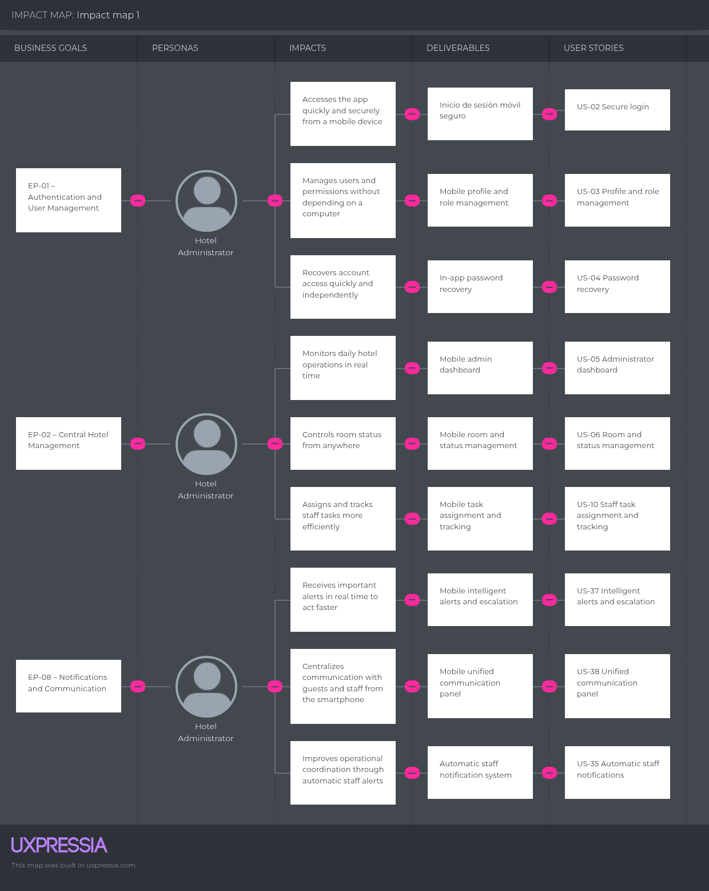

#### Impact Mapping Segmento 2: Traveler

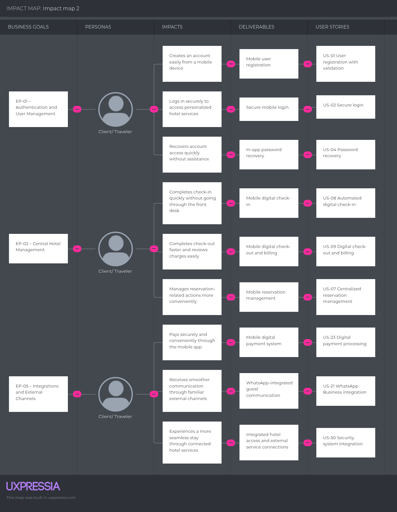

### 2.4.3. Product Backlog

<table border="1" cellpadding="8" cellspacing="0">
  <thead>
    <tr style="background-color: #f2f2f2;">
      <th>Order</th>
      <th>User Story Id</th>
      <th>Title</th>
      <th>Description</th>
      <th>Story Points (1 / 2 / 3 / 5 / 8)</th>
    </tr>
  </thead>
  <tbody>
    <tr>
      <td>1</td>
      <td>US-24</td>
      <td>Segmented landing page</td>
      <td><strong>As</strong> a visitor, <strong>I want</strong> to find specific information according to my profile (hotel administrator or guest) <strong>to</strong> understand Smart Stay's value.</td>
      <td>5</td>
    </tr>
    <tr>
      <td>2</td>
      <td>US-25</td>
      <td>ROI simulator for hotels</td>
      <td><strong>As</strong> a visiting hotel administrator, <strong>I want</strong> to use a simulator to estimate the return on investment I would get with Smart Stay <strong>to</strong> make informed decisions.</td>
      <td>8</td>
    </tr>
    <tr>
      <td>3</td>
      <td>US-27</td>
      <td>Demo request and commercial contact</td>
      <td><strong>As</strong> an interested visitor, <strong>I want</strong> to request a demonstration and contact the sales team easily and quickly <strong>to</strong> explore Smart Stay solutions.</td>
      <td>3</td>
    </tr>
    <tr>
      <td>4</td>
      <td>US-26</td>
      <td>Success stories and testimonials</td>
      <td><strong>As</strong> an interested visitor, <strong>I want</strong> to see real success stories from hotels using Smart Stay <strong>to</strong> validate solution effectiveness.</td>
      <td>5</td>
    </tr>
    <tr>
      <td>5</td>
      <td>US-28</td>
      <td>Corporate information and values</td>
      <td><strong>As</strong> a visitor, <strong>I want</strong> to know Smart Stay's mission, vision and values <strong>to</strong> understand the company's philosophy.</td>
      <td>2</td>
    </tr>
    <tr>
      <td>6</td>
      <td>US-05</td>
      <td>Administrator dashboard</td>
      <td><strong>As</strong> an administrator, <strong>I want</strong> a centralized panel with key information <strong>to</strong> manage my hotel efficiently.</td>
      <td>8</td>
    </tr>
    <tr>
      <td>7</td>
      <td>US-07</td>
      <td>Centralized reservation management</td>
      <td><strong>As</strong> an administrator, <strong>I want</strong> to manage all reservations in one place <strong>to</strong> avoid overbooking and optimize occupancy.</td>
      <td>8</td>
    </tr>
    <tr>
      <td>8</td>
      <td>US-08</td>
      <td>Automated digital check-in</td>
      <td><strong>As</strong> an administrator and guest, <strong>I want</strong> check-in to be performed digitally in less than 3 minutes <strong>to</strong> improve experience.</td>
      <td>8</td>
    </tr>
    <tr>
      <td>9</td>
      <td>US-09</td>
      <td>Digital check-out and billing</td>
      <td><strong>As</strong> a guest, <strong>I want</strong> to perform digital check-out and receive my invoice automatically <strong>to</strong> expedite my departure.</td>
      <td>5</td>
    </tr>
    <tr>
      <td>10</td>
      <td>US-06</td>
      <td>Room and status management</td>
      <td><strong>As</strong> an administrator, <strong>I want</strong> to manage all room statuses <strong>to</strong> optimize daily operations.</td>
      <td>5</td>
    </tr>
    <tr>
      <td>11</td>
      <td>US-20</td>
      <td>OTA and booking channel integration</td>
      <td><strong>As</strong> an administrator, <strong>I want</strong> to integrate my inventory with Booking.com, Expedia and other OTAs <strong>to</strong> maximize occupancy and avoid overbooking.</td>
      <td>8</td>
    </tr>
    <tr>
      <td>12</td>
      <td>US-01</td>
      <td>User registration with validation</td>
      <td><strong>As</strong> a new user, <strong>I want</strong> to register in Smart Stay by validating my email <strong>to</strong> access functionalities according to my role.</td>
      <td>3</td>
    </tr>
    <tr>
      <td>13</td>
      <td>US-02</td>
      <td>Secure login</td>
      <td><strong>As</strong> a registered user, <strong>I want</strong> to login securely <strong>to</strong> access my personalized dashboard according to my role.</td>
      <td>3</td>
    </tr>
    <tr>
      <td>14</td>
      <td>US-11</td>
      <td>IoT environmental control from mobile app</td>
      <td><strong>As</strong> a guest, <strong>I want</strong> to control temperature, lighting and other environmental aspects from my smartphone <strong>to</strong> personalize my experience.</td>
      <td>8</td>
    </tr>
    <tr>
      <td>15</td>
      <td>US-12</td>
      <td>Service requests from app</td>
      <td><strong>As</strong> a guest, <strong>I want</strong> to request room service, additional cleaning and other services from my smartphone <strong>to</strong> access services conveniently.</td>
      <td>5</td>
    </tr>
    <tr>
      <td>16</td>
      <td>US-23</td>
      <td>Digital payment processing</td>
      <td><strong>As</strong> an administrator and guest, <strong>I want</strong> to process payments securely and efficiently through multiple payment methods <strong>to</strong> ensure smooth transactions.</td>
      <td>8</td>
    </tr>
    <tr>
      <td>17</td>
      <td>US-10</td>
      <td>Staff task assignment and tracking</td>
      <td><strong>As</strong> an administrator, <strong>I want</strong> to assign tasks to staff and track their progress <strong>to</strong> optimize operations.</td>
      <td>5</td>
    </tr>
    <tr>
      <td>18</td>
      <td>US-16</td>
      <td>Analytics dashboard and operational KPIs</td>
      <td><strong>As</strong> an administrator, <strong>I want</strong> to visualize key metrics and KPIs <strong>to</strong> make informed decisions about hotel operations.</td>
      <td>8</td>
    </tr>
    <tr>
      <td>19</td>
      <td>US-34</td>
      <td>Mobile push notification system</td>
      <td><strong>As</strong> a guest, <strong>I want</strong> to receive push notifications on my smartphone about my request and service status <strong>to</strong> stay informed.</td>
      <td>5</td>
    </tr>
    <tr>
      <td>20</td>
      <td>US-35</td>
      <td>Automatic staff notifications</td>
      <td><strong>As</strong> hotel staff, <strong>I want</strong> to receive automatic notifications about assigned tasks and important operational changes <strong>to</strong> respond promptly.</td>
      <td>3</td>
    </tr>
    <tr>
      <td>21</td>
      <td>US-21</td>
      <td>WhatsApp Business integration</td>
      <td><strong>As</strong> an administrator, <strong>I want</strong> to use WhatsApp Business for direct guest communication and pre/post-stay query management <strong>to</strong> improve customer service.</td>
      <td>5</td>
    </tr>
    <tr>
      <td>22</td>
      <td>US-13</td>
      <td>Digital guest-staff communication</td>
      <td><strong>As</strong> a guest, <strong>I want</strong> to communicate with hotel staff digitally <strong>to</strong> resolve questions and requests quickly.</td>
      <td>5</td>
    </tr>
    <tr>
      <td>23</td>
      <td>US-22</td>
      <td>Digital reputation management</td>
      <td><strong>As</strong> an administrator, <strong>I want</strong> to manage Google, TripAdvisor and OTA reviews from one place <strong>to</strong> maintain good online reputation.</td>
      <td>5</td>
    </tr>
    <tr>
      <td>24</td>
      <td>US-17</td>
      <td>Financial and occupancy reports</td>
      <td><strong>As</strong> an administrator, <strong>I want</strong> to generate financial and occupancy reports <strong>to</strong> support management analysis and decision making.</td>
      <td>5</td>
    </tr>
    <tr>
      <td>25</td>
      <td>US-19</td>
      <td>IoT energy consumption monitoring</td>
      <td><strong>As</strong> an administrator, <strong>I want</strong> to monitor energy consumption of rooms and common areas <strong>to</strong> optimize operational costs.</td>
      <td>8</td>
    </tr>
    <tr>
      <td>26</td>
      <td>US-14</td>
      <td>Experience personalization based on preferences</td>
      <td><strong>As</strong> a guest, <strong>I want</strong> the system to learn my preferences <strong>to</strong> offer personalized experiences and services.</td>
      <td>8</td>
    </tr>
    <tr>
      <td>27</td>
      <td>US-15</td>
      <td>Post-stay evaluation and feedback</td>
      <td><strong>As</strong> a guest, <strong>I want</strong> to evaluate my experience and leave feedback <strong>to</strong> help the hotel improve its services.</td>
      <td>3</td>
    </tr>
    <tr>
      <td>28</td>
      <td>US-18</td>
      <td>Guest satisfaction analysis</td>
      <td><strong>As</strong> an administrator, <strong>I want</strong> to analyze guest satisfaction <strong>to</strong> identify improvement areas and maintain service quality.</td>
      <td>5</td>
    </tr>
    <tr>
      <td>29</td>
      <td>US-29</td>
      <td>RESTful API for room management</td>
      <td><strong>As</strong> a developer, <strong>I want</strong> to access RESTful endpoints <strong>to</strong> integrate Smart Stay with external hotel management systems.</td>
      <td>8</td>
    </tr>
    <tr>
      <td>30</td>
      <td>US-30</td>
      <td>API for IoT device control</td>
      <td><strong>As</strong> a developer, <strong>I want</strong> endpoints to control room IoT devices <strong>to</strong> enable integration with external applications.</td>
      <td>8</td>
    </tr>
    <tr>
      <td>31</td>
      <td>US-31</td>
      <td>API authentication and authorization</td>
      <td><strong>As</strong> a developer, <strong>I want</strong> a secure authentication system <strong>to</strong> access Smart Stay API endpoints safely.</td>
      <td>5</td>
    </tr>
    <tr>
      <td>32</td>
      <td>US-32</td>
      <td>Interactive API documentation</td>
      <td><strong>As</strong> a developer, <strong>I want</strong> to access complete and interactive documentation <strong>to</strong> easily integrate with Smart Stay API.</td>
      <td>3</td>
    </tr>
    <tr>
      <td>33</td>
      <td>US-33</td>
      <td>Webhooks for real-time events</td>
      <td><strong>As</strong> a developer, <strong>I want</strong> to configure webhooks <strong>to</strong> receive automatic notifications when important Smart Stay events occur.</td>
      <td>5</td>
    </tr>
    <tr>
      <td>34</td>
      <td>US-03</td>
      <td>Profile and role management</td>
      <td><strong>As</strong> an administrator, <strong>I want</strong> to manage users, assign roles and permissions <strong>to</strong> control access to different functionalities.</td>
      <td>5</td>
    </tr>
    <tr>
      <td>35</td>
      <td>US-04</td>
      <td>Password recovery</td>
      <td><strong>As</strong> a user, <strong>I want</strong> to recover my password via email <strong>to</strong> regain access to my account.</td>
      <td>2</td>
    </tr>
    <tr>
      <td>36</td>
      <td>US-36</td>
      <td>Automated email marketing</td>
      <td><strong>As</strong> an administrator, <strong>I want</strong> to send automated personalized emails to guests at different stages <strong>to</strong> enhance customer experience.</td>
      <td>5</td>
    </tr>
    <tr>
      <td>37</td>
      <td>US-37</td>
      <td>Intelligent alerts and escalation</td>
      <td><strong>As</strong> an administrator, <strong>I want</strong> to receive intelligent alerts about operational problems with automatic escalation <strong>to</strong> ensure quick resolution.</td>
      <td>5</td>
    </tr>
    <tr>
      <td>38</td>
      <td>US-38</td>
      <td>Unified communication panel</td>
      <td><strong>As</strong> an administrator, <strong>I want</strong> a centralized panel to manage all communications <strong>to</strong> streamline guest interaction management.</td>
      <td>8</td>
    </tr>
    <tr>
      <td>39</td>
      <td>US-39</td>
      <td>Native mobile app for staff</td>
      <td><strong>As</strong> hotel staff, <strong>I want</strong> a dedicated mobile app to manage my tasks and communication <strong>to</strong> work efficiently while on the move.</td>
      <td>8</td>
    </tr>
    <tr>
      <td>40</td>
      <td>US-42</td>
      <td>Multi-hotel configuration for chains</td>
      <td><strong>As</strong> a hotel chain administrator, <strong>I want</strong> to manage multiple properties from a master account <strong>to</strong> centralize operations with independent configurations.</td>
      <td>8</td>
    </tr>
    <tr>
      <td>41</td>
      <td>US-43</td>
      <td>Integration with existing PMS systems</td>
      <td><strong>As</strong> an administrator, <strong>I want</strong> to integrate Smart Stay with my current PMS system <strong>to</strong> migrate gradually without interrupting operations.</td>
      <td>8</td>
    </tr>
    <tr>
      <td>42</td>
      <td>US-44</td>
      <td>Brand customization per hotel</td>
      <td><strong>As</strong> an administrator, <strong>I want</strong> to customize interface and communications with my hotel's brand <strong>to</strong> maintain visual consistency.</td>
      <td>5</td>
    </tr>
    <tr>
      <td>43</td>
      <td>US-45</td>
      <td>Integrated loyalty program</td>
      <td><strong>As</strong> an administrator, <strong>I want</strong> to manage a loyalty program for recurring guests <strong>to</strong> provide automatic benefits and increase retention.</td>
      <td>8</td>
    </tr>
    <tr>
      <td>44</td>
      <td>US-46</td>
      <td>Event and conference management</td>
      <td><strong>As</strong> an administrator, <strong>I want</strong> to manage special events and conferences <strong>to</strong> provide specific group functionalities.</td>
      <td>8</td>
    </tr>
    <tr>
      <td>45</td>
      <td>US-47</td>
      <td>IoT predictive maintenance</td>
      <td><strong>As</strong> an administrator, <strong>I want</strong> the IoT system to predict maintenance needs <strong>to</strong> optimize equipment performance and reduce downtime.</td>
      <td>8</td>
    </tr>
    <tr>
      <td>46</td>
      <td>US-48</td>
      <td>Competition analysis and dynamic pricing</td>
      <td><strong>As</strong> an administrator, <strong>I want</strong> to analyze competitor prices and adjust my rates automatically <strong>to</strong> optimize revenue.</td>
      <td>8</td>
    </tr>
    <tr>
      <td>47</td>
      <td>US-49</td>
      <td>Automated compliance and auditing</td>
      <td><strong>As</strong> an administrator, <strong>I want</strong> the system to generate automatic compliance reports <strong>to</strong> facilitate regulatory audits.</td>
      <td>5</td>
    </tr>
    <tr>
      <td>48</td>
      <td>US-50</td>
      <td>Security system integration</td>
      <td><strong>As</strong> an administrator, <strong>I want</strong> to integrate Smart Stay with hotel security systems <strong>to</strong> provide automated access management.</td>
      <td>8</td>
    </tr>
    <tr>
      <td>49</td>
      <td>US-40</td>
      <td>Data backup and recovery</td>
      <td><strong>As</strong> a technical administrator, <strong>I want</strong> the system to have automatic backup and disaster recovery <strong>to</strong> guarantee operational continuity.</td>
      <td>5</td>
    </tr>
    <tr>
      <td>50</td>
      <td>US-41</td>
      <td>System monitoring and logs</td>
      <td><strong>As</strong> a technical administrator, <strong>I want</strong> to monitor system performance and access detailed logs <strong>to</strong> support troubleshooting activities.</td>
      <td>3</td>
    </tr>
  </tbody>
</table>

### 2.5. Strategic-Level Domain-Driven Design

#### 2.5.1. EventStorming

**Legend of terminologies:**

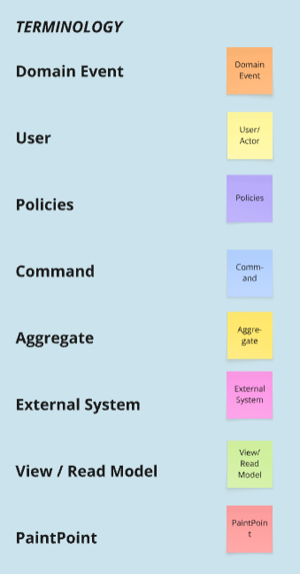

**Step 1: Unstructured Exploration:**

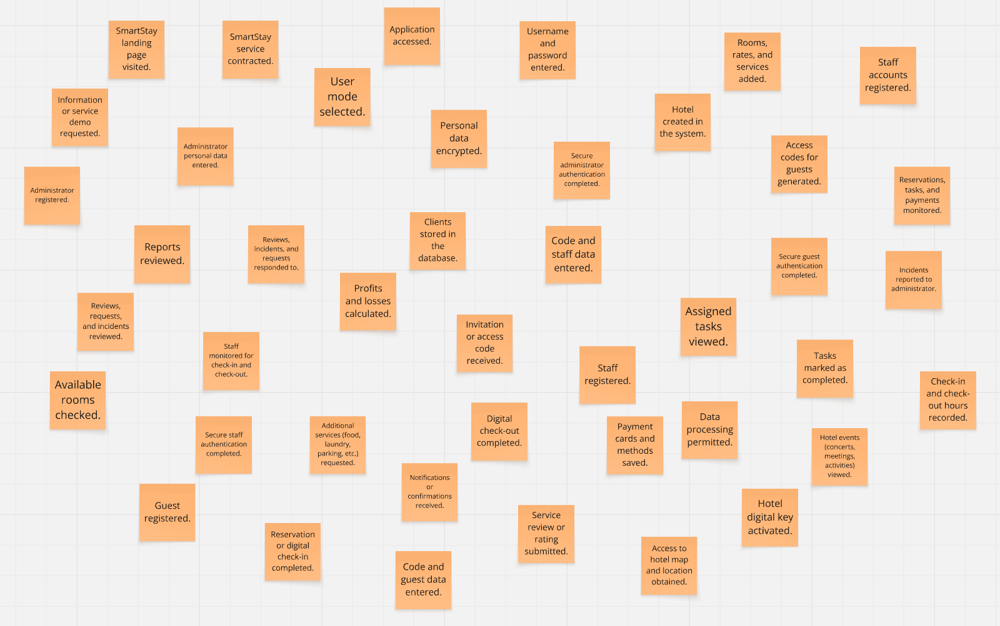

**Step 2: Timelines:**

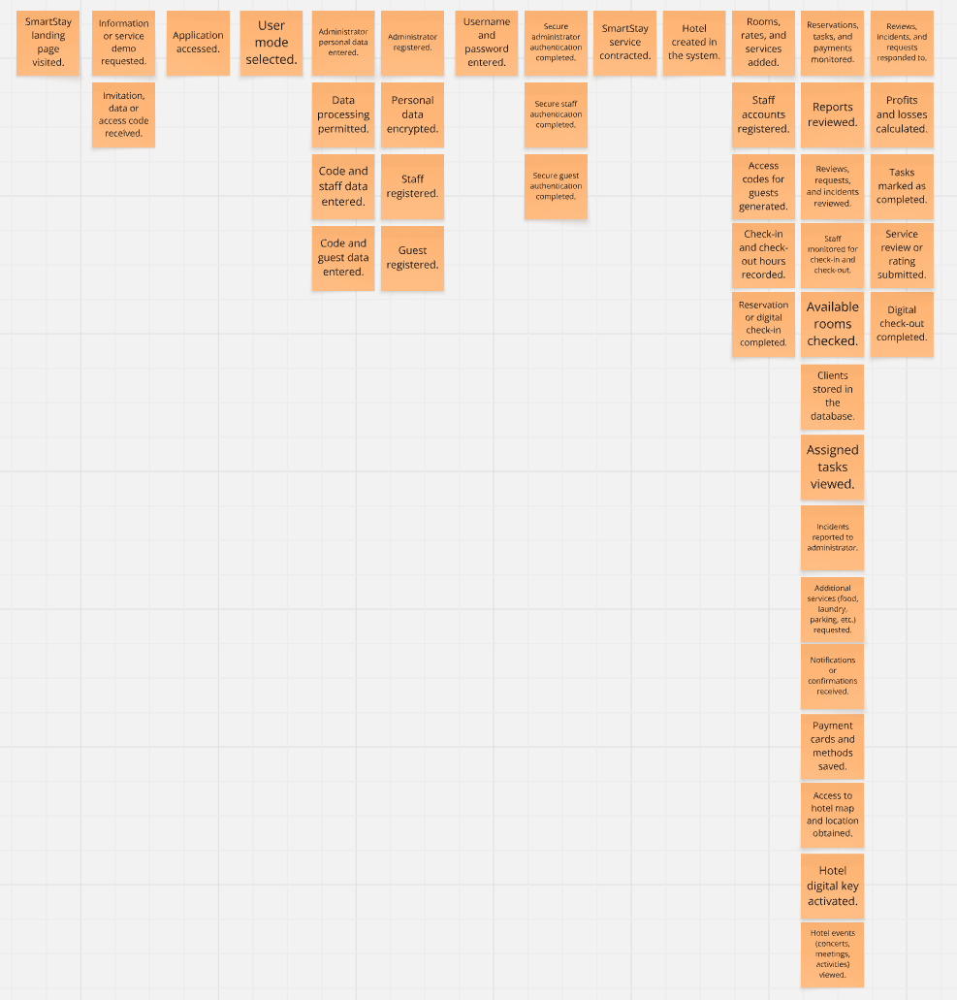

**Step 3: Paint Points:**

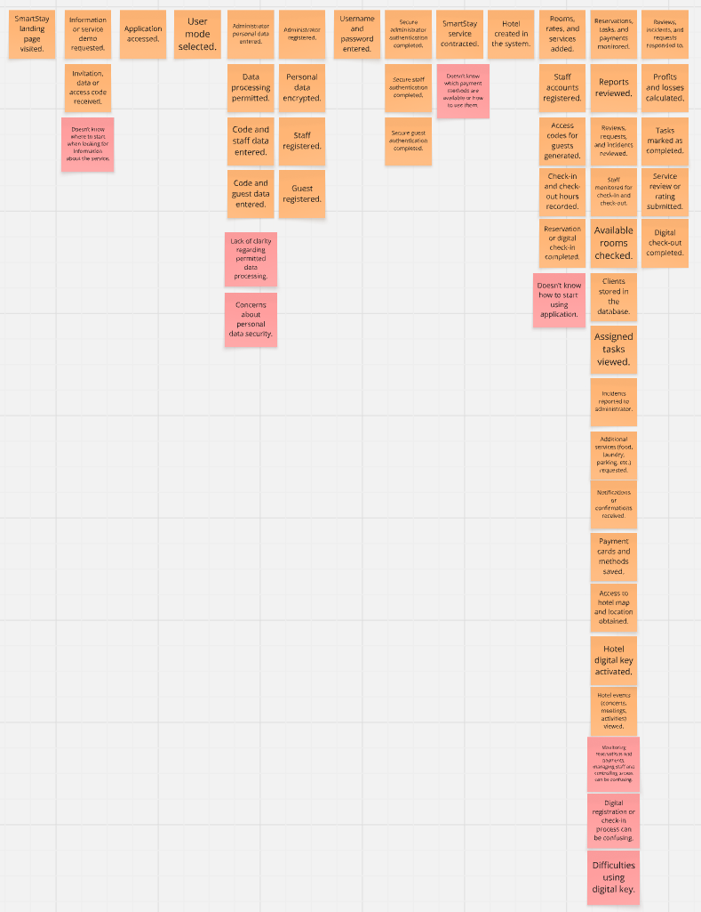

**Step 4: Pivotal Points:**

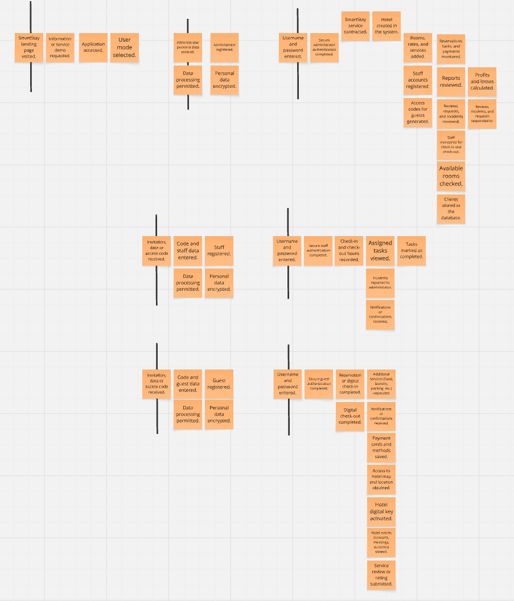

**Step 5: Commands:**

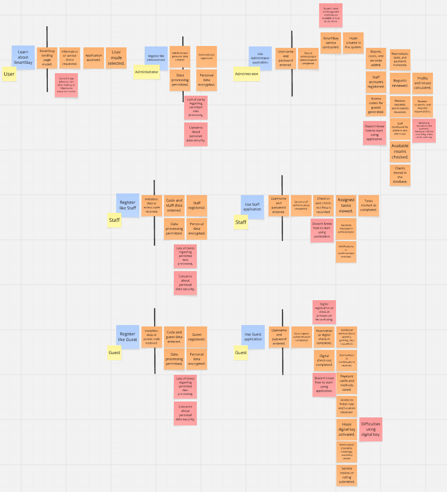

**Step 6: Policies:**

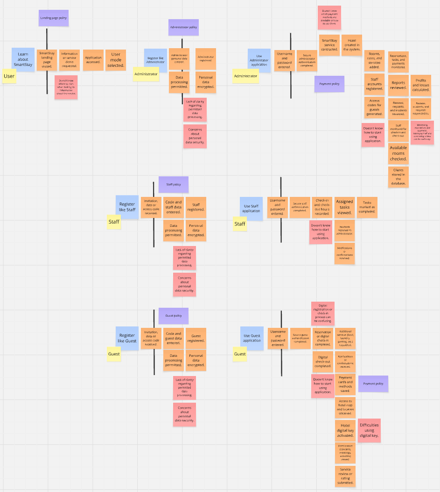

**Step 7: Read models:**

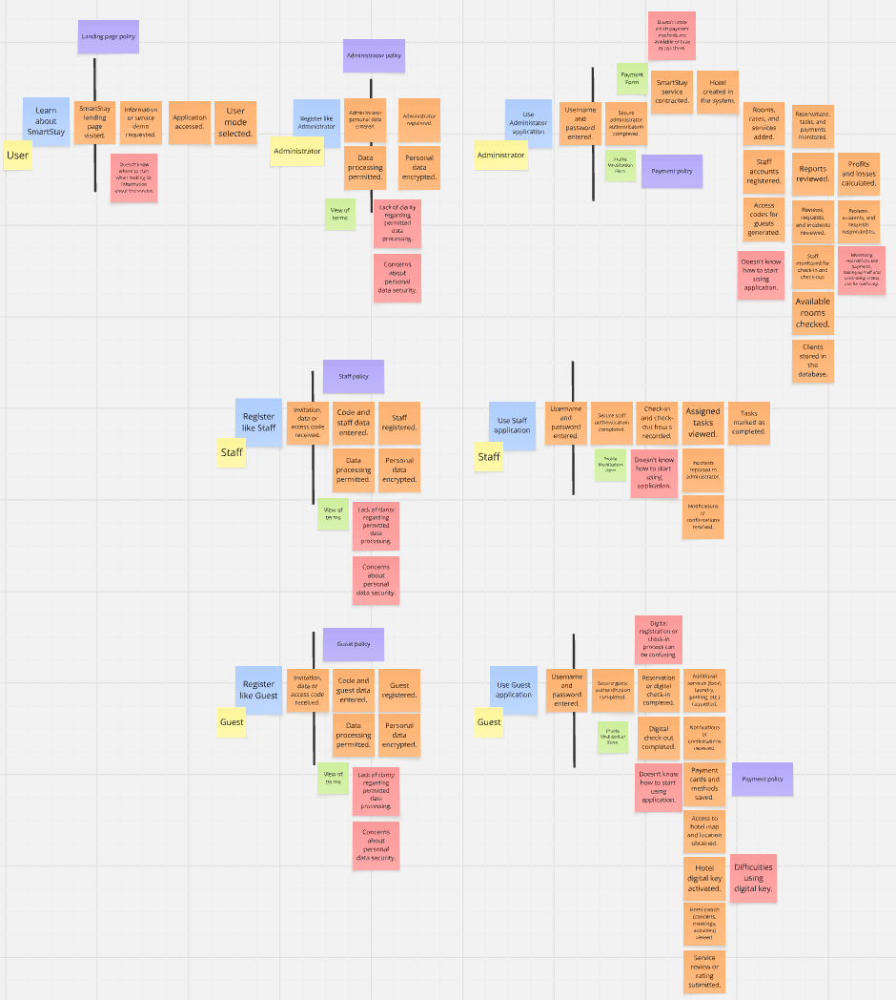

**Step 8: External Systems:**

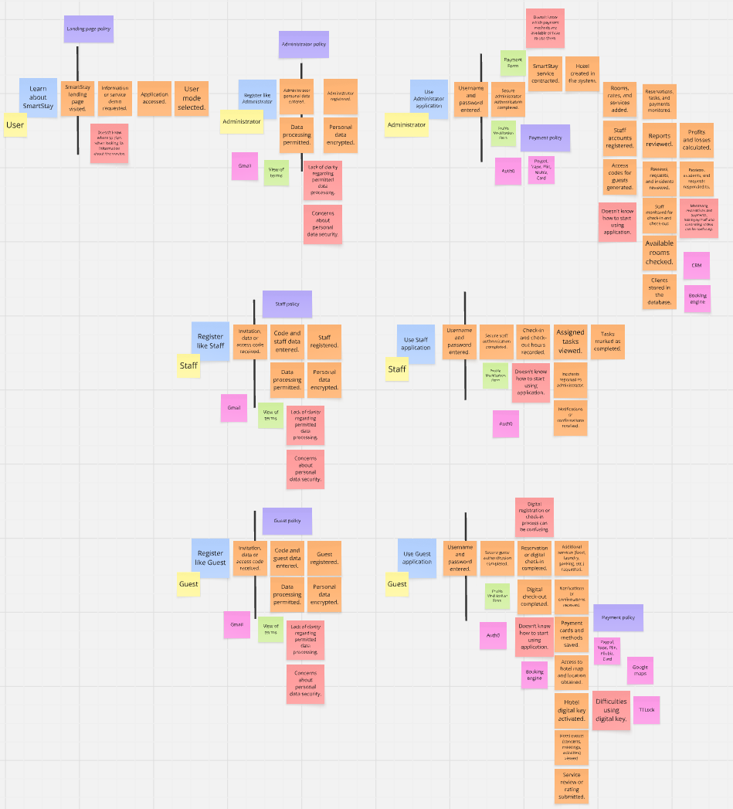

**Step 9: Aggregates:**

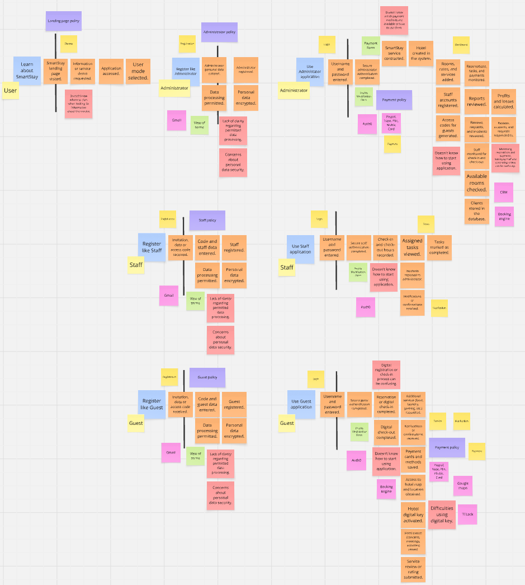

**Step 10: Bounded Contexts:**

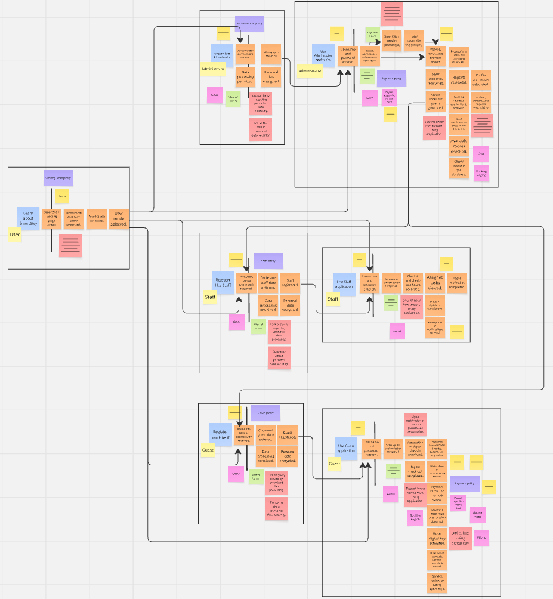

**Link para visualizar mejor:** https://tinyurl.com/8529395x

##### 2.5.1.1. Candidate Context Discovery

En esta sesión, el equipo aplicó la técnica de **Candidate Context Discovery** con el objetivo de descomponer el dominio general en subconjuntos con límites naturales o **Bounded Contexts**. Para lograrlo, se utilizó principalmente la técnica **Look-for-pivotal-events**, la cual consiste en identificar aquellos eventos clave que marcan un cambio de estado significativo en el proceso de negocio o un cambio de lenguaje dentro del dominio.

La sesión se dividió en fases progresivas para garantizar que los límites (*Boundaries*) de cada contexto estuvieran alineados con las reglas de negocio y las responsabilidades técnicas del sistema de gestión hotelera **Smart Stay**.

---

**Paso 1: Identificación de Pivotal Events**

Analizando la línea de tiempo del EventStorming, identificamos los eventos que actúan como "puentes" o puntos de quiebre entre las diferentes fases del servicio. Estos eventos clave son:

* **User mode selected:** Punto de quiebre entre la exploración general del servicio y el inicio de flujos específicos por rol.
* **Administrator registered / Staff registered / Guest registered:** Eventos que cierran la fase de gestión de identidad e inician la operatividad.
* **Hotel created in the system:** Marca el inicio de la configuración de infraestructura del hotel.
* **Reservation completed:** Finaliza el proceso comercial e inicia el flujo de servicios al huésped.
* **Digital check-in completed:** Activa las capacidades **IoT** de la habitación para el usuario.
* **Tasks marked as completed:** Marca el fin de una iteración operativa del personal de limpieza o mantenimiento.

---

**Paso 2: Agrupación de Bounded Contexts (Candidate Contexts)**

A partir de estos eventos, agrupamos los comandos, agregados y sistemas externos en contextos específicos. A continuación, se detalla la propuesta de Bounded Contexts para **Smart Stay**:

| Bounded Context | Descripción | Eventos Clave |
| :--- | :--- | :--- |
| **IAM (Identity & Access Management)** | Gestiona la seguridad, autenticación y autorización de todos los usuarios (Admin, Staff, Huésped). | Administrator registered, Secure authentication completed, Personal data encrypted. |
| **Profiles** | Administra la información detallada de los perfiles de usuario y el procesamiento de sus datos personales. | Data processing permitted, Staff/Guest registered. |
| **Properties Management** | Encargado de la gestión de la infraestructura física: creación de hoteles, configuración de habitaciones, tarifas y asignación de personal. | Hotel created, Rooms/Staff added, Available rooms checked. |
| **Bookings & Payments** | Controla el flujo comercial, desde el contacto inicial en la Landing Page hasta la gestión de pagos y cálculo de ganancias. | SmartStay service contracted, Payment cards saved, Profits and losses calculated. |
| **Operational Tasks** | Gestiona las actividades diarias del staff del hotel, como reportes de incidentes y gestión de tareas asignadas. | Assigned tasks viewed, Tasks marked as completed, Incidents reported. |
| **IoT Stay & Experience** | El **Core** de la solución. Gestiona la interacción digital del huésped con la habitación a través de **IoT**. | Digital check-in completed, Hotel digital key activated, Service review submitted. |
| **Analytics** | Recopila datos de uso y desempeño para generar reportes estratégicos para el administrador. | Reports reviewed, Hotel events viewed. |

##### 2.5.1.2. Domain Message Flows Modeling

##### 2.5.1.3. Bounded Context Canvases

#### 2.5.2. Context Mapping

#### 2.5.3. Software Architecture

##### 2.5.3.1. Software Architecture Context Level Diagrams

##### 2.5.3.2. Software Architecture Container Level Diagrams

##### 2.5.3.3. Software Architecture Deployment Diagrams

### 2.6. Tactical-Level Domain-Driven Design

#### 2.6.1. Bounded Context: [Nombre del Bounded Context]

##### 2.6.1.1. Domain Layer

##### 2.6.1.2. Interface Layer

##### 2.6.1.3. Application Layer

##### 2.6.1.4. Infrastructure Layer

##### 2.6.1.5. Bounded Context Software Architecture Component Level Diagrams

##### 2.6.1.6. Bounded Context Software Architecture Code Level Diagrams

###### 2.6.1.6.1. Bounded Context Domain Layer Class Diagrams

###### 2.6.1.6.2. Bounded Context Database Design Diagram

## Capítulo III: Solution UI/UX Design

### 3.1. Product design

#### 3.1.1. Style Guidelines

##### 3.1.1.1. General Style Guidelines

#### 3.1.2. Information Architecture

##### 3.1.2.1. Organization Systems

##### 3.1.2.2. Labelling Systems

##### 3.1.2.3. SEO Tags and Meta Tags

##### 3.1.2.4. Searching Systems

##### 3.1.2.5. Navigation Systems

#### 3.1.3. Landing Page UI Design

##### 3.1.3.1. Landing Page Wireframe

##### 3.1.3.2. Landing Page Mock-up

#### 3.1.4. Mobile Applications UX/UI Design

##### 3.1.4.1. Mobile Applications Wireframes

##### 3.1.4.2. Mobile Applications Wireflow Diagrams

##### 3.1.4.3. Mobile Applications Mock-ups

##### 3.1.4.4. Mobile Applications User Flow Diagrams

##### 3.1.4.5. Mobile Applications Prototyping

---

## Capítulo IV: Product Implementation & Validation

### 4.1. Software Configuration Management

#### 4.1.1. Software Development Environment Configuration

#### 4.1.2. Source Code Management

#### 4.1.3. Source Code Style Guide & Conventions

#### 4.1.4. Software Deployment Configuration

### 4.2. Landing Page & Mobile Application Implementation

#### 4.2.1. Sprint 1

##### 4.2.1.1. Sprint Planning 1

##### 4.2.1.2. Sprint Backlog 1

##### 4.2.1.3. Development Evidence for Sprint Review

##### 4.2.1.4. Testing Suite Evidence for Sprint Review

##### 4.2.1.5. Execution Evidence for Sprint Review

##### 4.2.1.6. Services Documentation Evidence for Sprint Review

##### 4.2.1.7. Software Deployment Evidence for Sprint Review

##### 4.2.1.8. Team Collaboration Insights during Sprint

### 4.3. Validation Interviews

#### 4.3.1. Diseño de Entrevistas

#### 4.3.2. Registro de Entrevistas

#### 4.3.3. Evaluaciones según heurísticas

---

## Conclusiones y recomendaciones

## Video App Validation

### Video About the product

### Video About the team

## Glosario

## Bibliografía

## Anexos
